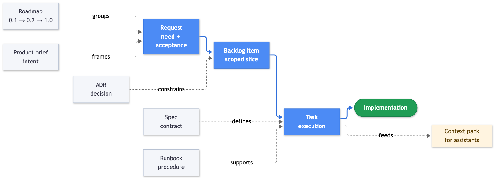
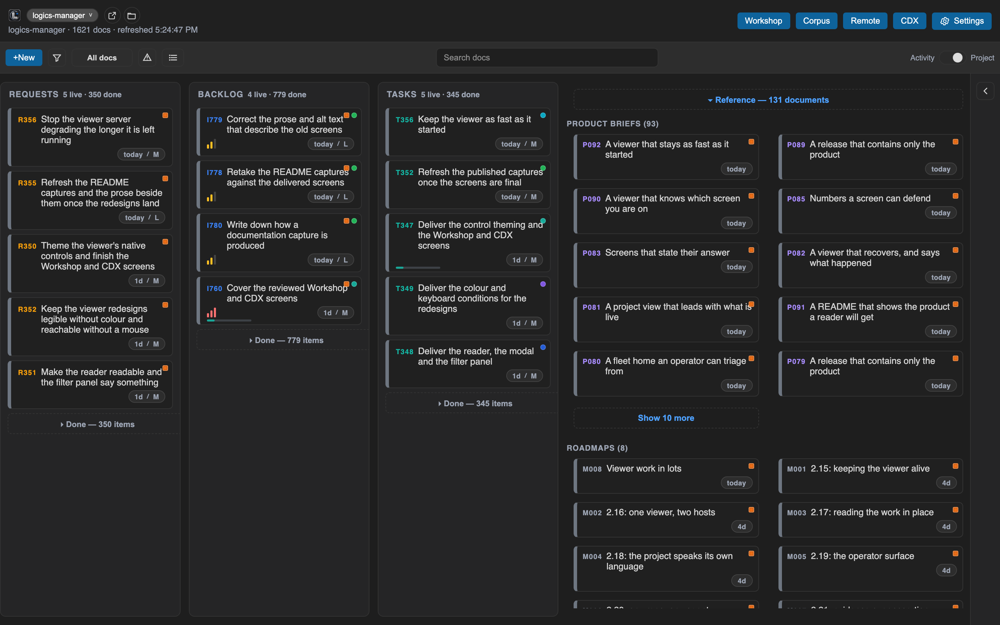
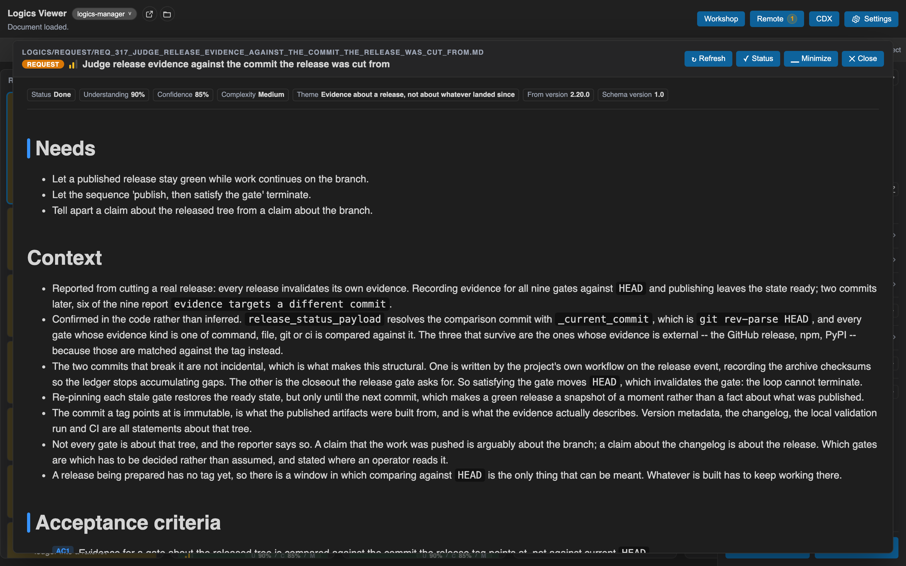

# logics-manager

<br clear="left"/>

[](https://github.com/AlexAgo83/logics-manager/actions/workflows/ci.yml)
[](LICENSE)


**Your project's memory, in Markdown, in your repo.** logics-manager turns requests, backlog
items, tasks and decisions into plain Markdown documents that live next to your code, so
every human and every AI assistant picks up the same context instead of starting over.

AI-heavy projects lose context between chats, agents and implementation passes. Logics
keeps it as durable, versioned artifacts: one delivery chain, framed by the documents
around it.





## Get started in a minute

Install with npm (works the same on macOS, Linux and Windows / WSL):

```bash
npm install -g @grifhinz/logics-manager
logics-manager bootstrap --check
logics-manager flow new request --title "Improve onboarding"
logics-manager view
```

`bootstrap` sets up the `logics/` tree, `flow new` writes your first request, and `view`
opens the board in your browser. Installing from source, Python packages and Obsidian
usage are covered in [getting started](docs/getting-started.md).



## What you can do

| Need | Command | Detail |
| --- | --- | --- |
| Capture and scope work | `flow new`, `flow promote`, `flow split` | [Core CLI](docs/cli.md) |
| Plan across versions | `flow roadmap propose` | [Core CLI](docs/cli.md) |
| See the board, read and filter docs | `view`, or the VS Code extension | [The viewer](docs/viewer.md), [VS Code](docs/vscode.md) |
| Keep the corpus consistent | `lint`, `audit`, `health`, `flow close` | [Core CLI](docs/cli.md) |
| Feed an assistant bounded context | `sync context-pack`, MCP server | [MCP for assistants](docs/mcp.md) |
| Teach your agents the workflow | `skills install` | [Bundled skills](docs/cli.md#bundled-agent-skills) |

One CLI owns the behavior; the VS Code extension and the MCP server call into it instead
of reimplementing workflow logic. The MCP server gives assistants a bounded tool API with
no shell or arbitrary filesystem access. Your documents stay plain Markdown, versioned with
git and readable in reviews. See [concepts and product shape](docs/concepts.md).

## Documentation

- [Getting started](docs/getting-started.md): install paths, first steps, Obsidian usage.
- [Concepts and product shape](docs/concepts.md): document types, the CLI and its clients.
- [The viewer](docs/viewer.md): board, reader, insights, list mode.
- [Core CLI](docs/cli.md): commands, agent cookbook, contracts, closing work.
- [VS Code extension](docs/vscode.md): features, installation, command palette.
- [MCP for assistants](docs/mcp.md): tool surface, connector plans, assistant model.
- [Onboarding prompts](docs/onboarding.md): starting prompts for need, framing, orchestration, execution.
- [Project i18n contract](docs/i18n.md) and [GitHub Issues bridge](docs/github-issues.md): optional integrations.
- [Development and validation](docs/development.md) and [release](docs/release.md): for contributors.

Full index in [`docs/`](docs/README.md). Security reports: see [SECURITY.md](SECURITY.md);
contributions: [CONTRIBUTING.md](CONTRIBUTING.md). logics-manager is [MIT licensed](LICENSE).
