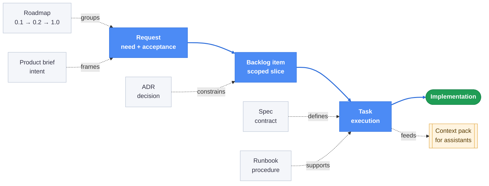

[⬅ Back to README](../README.md) · [Documentation index](./README.md)

# Concepts and product shape

## What it solves

AI-heavy projects often lose context between chats, agents, and implementation passes.
Logics turns that context into durable project artifacts, plain Markdown under `logics/`:

| Document | Holds |
| --- | --- |
| `request` | The problem, need, and acceptance criteria. |
| `backlog item` | A scoped delivery slice. |
| `task` | Executable implementation work. |
| `product brief` | Product framing and intent. |
| `roadmap` | A versioned long-term plan such as `0.1 -> 0.2 -> 1.0`. |
| `ADR` | Architectural decisions. |
| `spec` | A behavioral contract. |

Work moves along one delivery chain (in blue), framed by companion documents:

The result is a repo-local memory layer that reduces re-explaining, keeps implementation
grounded, and gives every assistant or human the same inspectable workflow state. The
documents are versioned with git, readable in reviews, and reusable across sessions.

## Product shape

`logics-manager` has one core and several integrations:

| Layer | Purpose |
| --- | --- |
| CLI runtime | Canonical workflow engine for creating, promoting, auditing, repairing, and closing Logics docs. See [cli.md](./cli.md). |
| VS Code extension | VS Code host for the canonical local viewer, with editor lifecycle and focus commands. See [vscode.md](./vscode.md). |
| MCP server | Assistant-facing adapter that exposes bounded Logics tools without giving agents a shell. See [mcp.md](./mcp.md). |
| Bundled agent skills | Eight reusable skills, installed into Claude Code / Codex / Hermes / Antigravity homes via `logics-manager skills install`, re-synced automatically on `update`. See [cli.md](./cli.md#bundled-agent-skills). |
| npm / Python packaging | Installation paths for the same CLI/runtime. See [getting-started.md](./getting-started.md). |

The CLI owns the behavior. The extension and MCP server call into it instead of
reimplementing workflow logic.

Beyond the workflow itself, the CLI exports indexes, context packs, and graph data, and
builds prompt packs for external image generators with `design prompt`, per asset kind,
so a sheet and a single hero image never receive the same instructions.
