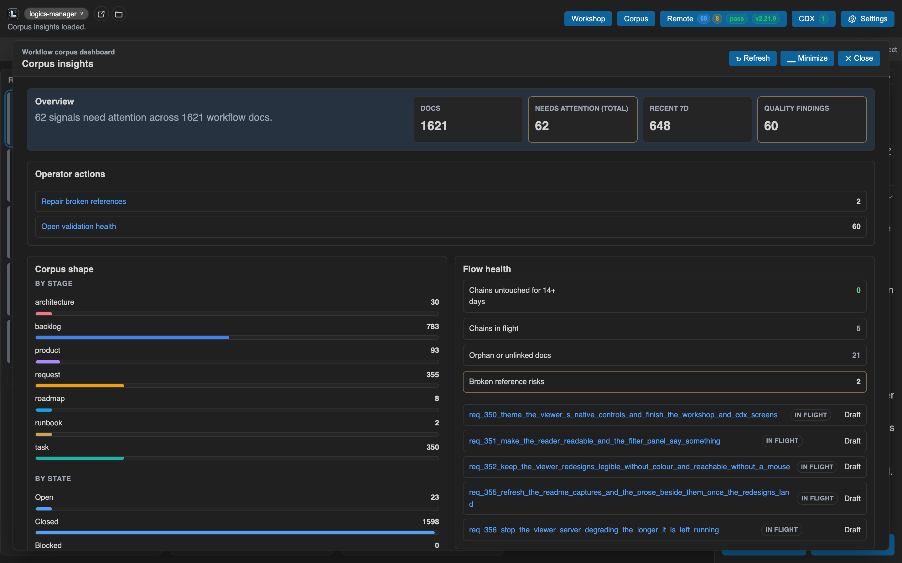
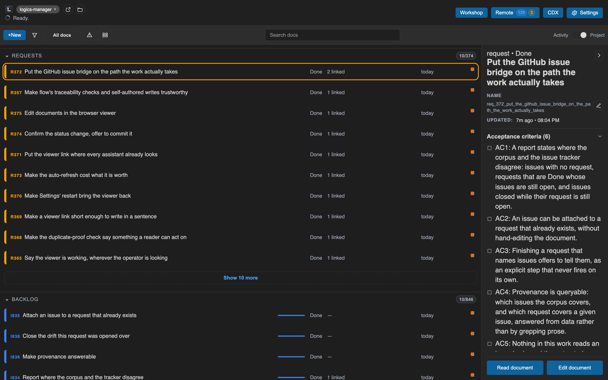

[⬅ Back to README](../README.md) · [Documentation index](./README.md)

# The Viewer

A local board over your `logics/*` documents. The columns are the three stages work moves
through (requests, backlog items, tasks), each showing what is live and folding what is
done. Product briefs, roadmaps, architecture decisions and the rest are a reference index
beside them: reachable, but not competing with the queue. Filterable, searchable, and
groupable by whatever you're deciding. It runs standalone (`logics-manager view`) or
embedded in the [VS Code extension](./vscode.md).

## Reading a document

Reading a document lists its sections down the left, marks where you are in them, and
gives the document itself the rest of the width: its tables, chain diagrams and code are
as much of it as its prose.

## Insights and health

Corpus insights summarizes the shape of the corpus and the signals worth acting on, and
Validation health answers whether anything blocks, with a repair action where fixes are
automatic.

## List mode

The same documents read as a list instead of columns, grouped by type, status, theme or
nothing at all, sorted, and dated.

The captures above are produced by `scripts/dev/capture-readme-media.mjs` against this
repository's own corpus; [`media/PROVENANCE.md`](media/PROVENANCE.md) records the framing.
Viewer commands and options are in the [CLI reference](./cli.md).
