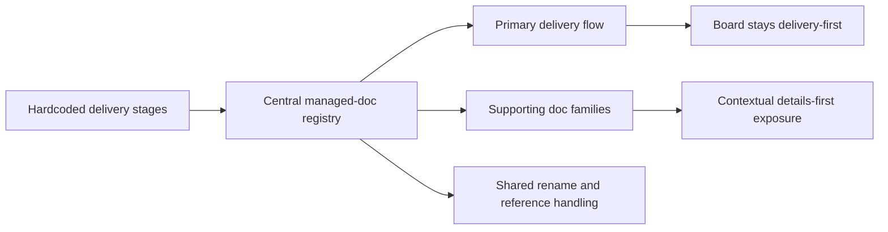

## adr_000_represent_companion_docs_in_the_vs_code_plugin_workflow_model - Represent companion docs in the VS Code plugin workflow model
> Date: 2026-03-14
> Status: Proposed
> Drivers: Centralize managed-doc typing, preserve delivery-first UX, support companion docs without board noise, and keep reference maintenance coherent.
> Related request: `req_022_align_vs_code_plugin_with_companion_docs_workflow`
> Related backlog: `item_022_align_vs_code_plugin_with_companion_docs_workflow`
> Related task: `(none yet)`
> Reminder: Update status, linked refs, decision rationale, consequences, migration plan, and follow-up work when you edit this doc.

# Overview
The plugin should move from a hardcoded 4-stage model to a centralized managed-doc model that distinguishes primary delivery docs from supporting companion docs.
`request`, `backlog`, and `task` remain the primary delivery flow.
`product`, `architecture`, and eventually `spec` are represented as supporting artifacts: indexed and maintained as first-class managed docs, but surfaced contextually first and only optionally at board level.

# Context
The plugin currently hardcodes stage assumptions across:
- the TypeScript indexer;
- extension-host helper logic;
- the webview rendering model and filters;
- related tests.

That model worked for `request`, `backlog`, `task`, and `spec`, but it does not fit the kit evolution that introduced `product` and `architecture` companion docs.
The architecture now needs to satisfy competing constraints:
- index and maintain all managed docs coherently;
- avoid making the main board unreadable;
- support future document families without repeating hardcoded patches;
- preserve rename/reference maintenance across every managed doc family.

# Decision
Adopt a centralized managed-doc registry in the plugin and treat document families in two groups:
- primary delivery docs: `request`, `backlog`, `task`
- supporting docs: `product`, `architecture`, `spec`

Implementation direction:
- indexer, extension-host helpers, and webview code should share a common notion of managed doc families instead of duplicating stage lists;
- supporting docs must be indexed and maintained as first-class managed docs;
- the default board remains focused on the primary delivery flow;
- supporting docs are exposed first through item details and explicit navigation/creation controls;
- board-level visibility for supporting docs is secondary and filterable.

This direction preserves workflow clarity while removing the architectural mismatch between the kit and the plugin.

# Alternatives considered
- Treat `product` and `architecture` exactly like delivery stages and add them as default board columns.
- Keep companion docs invisible at plugin level and rely only on raw markdown navigation.
- Add plugin-side governance logic that tries to decide automatically when product or architecture docs are required.

# Consequences
- The plugin needs a modest refactor to centralize managed-doc metadata and stage assumptions.
- Webview filters and details-panel logic become slightly more complex, but future changes become cheaper and more coherent.
- Supporting-doc visibility becomes more intentional and easier to reason about.
- The plugin remains aligned with the kit without duplicating kit-side governance rules.

# Migration and rollout
- Step 1: Centralize managed-doc typing and indexing.
- Step 2: Extend rename/reference maintenance to all managed docs.
- Step 3: Expose supporting docs in the details panel and navigation flows.
- Step 4: Add secondary visibility controls for supporting docs.
- Step 5: Add creation flows and regression coverage.

# Follow-up work
- `item_023_align_plugin_indexer_and_managed_doc_model_for_companion_docs`
- `item_024_extend_plugin_rename_and_reference_maintenance_to_companion_docs`
- `item_025_add_companion_docs_section_and_navigation_in_plugin_details_panel`
- `item_026_add_supporting_doc_visibility_controls_to_plugin_board_and_list_views`
- `item_027_add_companion_doc_creation_flows_and_regression_coverage_in_plugin`
