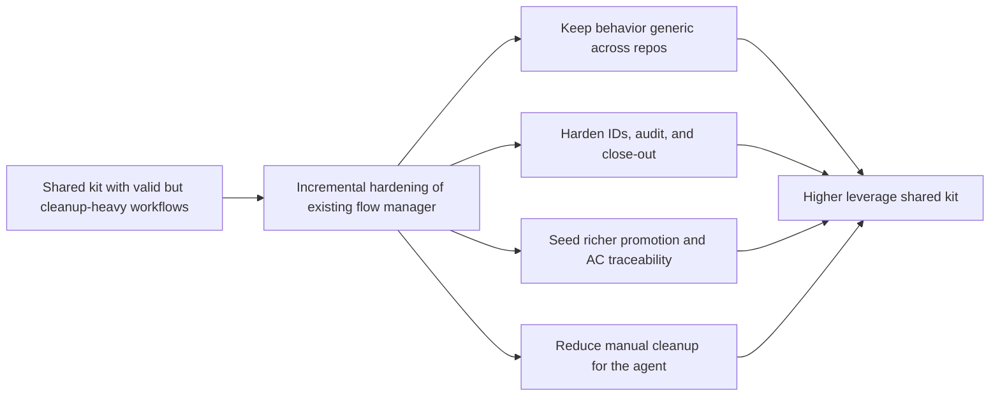

## adr_001_keep_logics_kit_hardening_incremental_generic_and_agent_productive - Keep Logics kit hardening incremental, generic, and agent-productive
> Date: 2026-03-14
> Status: Accepted
> Drivers: Reduce repetitive cleanup, preserve shared-submodule reuse, improve workflow generation safely, and keep the kit effective for both downstream repos and the agent itself.
> Related request: `req_025_harden_logics_kit_workflow_generation_and_governance_from_real_usage`
> Related backlog: `item_030_harden_logics_kit_workflow_generation_and_governance_from_real_usage`
> Related task: `task_024_harden_logics_kit_workflow_generation_and_governance_from_real_usage`
> Reminder: Update status, linked refs, decision rationale, consequences, migration plan, and follow-up work when you edit this doc.

# Overview
The shared Logics kit should evolve through conservative workflow hardening rather than through a repo-specific rewrite or an automation-heavy redesign.
The accepted direction is to improve the existing flow manager incrementally:
make generated docs richer by default, add explicit split and scoped-audit capabilities, harden ID allocation, and improve close-out guidance without breaking the kit’s generic cross-project contract.

# Context
Real end-to-end usage of the kit showed that the core workflow model was sound, but the authoring experience still left too much mechanical cleanup:
- promotion left downstream docs too generic;
- split had to be done manually;
- ID allocation could collide when creation happened close together;
- workflow audit was useful globally but too noisy for scoped work;
- AC traceability and finish/close flows needed more structure.

Because the kit lives in the `logics/skills` submodule and is shared by multiple repositories, the architecture had to avoid overfitting to this project.

# Decision
Keep the current flow-manager-centered architecture and harden it incrementally with these rules:
- enrich promotion only from stable information already present in the source docs;
- make split an explicit supported workflow, not a hidden side effect;
- use a robust allocation mechanism for numeric IDs;
- add scoped audit modes that complement the global audit;
- seed AC traceability and finish/close evidence conservatively;
- make `Decision framing` more actionable through guidance before moving to stronger automation.

This preserves the kit’s generic contract while making it materially more useful in daily use.

# Alternatives considered
- Replace the current flow manager with a new parallel workflow engine.
- Keep the current scripts and rely on manual cleanup/document fixes after generation.
- Make promotion much more “intelligent” by generating broad free-form summaries and repo-specific conventions.

# Consequences
- The kit gains more useful default behavior without losing its CLI-driven, low-dependency model.
- Shared tests and docs become more important because the changes affect multiple consuming repositories.
- Some historical repos may still carry older debt, but new flows become cleaner and safer.
- The agent can rely on the kit more directly instead of correcting it after each promotion.

# Migration and rollout
- Step 1: land V1 foundations for richer promotion, split, robust IDs, and scoped audit.
- Step 2: add V2 improvements for AC traceability, finish/close evidence, and decision follow-up guidance.
- Step 3: validate through shared tests, CLI smoke checks, and changelog/release updates.

# Follow-up work
- Monitor whether one additional conservative request-level synchronization step is still worth the complexity.
- Reuse the new scoped-audit and split capabilities in future consuming repos.
