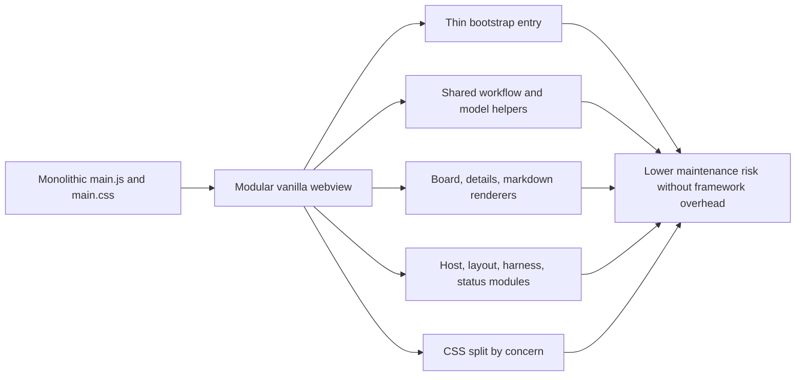

## adr_002_keep_the_plugin_webview_as_a_modular_vanilla_frontend - Keep the plugin webview as a modular vanilla frontend
> Date: 2026-03-14
> Status: Accepted
> Drivers: Improve maintainability, preserve CSP/package simplicity, avoid framework overhead, and reduce regression risk in the webview.
> Related request: `req_026_refactor_webview_frontend_structure_without_introducing_a_full_framework`
> Related backlog: `item_032_refactor_webview_frontend_structure_without_introducing_a_full_framework`
> Related task: `task_026_refactor_webview_frontend_structure_without_introducing_a_full_framework`
> Reminder: Update status, linked refs, decision rationale, consequences, migration plan, and follow-up work when you edit this doc.

# Overview
The plugin webview should stay a lightweight vanilla JS/CSS application, but it should no longer concentrate most responsibilities in `main.js` and `main.css`.
The accepted direction is a modular webview structure:
keep `main.js` as a bootstrap shell, move workflow/model helpers, host communication, renderers, and layout/harness/status concerns into dedicated files, and split CSS by UI concern.

# Context
The webview had grown incrementally until `main.js` mixed state, host bridge calls, rendering, harness behavior, status UI, and layout logic, while `main.css` mixed most visual concerns.
That structure worked but was becoming a bottleneck for review, debugging, and future changes.
At the same time, a move to React/Vite or another SPA stack would have increased packaging, CSP, and operational complexity well beyond what the plugin needed.

# Decision
Refactor the webview into explicit vanilla modules and keep the current static-asset loading model.

Implementation direction:
- `main.js` remains the entry point and state shell;
- workflow/model helpers live in a shared model module;
- host communication, layout control, harness behavior, status UI, and rendering each get clearer boundaries;
- CSS is split into concern-based files imported by `main.css`;
- tests and smoke checks are updated to validate the modular asset graph.

# Alternatives considered
- Keep the current monolithic files and accept growing maintenance cost.
- Introduce a full frontend framework and a heavier build pipeline.
- Split files mechanically without defining architectural boundaries.

# Consequences
- The webview remains easy to package and reason about in a VS Code extension context.
- Future UI work can target smaller modules with clearer contracts.
- The repo carries more frontend files, but each file is easier to review and test.
- Main bootstrap behavior stays understandable for contributors expecting a pragmatic extension webview.

# Migration and rollout
- Step 1: extract shared workflow/model helpers.
- Step 2: extract host communication and renderers.
- Step 3: extract runtime helpers such as layout, harness, and status behavior.
- Step 4: split CSS by concern and validate the packaged asset set.

# Follow-up work
- Continue reducing `main.js` only when a new extraction has a clear boundary.
- Avoid introducing framework/tooling churn unless a later request proves the current modular model insufficient.
