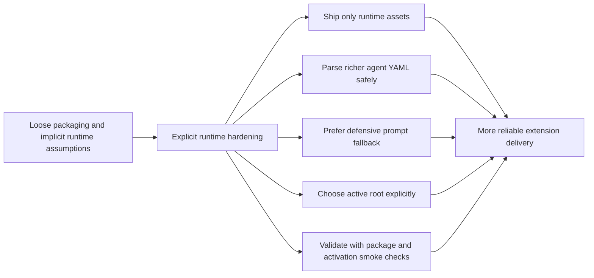

## adr_003_harden_extension_runtime_with_explicit_packaging_and_workspace_selection - Harden extension runtime with explicit packaging and workspace selection
> Date: 2026-04-09
> Status: Accepted
> Drivers: Ship a cleaner VSIX, support richer agent definitions safely, reduce brittle prompt injection, and remove ambiguous multi-root behavior.
> Related request: `req_027_harden_extension_packaging_agent_loading_and_workspace_runtime_behavior`
> Related backlog: `item_031_harden_extension_packaging_agent_loading_and_workspace_runtime_behavior`
> Related task: `task_025_harden_extension_packaging_agent_loading_and_workspace_runtime_behavior`
> Reminder: Update status, linked refs, decision rationale, consequences, migration plan, and follow-up work when you edit this doc.

# Overview
The extension runtime should prefer explicit, defensive behavior over clever but brittle shortcuts.
The accepted direction is to harden the runtime along four axes:
strict VSIX packaging boundaries, real YAML-based agent loading, safer prompt-injection fallback behavior, and explicit active-root selection in multi-root workspaces.

# Context
The extension had several pragmatic behaviors that worked locally but were increasingly hard to defend:
- the packaged VSIX included too much development material;
- the agent registry loader was stricter than normal YAML usage;
- prompt injection depended on brittle clipboard/editor behavior;
- multi-root handling effectively defaulted to the first workspace folder;
- there was no meaningful package-and-activate smoke path.

# Decision
Adopt a more explicit runtime contract:
- package only the assets needed at runtime;
- use a real YAML parser for agent definitions and validate a simple supported schema;
- degrade prompt injection earlier to safer fallback flows instead of relying on clipboard tricks;
- treat multi-root workspaces as an explicit selection problem rather than a silent first-root default;
- validate readiness through smoke checks that exercise packaging and activation.

# Alternatives considered
- Keep the existing pragmatic shortcuts and rely on local usage patterns.
- Harden only packaging while leaving parsing/runtime behavior unchanged.
- Add heavier end-to-end automation before fixing the runtime assumptions themselves.

# Consequences
- Packaging becomes cleaner and release artifacts easier to trust.
- Agent definitions can grow richer without breaking the loader.
- Prompt actions become less “magical” but more reliable.
- Multi-root behavior becomes predictable to users.
- CI gains a more realistic runtime readiness signal.

# Migration and rollout
- Step 1: constrain VSIX contents.
- Step 2: harden agent loading and tests.
- Step 3: harden prompt fallback behavior and multi-root handling.
- Step 4: validate through smoke/package checks and CI.

# Follow-up work
- Revisit whether deeper extension-host integration tests are needed beyond the current smoke level.
- Keep runtime hardening separate from the broader webview-structure refactor.

# References
- `logics/request/req_027_harden_extension_packaging_agent_loading_and_workspace_runtime_behavior.md`
- `logics/backlog/item_031_harden_extension_packaging_agent_loading_and_workspace_runtime_behavior.md`
- `logics/tasks/task_025_harden_extension_packaging_agent_loading_and_workspace_runtime_behavior.md`
