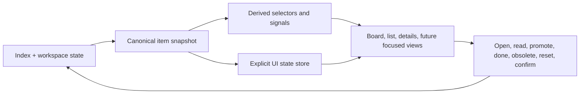

## adr_004_scale_the_plugin_around_a_derived_model_and_explicit_ui_state - Scale the plugin around a derived model and explicit UI state
> Date: 2026-04-09
> Status: Proposed
> Drivers: Keep the next wave of plugin UX work coherent, avoid feature-by-feature state sprawl, centralize workflow heuristics, and preserve the modular vanilla-webview direction.
> Related request: `req_039_improve_ui_state_persistence_in_the_plugin`
> Related backlog: `(cross-cutting follow-up across req_028 to req_044)`
> Related task: `(none yet)`
> Reminder: Update status, linked refs, decision rationale, consequences, migration plan, and follow-up work when you edit this doc.

# Overview
The next wave of plugin work should not be implemented as isolated UI tweaks layered onto `main.js`.
The target architecture should keep the existing pragmatic vanilla webview, but organize the plugin around four explicit layers:
- a canonical indexed item snapshot from the extension host;
- a derived-model layer that computes visibility, relationships, health, and workflow signals;
- an explicit UI-state layer that owns selection, filters, disclosure state, layout state, and persistence;
- focused renderers and actions that consume those two layers instead of reimplementing business rules locally.

# Context
The plugin already has a solid base:
- the extension host indexes managed docs and relationships in `src/logicsIndexer.ts`;
- the webview has a modular vanilla structure from `adr_002`;
- the current webview model already derives some useful workflow information such as companion docs, specs, and linked primary-flow items;
- the UI already persists part of its local state and supports both board and list views.

That foundation is good enough to deliver the next set of features, but only if the architecture stays disciplined.
The currently proposed portfolio from `req_028` through `req_044` clusters around a few recurring needs:
- control information density and disclosure;
- improve navigation, search, grouping, and continuity;
- add safer workflow actions;
- surface stronger derived guidance such as attention, health, and suggested actions.

Those needs all depend on the same architectural pressure points:
- `main.js` still carries too much UI state and too many coordination responsibilities;
- some visibility and workflow heuristics still live too close to rendering;
- board, list, and details are at risk of diverging if each new feature adds local logic independently;
- future signals such as health, attention, badges, and activity can easily become duplicated and inconsistent if they are computed ad hoc per surface.

# Decision
Keep the current extension-host plus modular-vanilla-webview architecture, but scale it with a stricter separation between canonical data, derived workflow logic, UI state, rendering, and actions.

Implementation direction:
- `src/` remains responsible for workspace access, indexing, maintenance operations, and canonical payload creation;
- the webview consumes a stable item snapshot and does not infer filesystem truth on its own;
- derived workflow logic is centralized in pure selector/signal functions instead of being spread across renderers or event handlers;
- local UI concerns such as filters, search, selected item, collapsed groups, collapsed detail sections, layout mode, and restored scroll state move under an explicit UI-state boundary;
- renderers become presentation-focused consumers of selectors and UI state;
- actions such as `done`, `obsolete`, `reset filters`, and future guided flows use centralized action policy and confirmation rules rather than surface-specific behavior.

This architecture is meant to absorb the next feature wave without abandoning the lightweight webview model adopted in `adr_002`.

# Target module boundaries
The intended boundary map is:

- `src/logicsIndexer.ts`
  - owns canonical managed-doc indexing and relationship extraction;
  - remains the source of truth for item snapshots sent to the webview.

- `src/extension.ts` and host-side helpers
  - own commands, file mutations, confirmation orchestration where host authority is required, and payload refresh.

- `media/logicsModel.js`
  - becomes the home of pure derived selectors over indexed items;
  - should absorb visibility selectors, grouping/sorting helpers, linked summaries, health rules, attention rules, suggested-action rules, and future activity derivation.

- `media/uiState` or equivalent extracted module
  - should own current-view state, disclosure state, persisted state keys, responsive overrides, and restoration policy;
  - should prevent new persistence logic from being scattered throughout `main.js`.

- `media/renderBoard.js`, `media/renderList.js`, `media/renderDetails.js`, and future focused renderers
  - should render state they are given;
  - should not become the source of workflow heuristics.

- `media/hostApi.js` plus future action-policy helpers
  - should own the boundary between UI intent and host-side actions;
  - should centralize confirmation and recoverability rules for sensitive actions.

- `media/main.js`
  - should stay the bootstrap and composition shell;
  - should wire modules together, not keep growing as the place where every new feature lands.

# Architectural rules
To keep the plugin coherent, the next items should follow these rules:

- Derive once, render many times.
  If a signal is needed in board, list, details, and an attention view, it belongs in selectors, not in each renderer.

- Persist explicit state, not incidental DOM behavior.
  Collapsed groups, collapsed sections, selected item, view mode, and scroll restoration should be tracked as named state, not rediscovered ad hoc from the DOM.

- Keep canonical data separate from local interpretation.
  The extension host owns the item snapshot; the webview owns local viewing state; selectors connect the two.

- Keep list and board as alternate views over the same model.
  Search, sort, grouping, health, and attention logic should not fork between the two surfaces.

- Keep intelligence explainable.
  Attention, health, and suggested-action signals must come from a small set of understandable heuristics, not opaque scoring.

- Prefer action policies over per-button exceptions.
  Confirmation, reset behavior, and similar safeguards should not be reimplemented independently by each surface.

# Alternatives considered
- Keep adding requested features directly into `main.js` and the existing renderers.
- Introduce a full SPA framework and move the plugin to a heavier frontend stack.
- Keep the current modular files but avoid introducing a distinct selector layer and UI-state boundary.

# Consequences
- The plugin can absorb search, grouping, persistence, health, attention, and navigation features without fragmenting its rules across surfaces.
- The webview stays lightweight and extension-friendly, but future work requires a bit more discipline up front.
- Some near-term items may benefit from small refactors before the visible UX change lands.
- Review quality should improve because behavioral changes can be evaluated in smaller, clearer modules.

# Migration and rollout
- Step 1: extract or clarify a UI-state boundary from `media/main.js`.
- Step 2: move visibility, grouping, sorting, and future workflow signals into selector-style helpers in `media/logicsModel.js` or adjacent modules.
- Step 3: separate board and list rendering concerns more explicitly so both consume the same selectors.
- Step 4: centralize disclosure-state and persistence policy for sections, groups, layout, and restored context.
- Step 5: land safer action-policy handling for reset and confirmation flows.
- Step 6: only then layer in stronger derived views such as attention, health, suggested actions, and activity.

# Recommended delivery order
The proposed portfolio should be tackled in this order:

- First: architecture-enabling UX and safety work
  - `req_029_default_collapsed_secondary_sections_in_detail_panel`
  - `req_031_remove_column_eye_toggle_from_board`
  - `req_032_enable_horizontal_scrolling_for_board_columns`
  - `req_033_allow_collapsing_and_expanding_groups_in_list_mode`
  - `req_028_add_reset_action_for_filter_defaults`
  - `req_030_add_confirmation_for_done_and_obsolete_actions`

- Second: navigation and continuity
  - `req_035_add_full_keyboard_navigation_to_the_plugin`
  - `req_036_add_instant_local_search_to_the_plugin`
  - `req_037_add_sorting_and_grouping_options_to_the_plugin`
  - `req_039_improve_ui_state_persistence_in_the_plugin`

- Third: derived guidance features
  - `req_040_add_attention_required_view_to_the_plugin`
  - `req_042_add_suggested_action_badges_to_the_plugin`
  - `req_044_add_stronger_item_health_signals_to_the_plugin`
  - `req_041_add_activity_timeline_to_the_plugin`

- Fourth: adoption and affordance polish
  - `req_038_add_compact_preview_for_items_in_the_plugin`
  - `req_043_improve_plugin_onboarding_and_empty_states`

- Side track:
  - `req_034_remove_vite_cjs_node_api_deprecation_warning_from_test_runs`

# Follow-up work
- If accepted, use this ADR as the architecture reference for the `req_028` to `req_044` portfolio.
- Consider creating one explicit technical task for extracting UI-state and selector boundaries before landing the more intelligence-heavy features.
- Revisit whether `media/logicsModel.js` should remain a single module or split into `selectors`, `signals`, and `relations` once the next feature wave starts landing.

# References
- `logics/request/req_039_improve_ui_state_persistence_in_the_plugin.md`
