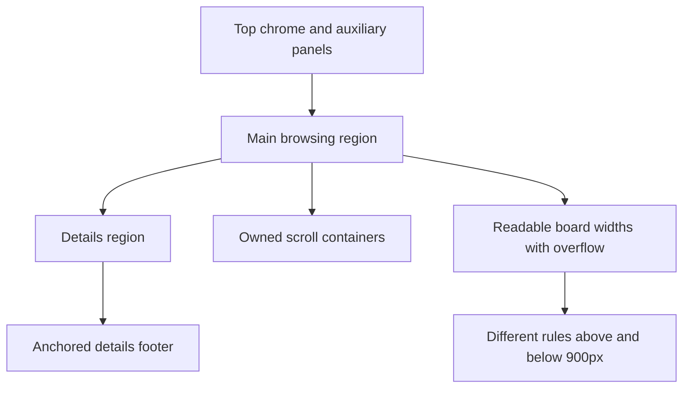

## adr_005_define_responsive_layout_scroll_and_sizing_rules_for_plugin_views - Define responsive layout, scroll, and sizing rules for plugin views
> Date: 2026-04-09
> Status: Accepted
> Drivers: Stop recurring layout regressions in board/list/details views, keep the plugin within the visible webview viewport, prevent detail-panel loss in stacked mode, and preserve readable board columns under width pressure.
> Related request: `req_045_move_secondary_view_controls_into_a_toggleable_second_toolbar_row`, `req_048_strengthen_webview_regression_tests_for_list_filters_and_layout_css`, `req_049_keep_detail_panel_actions_fixed_at_the_bottom_while_content_scrolls`, `req_053_preserve_readable_board_columns_by_preventing_column_compression`
> Related backlog: `item_050_move_secondary_view_controls_into_a_toggleable_second_toolbar_row`, `item_053_strengthen_webview_regression_tests_for_list_filters_and_layout_css`, `item_054_keep_detail_panel_actions_fixed_at_the_bottom_while_content_scrolls`, `item_062_preserve_readable_board_columns_by_preventing_column_compression`
> Related task: `task_044_move_secondary_view_controls_into_a_toggleable_second_toolbar_row`, `task_058_strengthen_webview_regression_tests_for_list_filters_and_layout_css`, `task_059_keep_detail_panel_actions_fixed_at_the_bottom_while_content_scrolls`, `task_067_preserve_readable_board_columns_by_preventing_column_compression`
> Reminder: Update status, linked refs, overview mermaid, decision rationale, consequences, migration plan, and follow-up work when you edit this doc.

# Overview
The plugin layout must stop behaving like an unbounded document whose panels compete incidentally for space.
This ADR fixes the contract for:
- viewport ownership,
- scroll ownership,
- vertical panel anchoring,
- horizontal width budgeting,
- and responsive behavior above and below `900px`.

# Context
Several visible regressions came from the same architectural weakness:
- the whole webview page could still behave as if it were taller than the visible viewport;
- stacked mode could push the splitter and `Details` panel off-screen;
- collapsed details could become hard to recover;
- toolbar/help/activity growth could steal too much vertical space;
- board mode could resolve horizontal pressure by crushing columns instead of overflowing.

These are not isolated CSS bugs.
They are layout-contract failures.

# Decision
Adopt the following layout rules as the plugin contract.

## 1. Viewport ownership
- `html` and `body` are bounded to the visible webview viewport.
- The document itself does not become the fallback scroll container.
- The main plugin layout consumes the remaining visible viewport after top chrome.

## 2. Major regions
- The plugin is split into:
  - top chrome and auxiliary panels,
  - the main browsing region,
  - the `Details` region.
- Each region has an explicit size budget.
- No region may silently force the whole page to grow beyond the visible viewport.

## 3. Scroll ownership
- There is one primary scroll owner per major region.
- In list mode, the list region owns vertical scroll.
- In board mode, the board rail owns horizontal overflow and its browsing area owns its own vertical scroll budget.
- The `Details` body owns detail-content scrolling.
- Auxiliary panels such as `Activity` scroll internally when bounded.

## 4. Rules above `900px`
- Layout is horizontal.
- The `Details` panel remains visible as a bounded side panel.
- Board columns keep a stable readable width and do not compress to absorb remaining width.
- If horizontal room is insufficient, the board rail scrolls horizontally.

## 5. Rules below `900px`
- Layout is stacked.
- The `Details` panel is anchored at the bottom of the visible layout.
- The splitter is anchored directly above `Details`.
- Growing list/board content must scroll beneath the anchored splitter instead of pushing the bottom panel down.

## 6. Collapsed details behavior
- Collapsed `Details` stays recoverable as a compact bottom bar.
- Hidden body/actions must not continue to reserve stray height.
- Re-expanding the panel must always be possible from the visible viewport.

## 7. Detail footer behavior
- The `Details` actions are structurally separated from the scrollable body.
- The action footer keeps a stable footprint.
- Long detail content scrolls above it instead of moving the footer.

## 8. Top chrome and auxiliary panels
- Header/toolbar may stay sticky at the top.
- Secondary toolbar row, help banner, and `Activity` belong to the top budget.
- They must not make the whole page taller than the viewport.
- `Activity` is height-bounded and scrolls internally if needed.

## 9. Board readability contract
- Board columns have a readable width contract.
- Horizontal overflow is preferred over unreadable narrowing.
- The same rule applies to primary-flow and companion-doc columns.

## 10. Responsive fallback
- Forced list mode below the narrow breakpoint remains valid.
- Responsive fallbacks may change presentation mode, but they must still respect the viewport, scroll, and anchoring rules above.

# Consequences
- Layout work must now be evaluated as a budget/ownership change, not just a local CSS tweak.
- New toolbar/activity/detail work must prove it preserves these contracts.
- Board work must preserve readable columns and let overflow happen when needed.
- Regression tests should lock these rules with targeted selector-level assertions.

# Guardrails for future work
- Do not let `body` become the practical scroll fallback.
- Do not let board/list content move the splitter in stacked mode.
- Do not let collapsed `Details` keep hidden height from body/actions.
- Do not solve board width pressure by shrinking columns below readable width.
- Do not add a new vertical panel without deciding who gives up space and who scrolls.

# Follow-up work
- Use this ADR as a required reference for:
  - `item_050` / `task_044`
  - `item_053` / `task_058`
  - `item_054` / `task_059`
  - `item_062` / `task_067`
- Re-check future board/detail responsive changes against this contract before implementation.

# Alternatives considered
- Let each view grow independently and rely on browser defaults for scroll behavior.
- Rejected because it reintroduces the same viewport, splitter, and footer regressions that this ADR is meant to prevent.

# Migration and rollout
- Apply the new layout contract incrementally in the plugin view layer.
- Update the affected board, list, details, and activity containers to respect the explicit scroll and height budgets.
- Add or refresh regression tests for stacked mode, bounded details, and board overflow before treating the contract as stable.

# References
- `logics/request/req_045_move_secondary_view_controls_into_a_toggleable_second_toolbar_row.md`
- `logics/request/req_048_strengthen_webview_regression_tests_for_list_filters_and_layout_css.md`
- `logics/request/req_049_keep_detail_panel_actions_fixed_at_the_bottom_while_content_scrolls.md`
- `logics/request/req_053_preserve_readable_board_columns_by_preventing_column_compression.md`
- `logics/backlog/item_050_move_secondary_view_controls_into_a_toggleable_second_toolbar_row.md`
- `logics/backlog/item_053_strengthen_webview_regression_tests_for_list_filters_and_layout_css.md`
- `logics/backlog/item_054_keep_detail_panel_actions_fixed_at_the_bottom_while_content_scrolls.md`
- `logics/backlog/item_062_preserve_readable_board_columns_by_preventing_column_compression.md`
- `logics/tasks/task_044_move_secondary_view_controls_into_a_toggleable_second_toolbar_row.md`
- `logics/tasks/task_058_strengthen_webview_regression_tests_for_list_filters_and_layout_css.md`
- `logics/tasks/task_059_keep_detail_panel_actions_fixed_at_the_bottom_while_content_scrolls.md`
- `logics/tasks/task_067_preserve_readable_board_columns_by_preventing_column_compression.md`
