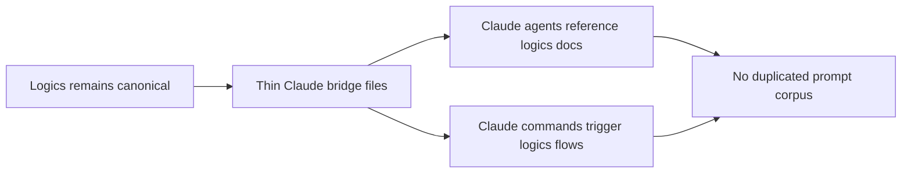

## adr_006_keep_claude_code_bridge_files_thin_and_derivative_of_logics - Keep Claude Code bridge files thin and derivative of Logics
> Date: 2026-03-16
> Status: Accepted
> Drivers: Keep `logics/` as the canonical workflow source, avoid duplicated agent definitions across assistant formats, preserve current plugin contracts, and enable Claude Code adoption with a minimal repo-level bridge.
> Related request: `req_055_add_a_minimal_claude_code_bridge_for_logics_agents`
> Related backlog: `item_064_add_a_minimal_claude_code_bridge_for_logics_agents`
> Related task: `task_069_add_a_minimal_claude_code_bridge_for_logics_agents`
> Reminder: Update status, linked refs, decision rationale, consequences, migration plan, and follow-up work when you edit this doc.

# Overview
Claude Code support should be added as a thin adapter layer at repo root, while the real workflow memory, instructions, and agent conventions stay owned by `logics/`.

This decision keeps Claude integration small, explicit, and derivative so the repository does not drift into parallel prompt systems for Codex and Claude.

# Context
The Logics kit already works across assistants at the document and script level:
- workflow state and repo memory live in `logics/`;
- reusable instructions live in `logics/instructions.md` and `logics/skills/*/SKILL.md`;
- the current VS Code plugin still depends on `logics/skills/*/agents/openai.yaml`.

Claude Code introduces a different project-level integration shape based on `.claude/agents/*.md` and `.claude/commands/*.md`.
Without an explicit architectural rule, the repo would likely drift into one of two bad outcomes:
- a second prompt/configuration tree at `.claude/` that starts competing with `logics/`;
- or a bridge so thin and inconsistent that it adds noise without making Claude Code meaningfully easier to use.

The bridge therefore needs an ownership contract, not just a file placement convention.

# Decision
Adopt the following repository contract for Claude Code integration.

## 1. Source of truth
- `logics/` remains the canonical workflow and agent knowledge base.
- The authoritative instructions stay in `logics/instructions.md`, `logics/skills/*/SKILL.md`, and workflow scripts under `logics/skills/*/scripts/`.

## 2. Claude bridge shape
- `.claude/` is allowed only as a thin Claude Code adapter layer.
- `.claude/agents/*.md` and `.claude/commands/*.md` may exist to expose project entrypoints that Claude Code can discover natively.
- These files should point Claude back to canonical Logics docs and scripts instead of restating detailed rules locally.

## 3. Duplication guardrail
- Do not create a second detailed prompt corpus in `.claude/`.
- Do not manually mirror the full content of `openai.yaml` manifests or `SKILL.md` files into Claude bridge files.
- If a future sync/generation step is added, it must preserve the same ownership model rather than move ownership into `.claude/`.

## 4. Scope of the first pass
- The first implementation pass should focus on the workflow-oriented entrypoint around request creation and flow management.
- Existing Codex/plugin behavior and the current `openai.yaml` contract remain unchanged in this milestone.

# Alternatives considered
- Keep the repo Claude-agnostic and rely only on direct document/script access.
  - Rejected because it leaves Claude Code usable but not natively discoverable at the project level.
- Move assistant ownership into `.claude/` and treat `logics/` as a secondary knowledge base.
  - Rejected because it inverts the existing architecture and creates duplicated maintenance work.
- Build a broad one-to-one wrapper set for every Logics skill immediately.
  - Rejected because it adds too much surface area before the ownership model is proven.

# Consequences
- Claude Code support becomes cleaner without forcing a migration away from the current Logics kit structure.
- Future Claude bridge additions must stay intentionally small and reference-driven.
- The plugin can continue using `openai.yaml` manifests without being blocked by Claude integration work.
- Any future generator or sync mechanism must preserve `logics/` as the conceptual owner.

# Migration and rollout
- Create only the minimal `.claude/` bridge files needed for the first workflow entrypoints.
- Link the request, backlog item, and task to this ADR before implementation continues.
- Validate the resulting doc chain with the workflow audit before marking the planning docs ready for delivery.

# References
- `logics/request/req_055_add_a_minimal_claude_code_bridge_for_logics_agents.md`
- `logics/backlog/item_064_add_a_minimal_claude_code_bridge_for_logics_agents.md`
- `logics/tasks/task_069_add_a_minimal_claude_code_bridge_for_logics_agents.md`
- `logics/instructions.md`
- `logics/skills/logics-flow-manager/SKILL.md`

# Follow-up work
- Use this ADR as the required architecture reference for `item_064` and `task_069`.
- Keep any first-pass `.claude/` implementation scoped to thin wrappers around request and flow management.
