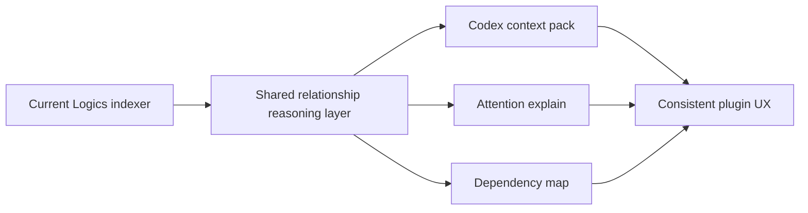

## adr_007_centralize_plugin_relationship_reasoning_for_context_packs_attention_explain_and_dependency_map - Centralize plugin relationship reasoning for context packs attention explain and dependency map
> Date: 2026-04-09
> Status: Accepted
> Drivers: Avoid duplicate graph traversal logic, keep context assembly and attention explanations consistent, preserve the Markdown-backed Logics model, and make a dependency map feasible without a separate relationship subsystem.
> Related request: `req_056_add_codex_context_pack_attention_explain_and_dependency_map`
> Related backlog: `item_065_build_codex_context_pack_for_related_logics_docs`, `item_066_explain_attention_reasons_and_suggested_remediation`, `item_067_add_dependency_map_for_logics_workflow_relationships`
> Related task: `task_070_orchestration_delivery_for_req_056_context_pack_attention_explain_and_dependency_map`
> Reminder: Update status, linked refs, decision rationale, consequences, migration plan, and follow-up work when you edit this doc.

# Overview
The plugin should introduce a shared relationship-reasoning layer that sits between raw Logics indexing and higher-level UX features.

This layer becomes the common source for:
- Codex context-pack assembly;
- attention-reason classification and remediation hints;
- dependency-map graph shaping and navigation state.

# Context
The extension already computes a useful relationship graph through `src/logicsIndexer.ts` and related host-side logic.
That graph currently powers:
- board and list rendering;
- detail-panel references and `Used by`;
- status and workflow heuristics.

The planned feature set in `req_056` expands the use of that graph in three different directions:
- assembling a compact AI context pack;
- explaining why an item is in attention scope;
- rendering a navigable dependency map.

Without an explicit architectural rule, each feature could independently implement its own traversal logic, inclusion heuristics, and graph-shaping behavior.
That would create drift quickly:
- context packs could include a different set of related docs than the dependency map;
- attention explanations could classify relationships differently from what the graph view shows;
- fixes in one relationship path could be missed in the others.

# Decision
Adopt a shared plugin-level relationship-reasoning layer as the architectural base for these features.

This means:
- raw managed-doc indexing remains the responsibility of the current Logics indexer;
- a shared reasoning layer derives normalized relationships, bounded traversals, explanation signals, and view-friendly graph slices from that index;
- `Context Pack for Codex`, `Attention Explain`, and `Dependency Map` consume that shared layer instead of inventing feature-local graph logic.

The shared layer should be capable of:
- resolving direct parent and child workflow relationships;
- exposing linked companion docs and specs consistently;
- computing bounded subgraphs around a selected item;
- emitting explainable attention reasons and associated remediation metadata;
- supporting deterministic trimming or prioritization for AI context assembly.

# Alternatives considered
- Keep all three features independent and let each one traverse the raw index directly.
  - Rejected because it would duplicate traversal logic and increase behavior drift.
- Build the dependency map first and let the other features reuse its data model later.
  - Rejected because the map is only one consumer; the common need is the reasoning layer, not the map UI.
- Replace the existing indexer with a brand new graph store or persistence layer.
  - Rejected because the current Markdown-backed Logics model is sufficient and should remain the source of truth.

# Consequences
- Relationship fixes and heuristics can be corrected once and reused across all three feature families.
- The first implementation needs a deliberate abstraction boundary before UI work accelerates.
- The plugin remains grounded in the existing derived model instead of adding a second persistence mechanism.
- Future relationship-driven features can build on the same layer if they follow the same contract.

# Migration and rollout
- Introduce the shared reasoning layer first as part of `task_070`.
- Land `item_065` on top of that layer for context-pack assembly and preview behavior.
- Land `item_066` on the same layer for reason classification and remediation guidance.
- Land `item_067` last as a bounded, selected-item dependency-map experience.
- Keep rollout incremental across versions if needed, but do not bypass the shared layer for short-term delivery speed.

# References
- `logics/request/req_056_add_codex_context_pack_attention_explain_and_dependency_map.md`
- `logics/backlog/item_065_build_codex_context_pack_for_related_logics_docs.md`
- `logics/backlog/item_066_explain_attention_reasons_and_suggested_remediation.md`
- `logics/backlog/item_067_add_dependency_map_for_logics_workflow_relationships.md`
- `logics/tasks/task_070_orchestration_delivery_for_req_056_context_pack_attention_explain_and_dependency_map.md`
# Follow-up work
- Use this ADR as the required architecture reference for `item_065`, `item_066`, `item_067`, and `task_070`.
- Keep the first dependency map bounded to a selected-item subgraph rather than a whole-workspace graph.
- Keep the context-pack and attention-explain implementations aligned to the same shared relationship semantics.
