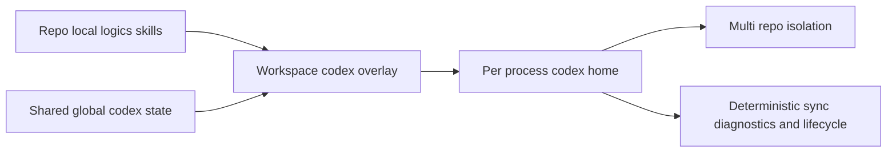

## adr_008_keep_codex_workspace_overlays_repo_local_isolated_and_composable - Keep Codex workspace overlays repo local isolated and composable
> Date: 2026-03-22
> Status: Superseded
> Drivers: Keep `logics/skills/` as the canonical source of truth, support multiple active repositories concurrently, prevent global skill collisions, preserve shared user-level Codex state where appropriate, and keep overlay operations diagnosable across platforms.
> Related request: `req_067_add_multi_project_codex_workspace_overlays_for_logics_skills`, `req_069_add_an_operator_facing_logics_codex_workspace_manager_cli`, `req_070_define_workspace_overlay_precedence_and_coexistence_with_global_codex_skills`, `req_071_add_diagnostics_and_self_healing_for_codex_workspace_overlays`, `req_072_harden_cross_platform_overlay_publication_for_symlink_junction_and_copy_fallback`, `req_073_add_concurrent_multi_repo_validation_for_codex_workspace_overlays`, `req_074_define_workspace_identity_and_overlay_lifecycle_for_moved_or_renamed_repositories`
> Related backlog: `item_090_add_multi_project_codex_workspace_overlays_for_logics_skills`, `item_092_add_an_operator_facing_logics_codex_workspace_manager_cli`, `item_093_define_workspace_overlay_precedence_and_coexistence_with_global_codex_skills`, `item_094_add_diagnostics_and_self_healing_for_codex_workspace_overlays`, `item_095_harden_cross_platform_overlay_publication_for_symlink_junction_and_copy_fallback`, `item_096_add_concurrent_multi_repo_validation_for_codex_workspace_overlays`, `item_097_define_workspace_identity_and_overlay_lifecycle_for_moved_or_renamed_repositories`
> Related task: (none yet)
> Superseded by: `adr_013_replace_repo_local_codex_workspace_overlays_with_a_global_published_logics_kit`
> Reminder: Update status, linked refs, decision rationale, consequences, migration plan, and follow-up work when you edit this doc.

# Overview
Codex integration for Logics should use per-workspace overlays instead of a single shared global skill pool.

Each repository keeps ownership of its skills under `logics/skills/`, while each Codex process runs against a workspace-specific `CODEX_HOME` projection that exposes only the relevant repo-local skills plus the shared Codex state that must remain global.

# Context
Codex skill installation is global by default, which is a poor fit for Logics kit reuse across many repositories.

The main failure modes are architectural, not cosmetic:
- same-named skills from different repos can collide in `~/.codex/skills`;
- different repositories may intentionally be on different kit revisions;
- several Codex sessions may be active at once, so switching one global active project is not sufficient;
- cross-platform filesystem differences complicate publication and cleanup;
- operator tooling, diagnostics, and validation all depend on a stable runtime contract.

The overlay portfolio in `req_067`, `req_069`, `req_070`, `req_071`, `req_072`, `req_073`, and `req_074` is all downstream of the same decision:
- the repo remains the owner of Logics skills;
- workspace overlays are runtime projections, not a second source of truth;
- shared user-level Codex state is reused deliberately rather than copied blindly.

# Decision
Adopt the following architecture contract for Codex workspace overlays.

## 1. Source of truth
- `logics/skills/` remains the canonical owner of repository-local Logics skills.
- Workspace overlays must project those skills; they must not become an independently maintained skill tree.

## 2. Runtime isolation boundary
- Each active repository may materialize its own workspace-specific `CODEX_HOME`.
- Codex processes must run against that workspace overlay rather than against the shared global `~/.codex` home when repo-local Logics skills are required.
- Multiple repositories may remain active concurrently because isolation happens per process, not through one mutable global active-project switch.

## 3. Shared global state
- Shared user-level Codex state may still remain global when it is conceptually user-owned rather than repo-owned.
- At minimum, this includes authentication, stable config, and system skills.
- Repo-local skills projected into the overlay take precedence over same-named user-global skills inside that workspace runtime.
- User-global skills may still be composed into overlays when they do not violate deterministic resolution.

## 4. Publication model
- Overlay publication is a runtime projection concern, not an ownership concern.
- The system may use symlinks, Windows-friendly junctions, or copy fallback depending on platform constraints, but all modes must preserve repo-local ownership and deterministic refresh behavior.

## 5. Operational model
- Operator tooling, diagnostics, validation, precedence rules, and workspace identity should all build on this same overlay contract.
- Those concerns may be delivered in separate backlog slices, but they must not redefine the boundary between repo ownership, overlay runtime state, and shared global Codex state.

# Alternatives considered
- Publish all Logics skills permanently into the shared global `~/.codex/skills` pool.
  - Rejected because it collapses repository boundaries, mixes versions, and makes concurrent multi-repo use unsafe.
- Keep one global active-project switch that rewrites the global Codex home when the user changes repo.
  - Rejected because it does not support parallel active sessions cleanly.
- Copy every repo-local skill into workspace overlays as a second maintained tree.
  - Rejected because it increases drift risk and weakens `logics/skills/` as the source of truth.

# Consequences
- Workspace overlays become a supported runtime boundary for Logics-aware Codex usage.
- Repo-local skills remain portable and reviewable where they already live.
- Shared user-level Codex state remains reusable without turning `~/.codex` into the owner of Logics skills.
- Precedence, diagnostics, lifecycle, and validation can now be designed against one stable architecture instead of ad hoc filesystem conventions.

# Migration and rollout
- Use this ADR as the architecture reference for the overlay backlog portfolio before implementation continues.
- Implement the operator-facing workspace manager on top of this runtime contract.
- Implement precedence, diagnostics, publication, validation, and lifecycle rules as separate slices that refine this architecture without replacing it.
- Validate the resulting doc chain and future task links against this ADR as the overlay work advances.

# References
- `logics/architecture/adr_006_keep_claude_code_bridge_files_thin_and_derivative_of_logics.md`
- `logics/request/req_067_add_multi_project_codex_workspace_overlays_for_logics_skills.md`
- `logics/request/req_069_add_an_operator_facing_logics_codex_workspace_manager_cli.md`
- `logics/request/req_070_define_workspace_overlay_precedence_and_coexistence_with_global_codex_skills.md`
- `logics/request/req_071_add_diagnostics_and_self_healing_for_codex_workspace_overlays.md`
- `logics/request/req_072_harden_cross_platform_overlay_publication_for_symlink_junction_and_copy_fallback.md`
- `logics/request/req_073_add_concurrent_multi_repo_validation_for_codex_workspace_overlays.md`
- `logics/request/req_074_define_workspace_identity_and_overlay_lifecycle_for_moved_or_renamed_repositories.md`
- `logics/backlog/item_090_add_multi_project_codex_workspace_overlays_for_logics_skills.md`
- `logics/backlog/item_092_add_an_operator_facing_logics_codex_workspace_manager_cli.md`
- `logics/backlog/item_093_define_workspace_overlay_precedence_and_coexistence_with_global_codex_skills.md`
- `logics/backlog/item_094_add_diagnostics_and_self_healing_for_codex_workspace_overlays.md`
- `logics/backlog/item_095_harden_cross_platform_overlay_publication_for_symlink_junction_and_copy_fallback.md`
- `logics/backlog/item_096_add_concurrent_multi_repo_validation_for_codex_workspace_overlays.md`
- `logics/backlog/item_097_define_workspace_identity_and_overlay_lifecycle_for_moved_or_renamed_repositories.md`

# Follow-up work
- Use this ADR as the required architecture reference for `item_090`, `item_092`, `item_093`, `item_094`, `item_095`, `item_096`, and `item_097`.
- Keep future overlay tasks aligned to the same ownership split: repo-local skills, workspace runtime projection, and shared global Codex state.
