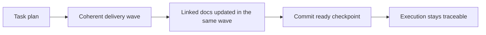

## adr_009_treat_logics_task_waves_as_coherent_documented_commit_checkpoints - Treat Logics task waves as coherent documented commit checkpoints
> Date: 2026-03-22
> Status: Accepted
> Drivers: Keep tasks execution-ready instead of vague, make documentation updates part of the delivery wave that changes behavior, encourage clean git checkpoints without forcing commits after every micro-step, and preserve operator review over commit creation.
> Related request: `req_075_strengthen_logics_task_waves_with_commit_and_documentation_update_checkpoints`
> Related backlog: `item_098_strengthen_logics_task_waves_with_commit_and_documentation_update_checkpoints`
> Related task: (none yet)
> Reminder: Update status, linked refs, decision rationale, consequences, migration plan, and follow-up work when you edit this doc.

# Overview
Logics tasks should model execution as coherent delivery waves.

Each meaningful wave should end in a repository state that is implementationally coherent, documentation-aware, and suitable for a commit checkpoint, while still leaving explicit operator control over whether and when the commit is created.

# Context
The current Logics task model already nudges good delivery hygiene, but it still leaves an important operational gap.

Tasks usually say:
- validate the result;
- update linked Logics docs;
- finish with a coherent report.

What they do not yet state clearly enough is the checkpoint contract between implementation, documentation, and git hygiene.
That creates drift in practice:
- code can move through several partial states without a clear wave boundary;
- documentation updates can slide to the end instead of tracking the implementation wave that changed behavior;
- contributors can leave a large uncheckpointed diff instead of progressing through coherent reviewable slices.

The task system should push toward a stronger middle ground:
- not a commit after every tiny checklist bullet;
- but also not a long ambiguous implementation span with delayed docs and no clean checkpoint.

# Decision
Adopt the following execution contract for Logics tasks.

## 1. Wave as the meaningful delivery unit
- A task should be executed through meaningful waves or checkpoints rather than as one undifferentiated implementation blob.
- A wave may span several micro-steps, but it should still represent a coherent delivery slice.

## 2. Documentation belongs inside the wave
- Any Logics docs materially affected by a wave should be updated as part of that wave.
- Documentation updates are not only a final closure chore; they are part of keeping the repository state truthful as implementation progresses.

## 3. Commit checkpoint expectation
- A meaningful completed wave should ideally leave the repository in a commit-ready state.
- This is a checkpoint expectation, not a rule to auto-commit after every checklist bullet.
- The operator still decides whether and when to create the commit.

## 4. Tooling and governance
- The task template, generated task plan, and `Definition of Done` should express this checkpoint contract explicitly.
- Lint or audit support may reinforce the contract at warning level, but the architecture does not require automatic commit creation.

# Alternatives considered
- Require a commit after every single task checklist line.
  - Rejected because it is too rigid for real implementation flow and turns the task plan into git ceremony.
- Treat commits and doc updates as entirely contributor-specific habits outside the task model.
  - Rejected because it weakens traceability and makes task execution less reproducible.
- Auto-commit task changes from tooling.
  - Rejected because commit creation should remain under explicit operator review.

# Consequences
- Tasks can become stronger execution contracts without forcing one branch or commit-message convention.
- Documentation drift should reduce because the expected update point moves closer to the implementation wave that caused the change.
- Contributors keep control over actual commit creation while still being guided toward cleaner checkpoints.
- Future lint or audit checks can evaluate checkpoint hygiene against an explicit architectural rule.

# Migration and rollout
- Use this ADR as the architecture reference for task-wave governance work before implementation continues.
- Update the task template and generated plan defaults to express the wave/checkpoint model.
- Update `Definition of Done` wording so commit-ready and documentation-ready checkpoints are explicit.
- Add warning-level governance later if template and generation changes are not sufficient on their own.

# References
- `logics/request/req_021_propose_commit_after_bootstrap_with_generated_message.md`
- `logics/request/req_075_strengthen_logics_task_waves_with_commit_and_documentation_update_checkpoints.md`
- `logics/backlog/item_098_strengthen_logics_task_waves_with_commit_and_documentation_update_checkpoints.md`

# Follow-up work
- Use this ADR as the required architecture reference for `item_098` and its future execution task.
- Keep any enforcement guidance checkpoint-oriented rather than micro-step-oriented.
