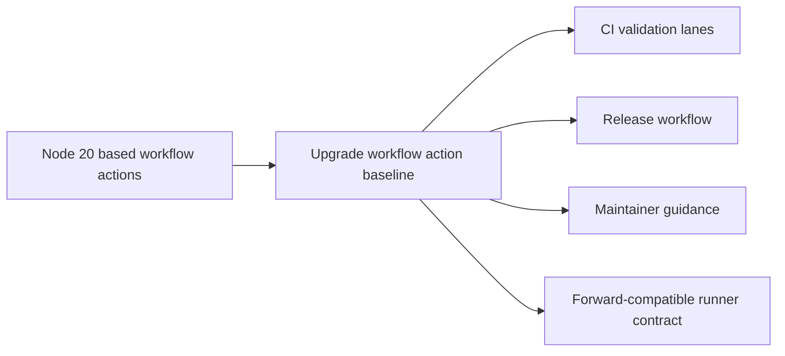

## adr_010_pin_github_actions_to_a_node_24_compatible_baseline - Pin GitHub Actions to a Node 24 compatible baseline
> Date: 2026-04-09
> Status: Accepted
> Drivers: GitHub runner compatibility, CI stability on Ubuntu and Windows, predictable release automation
> Related request: `req_079_migrate_github_actions_off_node_20_before_runner_deprecation`
> Related backlog: `item_102_migrate_github_actions_off_node_20_before_runner_deprecation`
> Related task: `task_091_migrate_github_actions_off_node_20_before_runner_deprecation`
> Reminder: Update status, linked refs, decision rationale, consequences, migration plan, and follow-up work when you edit this doc.

# Overview
Keep repository workflows on GitHub-hosted action versions that are compatible with the post-Node-20 runner contract, rather than waiting for the runner default flip to expose breakage during CI or release publication.

# Context
- Current workflow runs emit a deprecation warning because `actions/checkout@v4`, `actions/setup-node@v4`, and `actions/setup-python@v5` still rely on the Node 20 JavaScript action runtime.
- GitHub has announced that hosted runners will default JavaScript actions to Node 24 starting on June 2, 2026.
- This repository depends on CI and release workflows for multi-platform validation, VSIX packaging, and release publication, so a late migration would directly threaten delivery confidence.

# Decision
- Audit the workflow files that use GitHub-hosted JavaScript actions and move them to maintained versions that explicitly support the post-Node-20 runner contract.
- Pin the repository workflows to `actions/checkout@v6`, `actions/setup-node@v6`, and `actions/setup-python@v6`, while keeping the repository build toolchain on `node-version: 20` until a separate runtime-upgrade decision is made.
- Keep the migration small and workflow-focused: update the action versions, keep the existing validation matrix and release gates, and only change maintainer documentation when action behavior or requirements actually shift.
- Treat Ubuntu and Windows parity as part of the decision, not a follow-up nice-to-have.

# Alternatives considered
- Keep the current action versions and accept the warning until GitHub flips the default runtime.
This was rejected because it turns a known compatibility transition into a future release risk with little benefit.
- Rewrite affected workflow steps to avoid GitHub-hosted JavaScript actions where possible.
This was rejected for now because the current issue is action-runtime compatibility, not an inability to express the workflow with supported maintained actions.

# Consequences
- CI and release maintenance now includes tracking action-runtime compatibility in addition to normal Node and Python toolchain compatibility.
- The repository should avoid a time-compressed workflow migration when GitHub enforces the Node 24 default.
- The hosted-action runtime migration is now decoupled from any future decision to move the extension build itself off Node 20.
- If action major versions or contracts change, documentation and validation scripts may need minor follow-up updates.

# Migration and rollout
- Update the relevant actions in `ci.yml` and `release.yml`.
- Run repository validation on Ubuntu and Windows after the upgrade.
- Update maintainer-facing release or CI guidance if the workflow contract changes.

# References
- `logics/request/req_079_migrate_github_actions_off_node_20_before_runner_deprecation.md`
- `logics/backlog/item_102_migrate_github_actions_off_node_20_before_runner_deprecation.md`
- `logics/tasks/task_091_migrate_github_actions_off_node_20_before_runner_deprecation.md`
# Follow-up work
- Implemented in `task_091_migrate_github_actions_off_node_20_before_runner_deprecation`.
