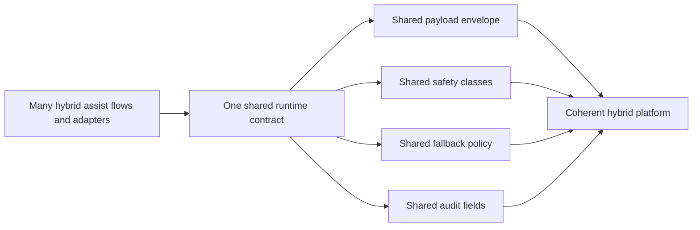

## adr_011_keep_hybrid_assist_runtime_contracts_shared_backend_agnostic_and_safely_bounded - Keep hybrid assist runtime contracts shared, backend-agnostic, and safely bounded
> Date: 2026-04-09
> Status: Proposed
> Drivers: shared runtime coherence, backend portability, safe bounded automation, auditability
> Related request: `req_093_add_shared_hybrid_assist_contracts_fallback_policy_activation_rules_and_audit_governance_for_logics_delivery_automation`
> Related backlog: `item_150_define_a_shared_hybrid_assist_payload_envelope_and_execution_metadata_contract`
> Related task: `task_100_orchestration_delivery_for_req_089_to_req_095_hybrid_assist_runtime_portfolio_governance_portability_and_plugin_exposure`
> Reminder: Update status, linked refs, decision rationale, consequences, migration plan, and follow-up work when you edit this doc.

# Overview
Keep the hybrid assist platform anchored in one shared runtime contract that is backend-agnostic, explicitly bounded by safety classes, and reusable from CLI, Codex, Claude-oriented adapters, and plugin surfaces.

# Context
- `req_089` through `req_094` define a growing hybrid assist portfolio where bounded tasks may use Ollama when available and fall back to Codex otherwise.
- That portfolio spans first-wave delivery flows, second-wave review flows, portability constraints, degraded-mode rules, and plugin-facing exposure.
- Without one shared contract, each flow could drift into its own payload format, fallback semantics, and execution boundary.
- The repo also now targets multiple consumer surfaces:
  - terminal and script-backed CLI flows;
  - Codex skills and workspace overlays;
  - Claude bridge files;
  - VS Code plugin diagnostics and actions.

# Decision
- Keep the hybrid assist platform centered on one shared runtime contract implemented under `logics/`.
- Make backend selection, payload envelopes, execution metadata, audit fields, and safety classes runtime concerns rather than adapter-specific concerns.
- Treat Ollama and Codex as interchangeable bounded reasoning backends behind the same structured contract where practical.
- Keep risky execution outside raw model output by classifying flows under explicit safety modes such as `proposal-only`, `deterministic-runner`, and `codex-only`.
- Require adapters, plugin surfaces, and future flows to consume the shared runtime contract instead of redefining flow semantics locally.

# Alternatives considered
- Let each assist flow define its own payload and fallback semantics.
Rejected because it would fragment CLI, plugin, and adapter behavior and make audit reuse much harder.
- Keep the hybrid runtime Codex-first and let Ollama-specific flows diverge opportunistically.
Rejected because it would turn backend portability into a documentation fiction rather than a real contract.
- Push more runtime semantics into the plugin or adapter layers.
Rejected because it would create multiple sources of truth and raise drift risk sharply.

# Consequences
- The shared runtime contract becomes a design constraint for all hybrid assist features.
- New flows may take slightly longer to add because they must fit the shared payload, safety, and audit model.
- Adapter layers become thinner and easier to reason about.
- Auditability and degraded-mode behavior become more consistent across the portfolio.

# Migration and rollout
- Define the shared payload envelope, safety classes, fallback rules, and audit fields first.
- Add first-wave and second-wave assist flows only after the shared contract is explicit.
- Keep new flows `suggestion-only` or otherwise bounded until deterministic execution paths are reviewed.
- Make plugin and adapter surfaces consume structured runtime outputs instead of inventing parallel state.

# References
- `logics/request/req_093_add_shared_hybrid_assist_contracts_fallback_policy_activation_rules_and_audit_governance_for_logics_delivery_automation.md`
- `logics/backlog/item_150_define_a_shared_hybrid_assist_payload_envelope_and_execution_metadata_contract.md`
- `logics/tasks/task_100_orchestration_delivery_for_req_089_to_req_095_hybrid_assist_runtime_portfolio_governance_portability_and_plugin_exposure.md`
# Follow-up work
- Implement the shared contract and safety classes through `item_150`, `item_151`, and `item_152`.
- Reuse the contract in the context and degraded-mode work tracked by `req_094`.
