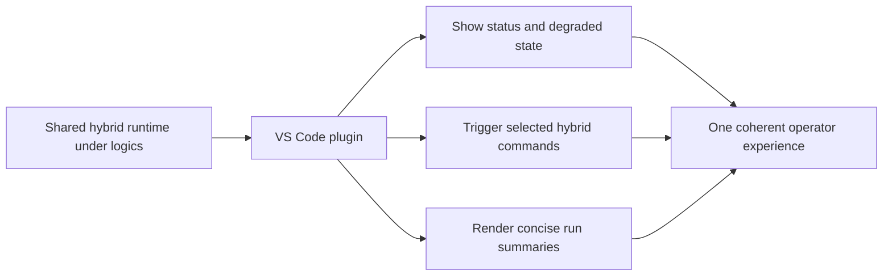

## adr_012_keep_the_vs_code_plugin_as_a_thin_client_over_shared_hybrid_runtime_commands - Keep the VS Code plugin as a thin client over shared hybrid runtime commands
> Date: 2026-03-25
> Status: Proposed
> Drivers: plugin/runtime coherence, cross-agent messaging clarity, maintainability, audit visibility
> Related request: `req_095_adapt_the_vs_code_logics_plugin_to_expose_hybrid_assist_runtime_status_actions_audit_and_cross_agent_messaging`
> Related backlog: `item_156_add_plugin_tool_actions_for_high_value_hybrid_assist_flows_through_shared_runtime_commands`
> Related task: `task_100_orchestration_delivery_for_req_089_to_req_095_hybrid_assist_runtime_portfolio_governance_portability_and_plugin_exposure`
> Reminder: Update status, linked refs, decision rationale, consequences, migration plan, and follow-up work when you edit this doc.

# Overview
Keep the VS Code plugin as a thin UX client over the shared hybrid runtime so diagnostics, actions, backend provenance, and audit visibility stay aligned with the `logics.py` source of truth.

# Context
- The plugin already exposes repo-local Logics workflow actions and Codex overlay awareness.
- `req_095` extends that scope to hybrid assist diagnostics, actions, backend provenance, and messaging cleanup.
- The risk is that the extension could start re-implementing backend routing, result-state semantics, or assist-flow logic in TypeScript.
- That would create a second runtime contract beside `logics.py`, which would drift quickly as the hybrid portfolio expands.

# Decision
- Keep the shared hybrid runtime under `logics/` as the source of truth for backend selection, result envelopes, degraded states, and audit semantics.
- Make the plugin consume structured runtime outputs for diagnostics, actions, and result summaries instead of re-encoding hybrid logic internally.
- Expose only a selected set of high-value hybrid actions in the plugin at first.
- Separate shared hybrid runtime wording from Codex-specific overlay wording in the plugin UI and README.
- Use plugin surfaces to explain runtime state and audit results, not to own the hybrid platform contract.

# Alternatives considered
- Re-implement hybrid assist flows directly in the extension.
Rejected because it would create duplicate semantics and higher maintenance cost.
- Keep all hybrid features terminal-only and avoid plugin integration entirely.
Rejected because the plugin is already an operator cockpit, and hiding hybrid state there would reduce visibility and adoption.
- Add plugin-only shortcuts that bypass shared runtime commands.
Rejected because it would erode the source-of-truth model and complicate auditability.

# Consequences
- Plugin work will depend on structured runtime outputs and may need small shared-runtime enhancements rather than TypeScript workarounds.
- The extension stays simpler to maintain because backend selection and assist-flow semantics remain centralized.
- Operators get clearer provenance and degraded-state visibility.
- The initial plugin surface should remain intentionally small until the shared runtime proves its value.

# Migration and rollout
- Extend environment diagnostics first so the plugin can show hybrid backend health and degraded state.
- Add a small set of high-value hybrid actions that invoke canonical runtime commands.
- Add concise audit/result panels and wording cleanup after the runtime signals are stable.
- Expand the plugin surface only when the shared runtime contracts and review loops are established.

# References
- `logics/request/req_091_ensure_hybrid_logics_delivery_automation_stays_compatible_with_claude_environments_and_windows_runtimes.md`
- `logics/request/req_095_adapt_the_vs_code_logics_plugin_to_expose_hybrid_assist_runtime_status_actions_audit_and_cross_agent_messaging.md`
- `logics/backlog/item_155_extend_plugin_environment_diagnostics_with_hybrid_runtime_health_backend_selection_and_degraded_state_visibility.md`
- `logics/backlog/item_156_add_plugin_tool_actions_for_high_value_hybrid_assist_flows_through_shared_runtime_commands.md`
- `logics/backlog/item_157_add_plugin_audit_visibility_result_panels_and_cross_agent_runtime_messaging_cleanup.md`
- `logics/tasks/task_100_orchestration_delivery_for_req_089_to_req_095_hybrid_assist_runtime_portfolio_governance_portability_and_plugin_exposure.md`
- `src/logicsEnvironment.ts`
- `src/logicsViewProvider.ts`
- `src/logicsWebviewHtml.ts`

# Follow-up work
- Deliver plugin diagnostics, actions, and audit surfaces through `item_155`, `item_156`, and `item_157`.
- Keep future plugin affordances gated on structured runtime outputs rather than TypeScript-only logic.

