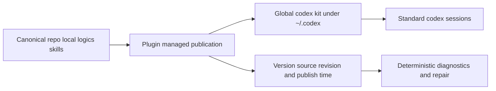

## adr_013_replace_repo_local_codex_workspace_overlays_with_a_global_published_logics_kit - Replace repo-local Codex workspace overlays with a global published Logics kit
> Date: 2026-03-26
> Status: Accepted
> Drivers: operator simplicity, deterministic global runtime provenance, zero-touch migration, plugin/runtime coherence
> Related request: `req_099_replace_repo_local_codex_overlays_with_a_global_published_logics_kit_and_managed_migration`
> Related backlog: `item_167_define_a_global_logics_kit_publication_manifest_and_version_resolution_policy`, `item_168_publish_and_auto_upgrade_the_global_codex_logics_kit_from_canonical_repo_sources_in_the_plugin`, `item_169_migrate_plugin_docs_and_existing_overlay_ux_to_the_global_published_kit_model`
> Related task: `task_103_orchestration_delivery_for_req_099_global_logics_kit_publication_and_overlay_migration`
> Supersedes: `adr_008_keep_codex_workspace_overlays_repo_local_isolated_and_composable`
> Reminder: Update status, linked refs, decision rationale, consequences, migration plan, and follow-up work when you edit this doc.

# Overview
The primary Codex runtime for Logics should no longer be a per-repository overlay. Instead, compatible repositories publish the canonical repo-local Logics kit into one shared global Codex home, with provenance recorded in a global manifest.

# Context
- `adr_008` chose workspace overlays to preserve strict per-repo isolation and avoid global skill collisions.
- That model was architecturally coherent, but operationally awkward:
  - users could have a healthy overlay and still run a Codex session that did not see repo-local skills;
  - the plugin had to explain overlay sync, overlay run commands, and process-specific `CODEX_HOME`;
  - the normal path still required users to reason about runtime plumbing instead of just opening a repository and launching Codex.
- `req_099` changes the priority order:
  - keep `logics/skills` canonical in repositories;
  - but treat those repo-local assets as publication sources rather than as the final runtime surface;
  - let the plugin converge the machine toward one shared global runtime automatically in the normal path.

# Decision
- Replace per-repository overlays as the primary Codex runtime contract with one globally published Logics kit under the main Codex home.
- Keep `logics/skills/` inside repositories as the canonical source of truth for shared runtime content.
- Record global runtime provenance in a manifest that includes:
  - installed version;
  - source repository path;
  - source revision;
  - publish time;
  - published skill inventory;
  - publication mode and degraded-state visibility.
- Let the plugin auto-publish or auto-upgrade the shared global kit when it opens a compatible canonical repository and detects that the repo-local source is newer or that the global runtime is missing or stale.
- Reserve user prompts for exceptional cases such as missing permissions, failed writes, or incompatible repo-local state.
- Keep legacy overlay tooling only as deprecated compatibility support, not as a first-class runtime path.

# Alternatives considered
- Keep `adr_008` as the primary model and improve guidance only.
Rejected because it preserves the user-facing confusion between repo readiness, overlay readiness, and the actual Codex session runtime.
- Publish globally only through a manual plugin action.
Rejected because it fails the zero-touch migration goal and would keep migration work on the operator.
- Globalize all Logics content, including workflow documents.
Rejected because requests, backlog items, tasks, product briefs, and ADRs remain project-owned material and must stay repo-local.

# Consequences
- The normal path becomes simpler: compatible repo open can converge the runtime and `codex` can launch directly against the shared global kit.
- The runtime becomes globally mutable rather than strictly isolated per repository, so provenance and diagnostics must remain explicit.
- Plugin wording, docs, and environment diagnostics must stop relying on overlay-centric concepts.
- Legacy overlay tooling may remain available temporarily, but it must not dominate the main user story.

# Migration and rollout
- Mark `adr_008` as superseded by this ADR.
- Publish the global manifest and winner-selection policy in code and docs.
- Deliver plugin auto-publication and upgrade behavior as the normal path.
- Rewrite plugin UX and operator docs so the global kit is the primary mental model.
- Treat old overlay state as deprecated compatibility data rather than as an active operator concern.

# References
- `logics/architecture/adr_008_keep_codex_workspace_overlays_repo_local_isolated_and_composable.md`
- `logics/request/req_099_replace_repo_local_codex_overlays_with_a_global_published_logics_kit_and_managed_migration.md`
- `logics/backlog/item_167_define_a_global_logics_kit_publication_manifest_and_version_resolution_policy.md`
- `logics/backlog/item_168_publish_and_auto_upgrade_the_global_codex_logics_kit_from_canonical_repo_sources_in_the_plugin.md`
- `logics/backlog/item_169_migrate_plugin_docs_and_existing_overlay_ux_to_the_global_published_kit_model.md`
- `logics/tasks/task_103_orchestration_delivery_for_req_099_global_logics_kit_publication_and_overlay_migration.md`
- `src/logicsCodexWorkspace.ts`
- `src/logicsEnvironment.ts`
- `src/logicsViewProvider.ts`
- `src/logicsViewDocumentController.ts`
- `README.md`

# Follow-up work
- Keep the global manifest and publication policy aligned with plugin diagnostics and auto-upgrade behavior.
- Retire or downscope overlay-specific docs and tooling as the migration stabilizes.
