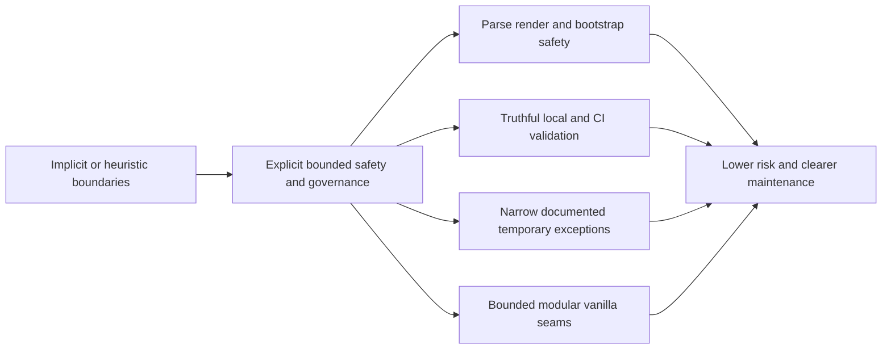

## adr_014_keep_plugin_safety_and_repository_governance_explicit_bounded_and_modular - Keep plugin safety and repository governance explicit, bounded, and modular
> Date: 2026-04-09
> Status: Accepted
> Drivers: deterministic safety boundaries for untrusted repo inputs, truthful local and CI validation, explicit temporary audit exceptions, canonical repository-state inspection, and bounded webview modularization
> Related request: `req_107_harden_agent_registry_yaml_parsing_against_malicious_skill_manifests`, `req_108_align_the_local_ci_check_with_the_full_repository_ci_contract`, `req_109_replace_coarse_bootstrap_detection_with_canonical_kit_inspection`, `req_110_make_the_security_audit_workflow_block_on_actionable_vulnerabilities`, `req_111_normalize_workflow_progress_indicators_and_close_placeholder_debt_in_completed_docs`, `req_114_fix_false_positive_mermaid_signature_warnings_after_signature_refresh`, `req_115_sanitize_webview_error_rendering_instead_of_injecting_raw_error_html`, `req_116_address_the_remaining_esbuild_and_vite_audit_advisory_in_the_toolchain`, `req_117_resume_modularization_of_oversized_core_extension_and_workflow_modules`
> Related backlog: `item_194_harden_agent_registry_yaml_parsing_against_malicious_skill_manifests`, `item_195_align_the_local_ci_check_with_the_full_repository_ci_contract`, `item_196_replace_coarse_bootstrap_detection_with_canonical_kit_inspection`, `item_197_make_the_security_audit_workflow_block_on_actionable_vulnerabilities`, `item_198_normalize_workflow_progress_indicators_and_close_placeholder_debt_in_completed_docs`, `item_201_fix_false_positive_mermaid_signature_warnings_after_signature_refresh`, `item_202_sanitize_webview_error_rendering_instead_of_injecting_raw_error_html`, `item_203_address_the_remaining_esbuild_and_vite_audit_advisory_in_the_toolchain`, `item_204_resume_modularization_of_oversized_core_extension_and_workflow_modules`
> Related task: `task_107_orchestration_delivery_for_req_107_to_req_117_across_maintenance_hardening_ui_refinement_and_modularization`
> Reminder: Update status, linked refs, decision rationale, consequences, migration plan, and follow-up work when you edit this doc.

# Overview
This wave should not rely on permissive heuristics or best-effort safety in the extension and Logics workflow.
The chosen direction is to make trust boundaries explicit:
validate hostile inputs before parse or render, derive repository state from canonical inspection, keep audit exceptions narrow and documented, and modularize the webview only through clear seams.
The impacted areas are plugin runtime safety, maintainer validation flows, workflow-governance tooling, and bounded frontend extraction.

# Context
- The project audit surfaced a cluster of issues with the same root shape:
  - untrusted workspace inputs were parsed or rendered with too little explicit guarding;
  - local validation and CI did not fully reflect the repository truth;
  - bootstrap state was inferred through coarse heuristics instead of canonical inspection;
  - the remaining toolchain advisory needed a strict but reviewable exception path;
  - frontend maintenance work risked re-concentrating behavior in large webview files.
- These changes are linked operationally even though they touch different files:
  - they all sit on the trust boundary between repository state, extension runtime, and operator confidence in the plugin;
  - they need to be reviewable as a coherent architecture rule rather than as ad hoc fixes.
- The architecture must stay pragmatic:
  - no framework rewrite for the webview;
  - no broad ignore lists for audits;
  - no heavy new policy engine just to validate Logics docs.

# Decision
- Adopt explicit pre-parse and pre-render boundaries for untrusted or semi-trusted inputs.
  - Repo-local manifests should be rejected on deterministic size and nesting rules before YAML parsing.
  - Error surfaces in the webview should render operator-visible text safely rather than injecting raw HTML.
- Treat repository-state-dependent behavior as a canonical inspection problem, not a heuristic presence-check problem.
  - Bootstrap availability and repair prompts should come from an explicit repository-state model.
- Keep maintainer trust flows truthful by default.
  - `ci:check` should reflect the real repository contract closely enough to be actionable.
  - Security audit automation should fail on actionable issues and only allow explicit, reviewable, narrow exceptions.
- Keep governance tooling deterministic and self-consistent.
  - Refresh and lint flows should converge rather than produce false-positive drift on normalized metadata such as Mermaid signatures and progress labels.
- Continue webview modularization only when an extraction exposes a clear seam and preserves the accepted vanilla-frontend architecture.
  - Small, responsibility-driven modules are preferred over broad mechanical file splitting.

# Alternatives considered
- Keep best-effort safety and rely on upstream dependencies or operator caution.
  - Rejected because it leaves the extension vulnerable to hostile repository inputs and makes failures less deterministic.
- Keep `npm audit` and local CI mostly report-only.
  - Rejected because green validation becomes untrustworthy and maintainers lose signal.
- Solve the menu and modularization follow-ups with a framework migration.
  - Rejected because the current webview architecture is intentionally vanilla and the required improvement is bounded extraction, not stack replacement.
- Handle workflow-governance inconsistencies as one-off doc cleanup.
  - Rejected because the same class of drift would recur without an explicit architectural rule about truthful normalization and validation.

# Consequences
- The extension host becomes more resilient against malformed repository inputs and unsafe UI error rendering.
- Maintainers get a stricter but more credible validation contract locally and in CI.
- Temporary audit exceptions remain possible, but only as explicit policy with a narrow blast radius.
- Repository-state decisions become easier to reason about because they come from a named inspection model.
- Future modularization work still needs discipline: only extract seams that genuinely reduce concentration and preserve the vanilla webview contract.

# Migration and rollout
- Land parser and render hardening together with regression tests so the new boundaries are defended in code.
- Align local CI and GitHub audit flows with the same actionable-security policy.
- Replace coarse bootstrap detection with canonical inspection before expanding more setup UI behavior.
- Normalize the targeted workflow-governance debt and keep refresh/lint consistency under test.
- Use this ADR as the architecture reference for later bounded modularization work under `item_204`.

# References
- `logics/request/req_107_harden_agent_registry_yaml_parsing_against_malicious_skill_manifests.md`
- `logics/request/req_108_align_the_local_ci_check_with_the_full_repository_ci_contract.md`
- `logics/request/req_109_replace_coarse_bootstrap_detection_with_canonical_kit_inspection.md`
- `logics/request/req_110_make_the_security_audit_workflow_block_on_actionable_vulnerabilities.md`
- `logics/request/req_111_normalize_workflow_progress_indicators_and_close_placeholder_debt_in_completed_docs.md`
- `logics/request/req_114_fix_false_positive_mermaid_signature_warnings_after_signature_refresh.md`
- `logics/request/req_115_sanitize_webview_error_rendering_instead_of_injecting_raw_error_html.md`
- `logics/request/req_116_address_the_remaining_esbuild_and_vite_audit_advisory_in_the_toolchain.md`
- `logics/request/req_117_resume_modularization_of_oversized_core_extension_and_workflow_modules.md`
- `logics/backlog/item_194_harden_agent_registry_yaml_parsing_against_malicious_skill_manifests.md`
- `logics/backlog/item_195_align_the_local_ci_check_with_the_full_repository_ci_contract.md`
- `logics/backlog/item_196_replace_coarse_bootstrap_detection_with_canonical_kit_inspection.md`
- `logics/backlog/item_197_make_the_security_audit_workflow_block_on_actionable_vulnerabilities.md`
- `logics/backlog/item_198_normalize_workflow_progress_indicators_and_close_placeholder_debt_in_completed_docs.md`
- `logics/backlog/item_201_fix_false_positive_mermaid_signature_warnings_after_signature_refresh.md`
- `logics/backlog/item_202_sanitize_webview_error_rendering_instead_of_injecting_raw_error_html.md`
- `logics/backlog/item_203_address_the_remaining_esbuild_and_vite_audit_advisory_in_the_toolchain.md`
- `logics/backlog/item_204_resume_modularization_of_oversized_core_extension_and_workflow_modules.md`
- `logics/tasks/task_107_orchestration_delivery_for_req_107_to_req_117_across_maintenance_hardening_ui_refinement_and_modularization.md`
# Follow-up work
- Keep the allowlist in `audit:ci` narrow and remove the temporary Vite/Vitest exception when the toolchain can move cleanly.
- Reuse the canonical bootstrap inspection model rather than adding new coarse path-presence checks elsewhere.
- Continue extracting webview behavior only through named modules with test coverage and clear responsibility boundaries.
