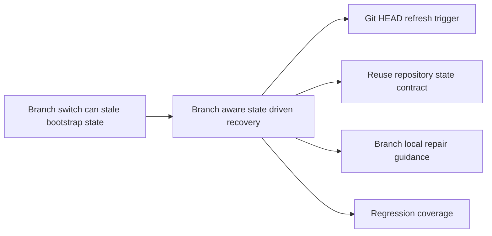

## adr_015_make_bootstrap_recovery_branch_aware - Make bootstrap recovery branch-aware
> Date: 2026-04-09
> Status: Accepted
> Drivers: truthful repository-state recomputation after branch switches, explicit branch-local recovery UX, reuse of the canonical bootstrap contract, and regression protection across branch-state transitions
> Related request: `req_118_handle_branch_switches_to_branches_without_logics_bootstrap_and_offer_setup_repair`
> Related backlog: `item_205_detect_and_refresh_logics_bootstrap_state_after_git_branch_switches`, `item_206_make_branch_local_bootstrap_recovery_and_setup_repair_explicit_in_the_plugin_ux`, `item_207_add_regression_coverage_for_branch_switch_bootstrap_degradation_and_repair`
> Related task: `task_108_orchestration_delivery_for_req_118_branch_aware_bootstrap_recovery_and_setup_repair`
> Reminder: Update status, linked refs, decision rationale, consequences, migration plan, and follow-up work when you edit this doc.

# Overview
Branch switches are allowed to change whether the active repository branch has `logics/`, a canonical `logics/skills` setup, or a complete workflow scaffold.
The chosen direction is to keep one repository-state model, but make its refresh and recovery behavior branch-aware.
The extension should re-evaluate state on git branch movement, explain missing or incomplete setup as branch-local when appropriate, and keep remediation prompts tied to the effective bootstrap state rather than the repository root alone.
The impacted areas are extension watchers, repository-state inspection, bootstrap prompt behavior, degraded-state UX copy, and targeted regression coverage.

# Context
- The extension already had a repository-state model for `missing-logics`, `missing-kit`, `partial-bootstrap`, and `ready`, but branch switches could bypass that model because file watchers on `logics/**/*` do not reliably fire when git removes or restores the entire directory tree.
- A user could therefore switch from a healthy branch to an unbootstrapped one and keep stale UI, stale agent assumptions, or stale bootstrap prompt suppression that was keyed only by repository root.
- The project already has architectural direction around canonical bootstrap inspection and explicit repository-state handling:
  - bootstrap repair should stay bounded to the supported canonical `logics/skills` contract;
  - malformed or non-canonical setups must remain distinct from supported bootstrap or repair flows;
  - the extension should prefer explicit state derivation over ad hoc heuristics.
- The main design pressure was to fix the branch-switch recovery problem without introducing a second branch-only state model or broadening automatic writes on branches where Logics may intentionally be absent.

# Decision
- Reuse the existing repository-state model as the single source of truth for bootstrap readiness, but make refresh invalidation branch-aware.
  - The extension watches `.git/HEAD` in addition to existing Logics paths so checkout-like changes trigger a normal provider refresh.
  - Repository state is recomputed after those refreshes instead of preserved from the previously active branch.
- Keep bootstrap or repair routing state-driven and canonical.
  - `missing-logics`, `missing-kit`, and `partial-bootstrap` remain supported recovery states.
  - Non-canonical or malformed setups remain on the warning-only path and do not receive the normal supported repair CTA.
- Tie prompt suppression to the effective bootstrap state, not only the root path.
  - A repository can therefore prompt again when the user lands on a genuinely different degraded branch state, while still respecting prior dismissal for the same state.
- Keep the solution reviewable through targeted automated coverage rather than broad new git integration machinery.
  - Environment tests prove state transitions.
  - Provider tests prove prompt and routing behavior.

# Alternatives considered
- Add a separate branch-state model parallel to the repository-state contract.
  - Rejected because it would duplicate state reasoning, increase drift risk, and make degraded-state UX harder to keep coherent.
- Treat branch switches as a purely UX problem and only change the copy.
  - Rejected because stale repository-state assumptions would still leave the plugin behaving incorrectly after checkout.
- Auto-repair or auto-bootstrap branches silently after detection.
  - Rejected because branch-local absence can be intentional and unsupported automatic writes would weaken operator control.
- Require manual refresh after every checkout.
  - Rejected because the extension already owns the repository-state contract and should keep branch changes from feeling like a plugin failure.

# Consequences
- Branch switches now participate in the same explicit repository-state contract as other refresh paths.
- Operators get clearer messaging that a missing or incomplete setup can be branch-local rather than a generic extension failure.
- Bootstrap prompts become more truthful across repeated branch changes because dismissal is preserved per effective state instead of suppressing all future prompts for the repository.
- The solution adds a small amount of watcher and state-key complexity, so regression tests remain part of the architectural contract.

# Migration and rollout
- Add the `.git/HEAD` watcher and branch-aware prompt-state invalidation first so state transitions are correct before changing UX copy.
- Update degraded-state copy and action titles to reflect branch-local bootstrap or repair semantics while keeping malformed setups on the warning-only path.
- Land focused tests for ready-to-missing, ready-to-partial, prompt reappearance across new states, and safe routing for malformed setups.
- Use this ADR as the architecture reference for future bootstrap-recovery work that touches branch transitions or prompt-state behavior.

# References
- `logics/request/req_118_handle_branch_switches_to_branches_without_logics_bootstrap_and_offer_setup_repair.md`
- `logics/backlog/item_205_detect_and_refresh_logics_bootstrap_state_after_git_branch_switches.md`
- `logics/backlog/item_206_make_branch_local_bootstrap_recovery_and_setup_repair_explicit_in_the_plugin_ux.md`
- `logics/backlog/item_207_add_regression_coverage_for_branch_switch_bootstrap_degradation_and_repair.md`
- `logics/tasks/task_108_orchestration_delivery_for_req_118_branch_aware_bootstrap_recovery_and_setup_repair.md`
# Follow-up work
- Reuse the branch-aware repository-state path for future bootstrap diagnostics instead of adding new branch-specific side channels.
- Keep bootstrap prompt keys and degraded-state routing under test when the provider refresh lifecycle changes again.
