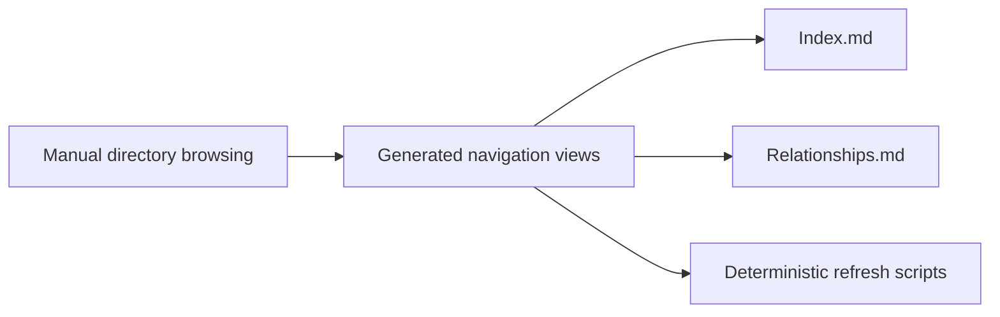

## adr_016_use_generated_corpus_index_and_relationship_views_for_logics_navigation - Use generated corpus index and relationship views for Logics navigation
> Date: 2026-04-09
> Status: Proposed
> Drivers: Corpus-scale discovery, repo-native navigation, deterministic refresh, and lightweight relationship guardrails.
> Related request: `req_134_generated_corpus_index_and_relationship_views`
> Related backlog: `item_257_generated_corpus_index_and_relationship_views`
> Related task: `task_117_generated_corpus_index_and_relationship_views`
> Reminder: Update status, linked refs, decision rationale, consequences, migration plan, and follow-up work when you edit this doc.

# Overview
The Logics corpus should expose generated navigation views as the canonical way to browse the repository at scale.
`INDEX.md` gives a fast entry point into the major workflow families.
`RELATIONSHIPS.md` makes the important cross-doc links and missing-link guardrails visible.
The refresh path stays deterministic and repo-local so the views remain easy to regenerate and diff.

# Context
The Logics corpus has grown beyond comfortable manual browsing.
Contributors can still inspect individual markdown files, but finding a related request, backlog item, task, product brief, or architecture note now requires too much directory scanning.
The repo already contains index and relationship generation scripts, which makes this a good fit for a lightweight architectural decision instead of a new storage layer.
The main constraint is to keep the source of truth in markdown while making discovery cheaper.

# Decision
Adopt generated `logics/INDEX.md` and `logics/RELATIONSHIPS.md` as the canonical repository navigation surface.
Treat the scripts under `logics/skills/logics-indexer/scripts/generate_index.py` and `logics/skills/logics-relationship-linker/scripts/link_relations.py` as the refresh entry points.
Keep the output repo-native, diffable, and easy to regenerate from the corpus itself.
Use the relationship report as a guardrail for unresolved refs and orphan docs rather than introducing a separate graph database or UI.

# Alternatives considered
- Manual navigation pages maintained by hand.
- A richer graph database or bespoke knowledge-map UI.
- Relying only on the extension insight panel without repo-level markdown views.

# Consequences
- Navigation becomes cheaper for humans and AI-assisted operators without changing the source-of-truth model.
- The generated views add a small maintenance step, but the scripts make that step deterministic and reviewable.
- The relationship report can now highlight unresolved refs and orphan docs, which helps the corpus stay honest as it grows.
- The markdown views remain useful even outside the extension, which keeps the repository itself self-describing.

# Migration and rollout
- Generate `logics/INDEX.md` and `logics/RELATIONSHIPS.md` from the existing corpus.
- Reference the new navigation views from the request, backlog, task, and product docs for the delivery slice.
- Keep the scripts and any future automation aligned so the views stay cheap to refresh.

# References
- `logics/request/req_134_generated_corpus_index_and_relationship_views.md`
- `logics/backlog/item_257_generated_corpus_index_and_relationship_views.md`
- `logics/tasks/task_117_generated_corpus_index_and_relationship_views.md`
- `logics/product/prod_005_logics_corpus_navigation_views.md`
- `logics/skills/logics-indexer/scripts/generate_index.py`
- `logics/skills/logics-relationship-linker/scripts/link_relations.py`

# Follow-up work
- Keep the generated views refreshed when the corpus changes.
- Evaluate whether additional summaries or filters should join the repo-level navigation surface later.
