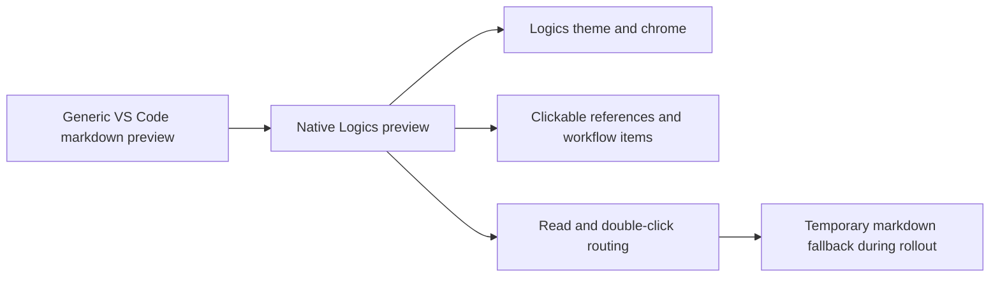

## adr_017_route_logics_document_reads_to_a_native_preview - Route Logics document reads to a native preview
> Date: 2026-04-09
> Status: Accepted
> Drivers: Keep Logics document reading inside the plugin, avoid drift with the generic VS Code markdown preview, preserve the existing theme and navigation model, and keep open/read/double-click behavior routed through one preview entrypoint.
> Related request: `req_142_add_a_polished_logics_markdown_preview_screen`
> Related backlog: `item_265_add_a_polished_logics_markdown_preview_screen`
> Related task: `task_121_add_a_polished_logics_markdown_preview_screen`
> Reminder: Update status, linked refs, decision rationale, consequences, migration plan, and follow-up work when you edit this doc.

# Overview
Logics document reading should happen in a native preview surface inside the plugin rather than in the generic VS Code markdown viewer.
That preview becomes the default place to inspect requests, backlog items, tasks, product briefs, architecture decisions, and specs.
It should reuse the same visual language as the existing Logics app surfaces and surface links as navigation targets instead of plain markdown text.

# Context
The current markdown preview is serviceable for raw text, but it does not match the plugin UI and makes relationships harder to inspect.
Users already expect the Logics extension to own navigation because the board, insights, and onboarding experiences are all plugin-native.
If read and double-click actions keep falling back to the IDE preview, the document experience will feel split and harder to extend.

# Decision
Route read and double-click actions for Logics markdown docs to a native preview surface inside the plugin.
Render the document title, references, and related workflow links inside that surface, and use the same entrypoint for every Logics markdown document type so the behavior stays consistent.
Keep the generic markdown preview only as a temporary fallback while the native preview rolls out.

# Alternatives considered
- Keep using the default VS Code markdown preview.
- Open a separate browser-style viewer outside the plugin.
- Enhance the markdown renderer in place without adding a dedicated preview surface.

# Consequences
- The preview pipeline becomes part of the plugin UI, so it must stay in sync with the Logics theme and navigation state.
- Read paths need to respect the same routing as board interactions to avoid split behavior.
- The native preview becomes a first-class surface that can be improved without depending on VS Code's generic markdown UI.

# Migration and rollout
- Introduce the native preview behind the existing read/open entrypoints.
- Wire the double-click path to the same preview route so the interaction model is unified.
- Keep the generic markdown fallback only as a temporary safety path during rollout.
- Migrate document types incrementally if needed, but keep the route contract stable.

# References
- `logics/request/req_142_add_a_polished_logics_markdown_preview_screen.md`
- `logics/backlog/item_265_add_a_polished_logics_markdown_preview_screen.md`
- `logics/tasks/task_121_add_a_polished_logics_markdown_preview_screen.md`
- `logics/product/prod_006_custom_logics_markdown_preview_experience.md`

# Follow-up work
- Remove the fallback once the native preview is stable across the supported document types.
- Validate the native preview route against the task implementation and keep the routing contract stable as document types expand.
