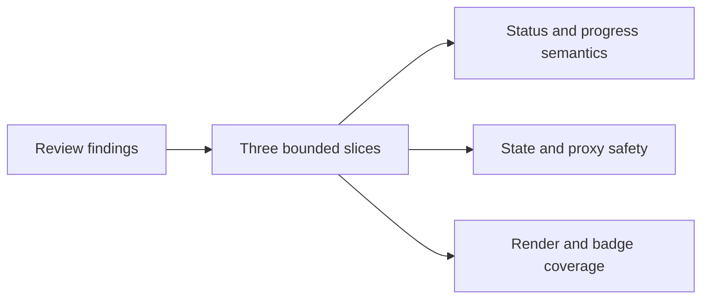

## adr_018_fix_post_1_23_review_findings_with_targeted_delivery_slices - Fix post-1.23 review findings with targeted delivery slices
> Date: 2026-04-09
> Status: Proposed
> Drivers: Preserve semantic correctness, keep state ownership explicit, and add durable render coverage without broad refactors.
> Related request: `req_148_fix_post_1_23_review_findings_across_indexer_semantics_render_consistency_and_test_coverage`
> Related backlog: `item_272_fix_isprocessedworkflowstatus_divergence_parseprogress_clamp_and_totalcount_semantics`, `item_273_fix_activetoolsview_dual_state_collectlinkedworkflowitems_proxy_and_openlinkeditem_safety`, `item_274_add_missing_render_tests_for_corpusinsightshtml_untested_functions_and_badge_edge_cases`
> Related task: `task_124_fix_post_1_23_review_findings_with_targeted_delivery_slices`
> Reminder: Update status, linked refs, decision rationale, consequences, migration plan, and follow-up work when you edit this doc.

# Overview
Keep the 1.23.x review fixes split into three bounded delivery slices:
semantic correctness, state and proxy safety, and render coverage.
Prefer small targeted changes over broad rewrites so each slice can be validated independently.
Execute the slices under a single orchestration task so the delivery plan stays coherent while the implementation remains bounded.
The resulting work stays close to the existing model and UI surfaces rather than introducing new abstractions.

# Context
The 1.23.x review surfaced a set of correctness issues that are individually small but collectively risky:
status evaluation diverged between implementations, one progress parser lost its clamp, a UI state source split in two, a proxy returned empty results silently, and the render surface lacked direct coverage.
These are best addressed as separate slices so each fix stays focused and reviewable.
The main constraint is to keep the implementation narrow enough that the release can ship the fixes without collateral churn.

# Decision
Treat the review findings as three independent delivery slices with their own backlog items and tasks.
Use targeted changes for each slice rather than a single large refactor.
This keeps the semantic fixes, state fixes, and test coverage work independently verifiable and easier to review.

# Alternatives considered
- Merge everything into one broad remediation branch.
- Leave the issues to be fixed opportunistically in later work.
- Introduce a larger abstraction layer to unify the affected surfaces.

# Consequences
- Review and validation become easier because each slice has a clear acceptance boundary.
- The release gains safer incremental fixes instead of a risky cross-cutting rewrite.
- The team carries a small amount of additional coordination overhead because the work is split across several tasks.
- The architecture remains close to existing code paths, which lowers migration risk.

# Migration and rollout
- Implement the three backlog slices independently.
- Validate each slice with the relevant tests before closing the linked task.
- Keep the release notes and linked request/backlog/task docs in sync as the slices land.

# References
- `logics/request/req_148_fix_post_1_23_review_findings_across_indexer_semantics_render_consistency_and_test_coverage.md`
- `logics/backlog/item_272_fix_isprocessedworkflowstatus_divergence_parseprogress_clamp_and_totalcount_semantics.md`
- `logics/backlog/item_273_fix_activetoolsview_dual_state_collectlinkedworkflowitems_proxy_and_openlinkeditem_safety.md`
- `logics/backlog/item_274_add_missing_render_tests_for_corpusinsightshtml_untested_functions_and_badge_edge_cases.md`
- `logics/tasks/task_124_fix_post_1_23_review_findings_with_targeted_delivery_slices.md`
# Follow-up work
- Keep the slices narrow and complete them before expanding scope.
- Revisit whether a broader data-contract or render-system ADR is needed only if future work starts to cross these boundaries again.
