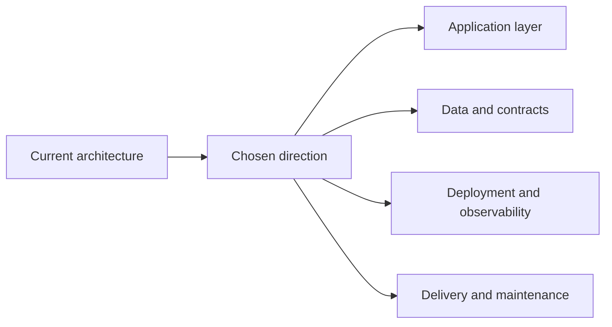

## adr_019_use_extension_host_quick_pick_for_status_changes - Use extension-host quick pick for status changes
> Date: 2026-04-11
> Status: Accepted
> Drivers: Keep the status change flow inside the extension host, reuse the existing markdown indicator writer, and avoid opening a file editor for a common workflow action.
> Related request: `req_154_add_a_manual_status_selector_button_in_the_detail_panel_to_change_item_status_directly`
> Related backlog: `item_280_add_status_selector_button_ui_and_per_type_status_set_in_the_detail_panel`, `item_281_implement_status_write_to_markdown_file_and_board_refresh_on_status_change`
> Related task: `task_126_orchestration_delivery_for_req_150_to_req_154_plugin_polish_and_status_selector`
> Reminder: Update status, linked refs, decision rationale, consequences, migration plan, and follow-up work when you edit this doc.

# Overview
Use the extension host to drive status changes from a VS Code quick pick.
Keep the selector in the detail panel, but write the chosen status through the existing markdown indicator updater.
This avoids a separate file-editing workflow and keeps the refresh path aligned with the rest of the webview actions.
The impacted areas are the webview action bar, the host message contract, and the markdown write/refresh support code.

# Context
The manual status selector needs to feel like a first-class in-panel action, not a detour into the editor.
The UI already routes other item actions through the extension host, which keeps the webview thin and centralizes file mutation in one place.
Status changes must preserve surrounding markdown content and trigger a normal board/list refresh afterward.

# Decision
Implement the status selector as an extension-host quick pick triggered by a detail-panel button.
The webview only posts the selected item id; the host resolves valid statuses per item stage, shows the picker, writes the new `Status:` value, and refreshes the view.
This keeps the write path consistent with existing lifecycle actions and avoids introducing a second editing surface.

# Alternatives considered
- Open the markdown file directly and ask the user to edit `Status:` manually.
- Embed the full selector logic in the webview and let the frontend write file content directly.
- Keep only the existing Done and Obsolete actions and defer arbitrary status changes.

# Consequences
- The webview remains simple and stateless for this action.
- The host owns the stage-to-status vocabulary, so future kit changes are localized.
- The existing markdown indicator writer stays the single mutation path for status changes.
- The action can be covered with host-side tests and webview interaction tests without adding a new editor workflow.

# Migration and rollout
- Ship the button and host message in one pass, then validate that existing Done and Obsolete actions still work unchanged.
- No data migration is required because the feature only writes the existing `Status:` line in place.

# References
- `logics/request/req_154_add_a_manual_status_selector_button_in_the_detail_panel_to_change_item_status_directly.md`
- `logics/backlog/item_280_add_status_selector_button_ui_and_per_type_status_set_in_the_detail_panel.md`
- `logics/backlog/item_281_implement_status_write_to_markdown_file_and_board_refresh_on_status_change.md`
- `logics/tasks/task_126_orchestration_delivery_for_req_150_to_req_154_plugin_polish_and_status_selector.md`

# Follow-up work
- Align kit-side status vocabulary for Obsolete and other shared values.
- Keep the selector status list in sync with the Logics doc conventions if those conventions change.
