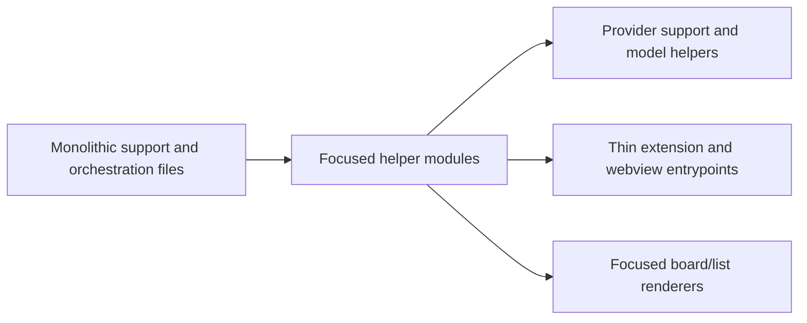

## adr_020_split_the_oversized_plugin_and_workflow_surfaces_into_focused_modules - Split the oversized plugin and workflow surfaces into focused modules
> Date: 2026-04-11
> Status: Proposed
> Drivers: Reduce cognitive load, lower change risk on oversized files, and preserve thin entrypoints around focused helpers.
> Related request: `req_158_address_post_audit_improvements_across_workflow_traceability_docs_and_oversized_source_files`
> Related backlog: `item_287_create_modularization_plan_for_the_five_oversized_source_files`
> Related task: `task_126_orchestration_delivery_for_req_150_to_req_154_plugin_polish_and_status_selector`
> Reminder: Update status, linked refs, decision rationale, consequences, migration plan, and follow-up work when you edit this doc.

# Overview
The largest plugin and workflow surfaces should be split along clear domain seams instead of remaining monolithic.
`logicsViewProviderSupport.ts` and `media/logicsModel.ts` should host pure data and policy helpers, not scattered orchestration.
`logicsViewProvider.ts` and `media/main.js` should stay as thin coordination entrypoints over smaller modules.
`media/renderBoard.js` should keep board/list rendering focused and delegate reusable cell and grouping logic.

# Context
The corpus audit flagged five oversized surfaces as the highest-risk files in the repository.
They are large for different reasons: provider support logic, provider orchestration, webview bootstrap and event wiring, board/list rendering, and derived model aggregation.
The goal is not to split everything immediately, but to define bounded seams that can be extracted without changing behavior.
Keeping the entrypoints readable matters more than hitting an arbitrary line count everywhere.

# Decision
Treat the five oversized files as candidates for seam-driven modularization in the following order:
1. Extract pure helper modules from `logicsViewProviderSupport.ts` for status, environment, and summary logic.
2. Separate orchestration from state/view helpers in `logicsViewProvider.ts` so refresh and command dispatch stay thin.
3. Split `media/main.js` into bootstrap/state hydration, DOM wiring, and interaction handlers.
4. Break `media/renderBoard.js` into shared item rendering, grouping, and column/stage presentation helpers.
5. Split `media/logicsModel.js` into selectors, aggregation, and relationship/insight helpers.

Keep each extraction behavior-preserving and prefer moving pure logic first.
Do not introduce a framework or persistence layer as part of this modularization pass.
The intended end state is smaller, testable modules with the original entrypoints remaining as orchestration shells.

# Alternatives considered
- Leave the files large and only add comments or section headers.
- Split by filename size alone without respecting domain seams.
- Replace the current modular webview architecture with a framework rewrite.

# Consequences
- The codebase gets clearer split boundaries for future work and easier review scope for large changes.
- Small helper modules should be easier to unit test than the current oversized entrypoints.
- The refactor will create more files, so import structure and naming need to stay disciplined.
- The line-count goal may be met in stages; some files can remain thin orchestration shells if that is the most readable outcome.

# Migration and rollout
- Start with pure helpers in `logicsViewProviderSupport.ts` and `media/logicsModel.ts`.
- Then extract event wiring and bootstrap helpers from `media/main.js`.
- Finally split rendering helpers from `media/renderBoard.js` and trim `logicsViewProvider.ts` around command orchestration.
- After each extraction, run the focused regression tests that cover the changed behavior.

# References
- `logics/backlog/item_287_create_modularization_plan_for_the_five_oversized_source_files.md`
- `logics/request/req_158_address_post_audit_improvements_across_workflow_traceability_docs_and_oversized_source_files.md`
- `logics/tasks/task_126_orchestration_delivery_for_req_150_to_req_154_plugin_polish_and_status_selector.md`
# Follow-up work
- Reassess the plan once the first extraction lands and refresh the seam boundaries if any module becomes too broad.
- Track whether the entrypoints remain readable after future feature waves.
