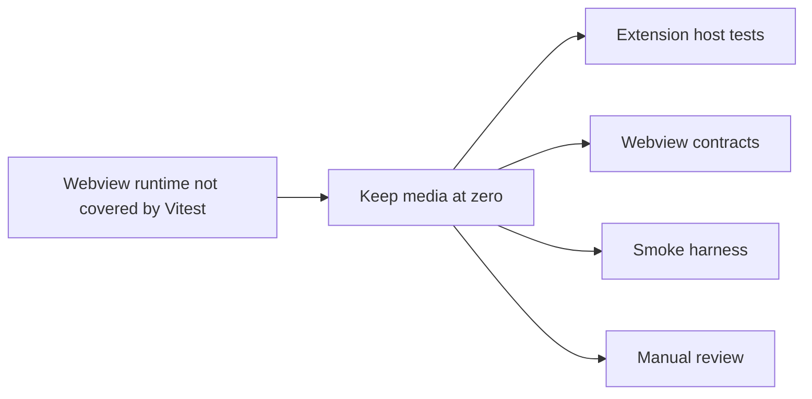

## adr_021_keep_media_coverage_at_zero_and_rely_on_smoke_tests_for_webview_regressions - Keep media coverage at zero and rely on smoke tests for webview regressions
> Date: 2026-04-12
> Status: Accepted
> Drivers: Keep the eval-loaded webview runtime outside the Node/Vitest coverage gate, avoid brittle browser-side instrumentation, and use the existing smoke harness as the regression fence.
> Related request: `logics/request/req_171_address_post_audit_coverage_regressions_dead_shim_and_file_size_drift.md`
> Related backlog: `logics/backlog/item_316_improve_extension_ts_branch_coverage_and_maintain_overall_coverage_floor.md`
> Related task: `logics/tasks/task_134_wave_1_maintenance_hardening_graph_embeddings_coverage_and_static_analysis.md`
> Reminder: Update status, linked refs, decision rationale, consequences, migration plan, and follow-up work when you edit this doc.

# Overview
Keep `media/` at 0% in the Node/Vitest coverage gate.
Treat the webview runtime as eval-loaded browser code that is exercised by smoke checks and manual harness runs instead of file-level coverage.
Keep the extension host tests focused on the TypeScript entrypoints and contracts they can actually observe.
Use the smoke harness as the primary regression fence for webview behavior.

# Context
The webview layer is loaded as browser-side JS under `media/` and is not a good fit for the Node/Vitest coverage gate.
Trying to force file-level coverage there would require brittle instrumentation or an artificial harness that duplicates browser behavior.
The repo already has smoke checks and harness-driven tests that validate the extension host contract and the rendered webview flow.

# Decision
Keep `media/` at 0% in the coverage gate and rely on the smoke harness plus the manual webview harness for regressions.
Keep `src/` coverage and branch gates focused on the TypeScript entrypoints where Vitest can exercise real logic.

# Alternatives considered
- Add browser automation coverage for `media/`
- Instrument the runtime to fake file-level coverage for browser bundles
- Lower the overall coverage gate and ignore the webview regression surface

# Consequences
- Coverage numbers for `media/` remain at 0% by design.
- The repo needs explicit smoke checks and harness runs to protect the webview experience.
- The coverage gate stays meaningful for the TypeScript surface instead of being polluted by browser bundle noise.

# Migration and rollout
- No migration is required.
- Keep the existing smoke checks in CI and run the manual webview harness when changing the browser bundle or host protocol.

# References
- `logics/request/req_171_address_post_audit_coverage_regressions_dead_shim_and_file_size_drift.md`
- `logics/tasks/task_134_wave_1_maintenance_hardening_graph_embeddings_coverage_and_static_analysis.md`

# Follow-up work
- Keep the smoke harness aligned with `media/` protocol changes.
- If a real browser automation suite is introduced later, revisit the coverage policy and this ADR.
