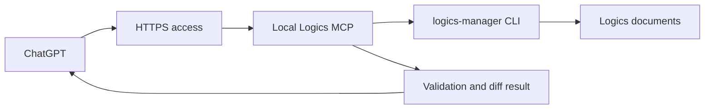

## adr_022_chatgpt_logics_agent_mcp_contract - ChatGPT Logics Agent MCP Contract
> Date: 2026-05-27 (http transport update)
> Status: Proposed
> Drivers: local-first ChatGPT integration, bounded write actions, canonical Logics workflow, Codex handoff clarity
> Related request: `logics/request/req_191_build_a_chatgpt_logics_agent.md`
> Related backlog: `logics/backlog/item_352_build_a_chatgpt_logics_agent.md`
> Related task: `logics/tasks/task_153_build_a_chatgpt_logics_agent.md`
> Reminder: Update status, linked refs, decision rationale, consequences, and follow-up work when you edit this doc.

# Overview
The ChatGPT Logics Agent should expose a deliberately small MCP contract over the local `logics-manager` CLI.
The MCP server is a local operator bridge: ChatGPT can request product workflow actions, but the repository remains protected by strict tool allowlists, repo-relative paths, and canonical Logics validation.

The contract is designed for one trusted operator working in one local repository.
It is not a general shell, not a remote code execution service, and not a replacement for Codex.

# Context
- The product brief in `logics/product/prod_010_chatgpt_logics_agent.md` defines ChatGPT as the framing agent and Codex as the delivery agent.
- ChatGPT cannot use a pure local `localhost` MCP endpoint directly, so the local MCP process may need to be exposed through a controlled HTTPS tunnel for ChatGPT usage.
- OpenAI's current ChatGPT connector guidance treats local developer-machine MCP servers as needing a remote or tunnel path before ChatGPT can connect.
- Codex can be used as an agentic dogfooding client before the ChatGPT connector is available end to end, because it can exercise the same tool names, inputs, errors, and validation loop.
- Logics already has a canonical CLI, `python3 -m logics_manager`, for creating, promoting, validating, and auditing workflow docs.
- The highest-risk failure mode is accidentally turning ChatGPT into a broad repository mutation surface.
- The MVP should therefore expose Logics workflow actions only, with no arbitrary shell access and no free-form filesystem write tool.

# Decision
- Implement the ChatGPT Logics Agent as an MCP server that wraps `logics-manager` commands through a narrow, explicit tool contract.
- Keep all tool execution local to the operator machine and scoped to the configured repository root.
- Permit ChatGPT to create and promote Logics documents, run validation, list active work, and inspect diffs.
- Do not permit ChatGPT to run arbitrary shell commands, edit arbitrary repository files, invoke Codex directly, or write outside the approved Logics workflow directories.
- Return structured results for every action so ChatGPT can explain what changed without guessing.
- Treat `logics-manager` as the only write path for request, backlog, task, product, and architecture workflow operations.

# MCP tool contract

## `create_request`
Purpose: create a new Logics request from a ChatGPT-framed need.

Input:
- `title`: short human title.
- `needs`: list of need statements.
- `context`: list of relevant context statements.
- `acceptance_criteria`: list of testable acceptance checks.
- `theme`: optional Logics theme.
- `complexity`: optional `Low`, `Medium`, or `High`.

Behavior:
- Calls `python3 -m logics_manager flow new request`.
- Applies content through the request template only.
- Runs lint after writing.

Output:
- `path`
- `ref`
- `summary`
- `lint_status`
- `diff_summary`

## `promote_request_to_backlog`
Purpose: promote an existing request into a backlog item.

Input:
- `request_path`: repo-relative path under `logics/request/`.

Behavior:
- Rejects absolute paths and paths outside `logics/request/`.
- Calls `python3 -m logics_manager flow promote request-to-backlog`.
- Runs lint after writing.

Output:
- `source_path`
- `created_path`
- `created_ref`
- `lint_status`
- `diff_summary`

## `promote_backlog_to_task`
Purpose: promote an existing backlog item into an executable task.

Input:
- `backlog_path`: repo-relative path under `logics/backlog/`.

Behavior:
- Rejects absolute paths and paths outside `logics/backlog/`.
- Calls `python3 -m logics_manager flow promote backlog-to-task`.
- Runs lint after writing.

Output:
- `source_path`
- `created_path`
- `created_ref`
- `lint_status`
- `diff_summary`

## `create_product_brief`
Purpose: create or link a product brief for a product-shaped initiative.

Input:
- `title`: short product brief title.
- `request_path`: optional repo-relative request path.
- `backlog_path`: optional repo-relative backlog path.
- `task_path`: optional repo-relative task path.

Behavior:
- Calls `python3 -m logics_manager flow companion product`.
- Links provided refs through CLI flags when available.
- Runs lint and audit after writing.

Output:
- `path`
- `ref`
- `linked_refs`
- `lint_status`
- `audit_status`
- `diff_summary`

## `create_architecture_decision`
Purpose: create an ADR for an architecture or security decision.

Input:
- `title`: short ADR title.
- `request_path`: optional repo-relative request path.
- `backlog_path`: optional repo-relative backlog path.
- `task_path`: optional repo-relative task path.

Behavior:
- Calls `python3 -m logics_manager flow companion architecture`.
- Links provided refs through CLI flags when available.
- Runs lint and audit after writing.

Output:
- `path`
- `ref`
- `linked_refs`
- `lint_status`
- `audit_status`
- `diff_summary`

## `list_active_work`
Purpose: show ChatGPT the current active Logics workflow state without scanning arbitrary files.

Input:
- `kind`: optional `all`, `request`, `backlog`, or `task`.

Behavior:
- Calls `python3 -m logics_manager flow list --format json`.

Output:
- `items`: list of refs, paths, statuses, titles, and linked refs.

## `run_logics_lint`
Purpose: validate workflow document formatting and indicators.

Input:
- none.

Behavior:
- Calls `python3 -m logics_manager lint --require-status`.

Output:
- `status`
- `issues`
- `warnings`

## `run_logics_audit`
Purpose: validate workflow consistency and traceability.

Input:
- none.

Behavior:
- Calls `python3 -m logics_manager audit --legacy-cutoff-version 1.1.0 --group-by-doc`.

Output:
- `status`
- `issues_by_doc`

## `show_git_diff`
Purpose: let ChatGPT summarize pending Logics changes after a tool action.

Input:
- `paths`: optional list of repo-relative paths.

Behavior:
- Runs a read-only diff for allowed Logics paths only.
- Rejects paths outside `logics/`.

Output:
- `changed_paths`
- `diff_summary`
- `raw_diff`: optional, size-limited.

# Guardrails
- The server must be configured with one repository root at startup.
- All accepted paths must be repo-relative.
- Absolute paths, `..` traversal, symlinks escaping the repo, and paths outside the allowed Logics directories must be rejected.
- Write-capable tools may only affect `logics/request/`, `logics/backlog/`, `logics/tasks/`, `logics/product/`, and `logics/architecture/`.
- The server must not expose a generic shell, generic file write, or generic patch tool.
- Commands must be invoked from a fixed allowlist, with arguments built by the server rather than passed through from ChatGPT.
- Every write action must return a changed-path list and validation result.
- Audit failures should be returned as action results, not hidden or silently ignored.
- The MCP layer should be stateless beyond repository configuration and should rely on Git for reviewability.

# Error contract
- `invalid_path`: input path is absolute, escapes the repo, or is outside the allowed Logics area.
- `unsupported_action`: ChatGPT requested behavior outside the MCP tool contract.
- `command_failed`: the underlying `logics-manager` command failed.
- `lint_failed`: the action wrote files but lint reported blocking issues.
- `audit_failed`: the action wrote files but audit reported blocking consistency issues.
- `dirty_conflict`: the requested action would overwrite or obscure existing uncommitted changes in the same target file.
- `output_too_large`: diff or list output exceeded the configured response limit.

# Confirmation policy
- Read-only tools do not require extra confirmation.
- Write-capable tools should rely on ChatGPT's tool confirmation when available.
- The server should still reject unsafe arguments even after confirmation.
- A later version may add a local confirmation token or one-time session approval for higher-risk write flows.

# Consequences
- ChatGPT can shape Logics work directly from conversation while the repository remains bounded by a small workflow-specific API.
- The MVP can ship without adding a public service or granting ChatGPT broad repository access.
- Codex remains responsible for implementation and verification, which keeps the agent responsibilities clear.
- Codex can also validate MCP ergonomics before ChatGPT is wired up, giving the project an early signal that the tool contract is understandable by an agent.
- The tunnel or remote exposure layer becomes operationally important and must be documented carefully.
- The local runtime needs both stdio for local agent clients and HTTP for tunnel-based connector testing.
- Tool implementation must be precise about path normalization and command construction, because the MCP boundary is now a write-capable interface.

# Dogfooding strategy
- Use automated handler tests for deterministic safety coverage.
- Use Codex as the first agentic client to test whether the MCP tool names, inputs, outputs, and errors are self-explanatory.
- The standard dogfooding scenario should ask Codex to create a request, promote it to backlog, promote it to task, run lint and audit, and summarize the diff using only the MCP Logics tools.
- Treat failures in Codex's ability to choose the right tool, recover from validation errors, or explain the result as product feedback on the MCP contract.
- Do not treat Codex dogfooding as a replacement for final ChatGPT connector validation; it is an earlier proxy for agent usability.

# Alternatives considered
- Expose a generic shell tool.
Rejected because it gives ChatGPT too much mutation power for a product framing agent.
- Let ChatGPT edit Markdown files directly.
Rejected because it bypasses `logics-manager` templates, transitions, signatures, lint, and audit.
- Build a hosted multi-tenant Logics service first.
Rejected because the immediate use case is local-first, single-operator workflow acceleration.
- Invoke Codex from ChatGPT automatically.
Rejected for the MVP because implementation should remain a deliberate Codex workflow with visible local validation.

# References
- Related request: `logics/request/req_191_build_a_chatgpt_logics_agent.md`
- Related backlog: `logics/backlog/item_352_build_a_chatgpt_logics_agent.md`
- Related task: `logics/tasks/task_153_build_a_chatgpt_logics_agent.md`
- `logics/product/prod_010_chatgpt_logics_agent.md`
- `logics/product/prod_009_logics_cli_as_the_primary_operator_surface_and_unified_runtime_api.md`

# Follow-up work
- Implement the MCP server with this tool contract.
- Add unit tests for path validation and command allowlisting.
- Add an operator README for local launch, HTTPS tunnel setup, ChatGPT connector setup, and shutdown.
- Add a smoke test that creates a request, promotes it to backlog, promotes it to task, and verifies lint and audit.
- Add a Codex dogfooding script or documented prompt that exercises the MCP tools without relying on direct `logics-manager` CLI knowledge.
