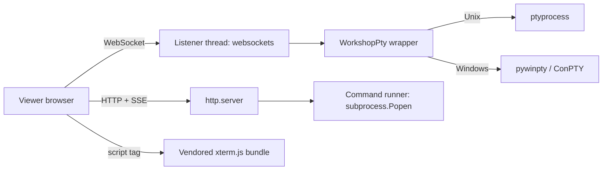

## adr_023_workshop_terminal_transport_pty_library_and_emulator_bundling - Workshop terminal transport, PTY library, and emulator bundling
> Date: 2026-06-15 (phase log updated 2026-06-15)
> Status: Accepted
> Drivers: No native build step on operator machines, stdlib-first dependencies, clean unavailable state when backends fail to import, low-latency bidirectional terminal I/O, and a vendored emulator that loads without a bundler.
> Related request: `req_244_restyle_the_explorer_and_add_a_workshop_screen_with_terminals_and_command_runner`
> Related backlog: `item_421_add_in_app_terminal_manager_with_pty_transport_and_cdx_handoff_launchers`
> Related task: `task_219_implement_explorer_restyle_and_workshop_screen_with_terminals_and_command_runner`
> Reminder: Update status, linked refs, decision rationale, consequences, and follow-up work when you edit this doc.

# Overview
Lock in the runtime choices that the Workshop terminal and command runner slices need: which I/O transport carries terminal traffic, which PTY library spawns the shell, and how the terminal emulator is vendored into the viewer.

# Context
- The viewer ships as a static asset bundle served by the existing stdlib `http.server` companion of `logics-manager view`. Operators install it via `pipx`/`pip` and run it on their own machines.
- Operator machines span macOS, Linux, and Windows. None should require a native build step (no node-gyp, no MSVC toolchain).
- The terminal slice needs bidirectional streaming with low latency, the command-runner slice only needs server-to-client streaming plus a small POST surface (start/stop).
- The existing `http.server` already handles HTTP requests on the same port. Adding a second long-lived listener is acceptable if it stays in-process.
- We want to keep the dependency footprint small and rely on the Python stdlib where possible, falling back to widely packaged pure-Python or pre-built wheels when the stdlib is not enough.

# Decision
- **Terminal transport: WebSocket** on a companion listener thread inside the viewer process, using the `websockets` library (asyncio, pure Python, BSD-licensed, available as wheels on every platform). The WebSocket server listens on the same loopback address as the HTTP server and accepts a session identifier as the first frame. Each PTY session keeps one WebSocket open in each direction so resize, input, and output share the same channel.
- **Command-runner transport: SSE + POST** on the existing `http.server`. `GET /api/workshop/commands/<id>/stream` streams stdout/stderr line-by-line as `text/event-stream`, `POST /api/workshop/commands/<id>/start` and `/stop` mutate the session. SSE is enough here because commands are short-lived and we never need keystrokes back into the process.
- **PTY library:**
  - macOS and Linux: `ptyprocess` (pure Python, used by Jupyter/Spyder; releases the GIL on `read`).
  - Windows: `pywinpty` (ConPTY-backed wheel; only loaded on `sys.platform == "win32"`).
  - Selection happens behind a thin `WorkshopPty` interface so callers do not branch on platform.
- **Command-runner process control:** `subprocess.Popen` with `start_new_session=True` on Unix and `CREATE_NEW_PROCESS_GROUP` on Windows so the stop endpoint can deliver a clean group-level signal and wait for exit before reporting status.
- **Entry-point discovery:** stdlib `tomllib` (Python 3.11+) for `pyproject.toml`; the existing JSON parsing for `package.json`. No third-party parser.
- **Terminal emulator:** vendor `xterm.js@5.5.x` plus `@xterm/addon-fit` and `@xterm/addon-web-links` under `clients/shared-web/media/vendor/xterm/` and ship the minified bundles directly. The viewer loads them with regular `<script>` tags; no bundler step is added. xterm.js is MIT-licensed; a `LICENSE` file ships alongside the vendored sources.
- **Capability gating:** the runtime exposes `workshop.available` only when the OS PTY backend imports cleanly and the listener thread starts. Failure to import or bind degrades to the unavailable state with a human-readable message.

# Consequences
- Adds two runtime dependencies in `pyproject.toml`: `websockets` (all platforms) and a platform-marker dependency on `ptyprocess` (Unix) / `pywinpty` (Windows). Both ship as wheels — no compilers required.
- The viewer process now owns a second listener thread. We must ensure it is shut down with the HTTP server (and that `SIGINT` reaches both) — covered by an explicit shutdown hook.
- The vendored xterm.js bundle adds ~280 kB to the viewer payload. Acceptable because the viewer is local-only and the assets are gzipped over loopback.
- Operators on hardened environments where loopback WebSockets are blocked will see the Workshop unavailable state. That is a feature: we prefer a clear "unavailable" message over silent fallbacks.
- Future ADRs can replace the SSE command runner with WebSockets without breaking clients because the frontend already speaks both transports.

# Migration plan
- Land the PTY/transport plumbing behind the `workshop` capability so existing viewer sessions continue to work unchanged.
- Vendor xterm.js in a single commit with provenance (`vendor/xterm/PROVENANCE.md`) and pin a version.
- Smoke-test on macOS, Linux, and Windows before flipping the capability default to available.

# Phase log

## Phase 2.1 (shipped under `task_222`, 2026-06-15) — stdlib-only PTY + SSE
The first delivery of the terminal slice ships without the new runtime dependencies that this ADR proposed. The goal was to keep the installer footprint at zero new wheels for the phase-2.1 audience (macOS / Linux operators using `pipx`-installed `logics-manager`) and to land something the team can use immediately.

- **PTY**: `pty.fork()` from the Python stdlib (Unix only). Windows hosts advertise `workshop.detail.terminalsAvailable=false` until phase 2.2 wires `pywinpty`.
- **Transport**: SSE+POST on the existing `http.server`. `GET /api/workshop-terminal/<id>/stream` carries the output (`data` events + a final `end` frame); `POST /api/workshop-terminal-input` / `-resize` / `-stop` mutate the session. The `websockets` listener thread is deferred.
- **Emulator**: xterm.js 5.3.0 + `xterm-addon-fit` 0.8.0 + `xterm-addon-web-links` 0.9.0 vendored under `clients/shared-web/media/vendor/xterm/` (matching the original plan). Loaded with plain `<script>`/`<link>` tags, no bundler.
- **Auth**: the SSE + POST routes go through the same `do_GET`/`do_POST` gate as everything else, so the bearer-token contract from `req_245` covers them. The terminal POST routes are in `VIEWER_MUTATING_ROUTES` so LAN clients see 403 even with the right token.

Phase 2.2 (planned): add `ptyprocess`/`pywinpty` for Windows + WSL, promote the transport to WebSockets only if SSE+POST shows latency or input-rate problems in real use. The frontend abstraction over the transport stays the same.

# Follow-up work
- Track an upstream issue: if `websockets` adds first-class support for adopting an existing `socket`, simplify the listener bootstrap.
- Revisit SSE for the command runner and the terminal once they have been live for a release; if operators ask for interactive prompts or high-throughput I/O we will promote them to WebSockets.

# References
- Related request: `req_244_restyle_the_explorer_and_add_a_workshop_screen_with_terminals_and_command_runner`
- Related backlog: `item_421_add_in_app_terminal_manager_with_pty_transport_and_cdx_handoff_launchers`
- Related task: `task_219_implement_explorer_restyle_and_workshop_screen_with_terminals_and_command_runner`
