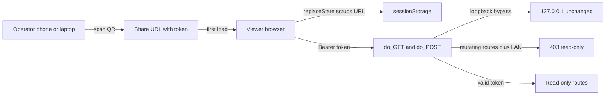

## adr_024_lan_viewer_auth_model_read_only_contract_and_qr_library_choice - LAN viewer auth model, read-only contract, and QR library choice
> Date: 2026-06-15
> Status: Accepted
> Drivers: Keep the viewer safe to expose on a trusted LAN without persisting secrets, enforce read-only at the HTTP layer so future endpoints cannot regress the posture, and give operators a friction-free phone handoff with no native build step.
> Related request: `req_245_expose_the_viewer_on_the_local_network_with_token_authentication_and_read_only_safety`
> Related backlog: `item_423_add_lan_opt_in_cli_flag_with_http_layer_read_only_enforcement`
> Related task: `task_220_implement_lan_exposure_with_token_auth_qr_code_and_read_only_safety`
> Reminder: Update status, linked refs, decision rationale, consequences, and follow-up work when you edit this doc.

# Overview
Capture how the viewer is exposed on the LAN: how the token is generated and accepted, why read-only enforcement lives at the HTTP layer, and how the launch-time QR fallback is produced.

# Context
- Operators want to point a phone at the viewer for read-only inspection during pair sessions, but the existing surface binds to loopback only and ships no auth.
- We must not persist any secret to disk (the token has to die with the process) and we must not allow LAN clients to drive mutating endpoints.
- The read-only posture must be enforced where the request is handled — adding `if mutating: refuse` next to each route is brittle.
- The handoff needs to work from a phone with no extra tools; a printable QR is the cleanest UX but adding a heavy native dependency is not.

# Decision
- **Token generation:** `secrets.token_urlsafe(32)` at process start, kept in memory on the server instance only, regenerated on every launch. No persistence, no env var, no log line outside the launch banner.
- **Token comparison:** `hmac.compare_digest` against the constant on every request to defeat timing oracles.
- **Handoff:**
  - First load: `GET /?t=<token>` — the handler accepts the token from `?t=` once, the browser swaps it into `sessionStorage` (`logics.lan.token`) and calls `history.replaceState` to scrub the query from the URL bar.
  - Subsequent requests: the browser attaches `Authorization: Bearer <token>` from sessionStorage to every fetch/EventSource request.
- **Enforcement layer:** in `LogicsViewerRequestHandler.do_GET` / `do_POST`, before route dispatch:
  - If the remote address is loopback (`127.0.0.1`, `::1`), pass through. This preserves the local UX and lets local tests skip the gate.
  - Otherwise require either the Bearer header or the one-time `?t=` query parameter; on mismatch, refuse with HTTP 401 and `WWW-Authenticate: Bearer`.
  - `do_POST` additionally consults `VIEWER_MUTATING_ROUTES` and refuses with HTTP 403 in LAN mode — any new mutating route must opt in by extending the registry.
- **Read-only contract:** `VIEWER_MUTATING_ROUTES` is the single source of truth. Reviewers can grep for it; the test suite asserts that every POST route is either in the registry or explicitly listed as safe.
- **QR library:** ship a minimal pure-Python QR encoder vendored in the repo at `logics_manager/_qr_terminal.py` (a small implementation, MIT-style, no native build). The launch banner prints the QR matrix to the terminal with a plain-text URL + token fallback under it. Adding `segno` or `qrcode` as a hard dep would force every operator install to also pull a wheel; the vendored encoder keeps the install surface minimal. The encoder is independently importable so we can swap it for a vendored library later without changing callers.

# Consequences
- The LAN token never touches disk, env, or logs after the launch banner. Operators who lose the terminal lose the token; they restart the viewer. Acceptable: the viewer is designed to be ephemeral.
- Loopback bypass means a local attacker who can already write to `/tmp` and bind to 127.0.0.1 isn't blocked by the auth check. That matches the existing trust model.
- Every future POST endpoint must be triaged: add it to `VIEWER_MUTATING_ROUTES` or document why it is safe to expose read-only.
- A vendored QR encoder adds maintenance surface we own; we accept that to keep the install footprint minimal.

# Migration plan
- Land the registry and the LAN-mode gate first (items 1-2). Token generation and enforcement (items 4-6) build on top.
- Add a test fixture that walks every registered POST route and asserts the LAN gate refuses it. Any new route surfaces in the failing test until triaged.

# Follow-up work
- If we later need write access from LAN, promote the bearer scheme to scoped capabilities rather than a single boolean.
- Reconsider the vendored QR encoder if upstream `segno` adopts a license/policy we are happy with and ships in our base image.

# References
- Related request: `req_245_expose_the_viewer_on_the_local_network_with_token_authentication_and_read_only_safety`
- Related backlog: `item_423_add_lan_opt_in_cli_flag_with_http_layer_read_only_enforcement`
- Related task: `task_220_implement_lan_exposure_with_token_auth_qr_code_and_read_only_safety`
