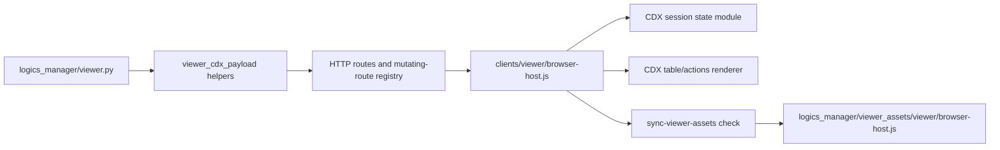

## adr_025_bound_viewer_cdx_modularization_around_payload_state_and_asset_sync - Bound viewer CDX modularization around payload state and asset sync
> Date: 2026-06-19
> Status: Settled
> Drivers: Reduce regression risk around CDX refresh/session behavior, keep browser-host changes reviewable, and preserve the packaged viewer asset sync contract.
> Related request: `req_250_address_project_audit_follow_up_actions`
> Related backlog: `item_441_plan_viewer_surface_modularization_and_asset_sync_safeguards`
> Related task: `task_233_orchestrate_project_audit_remediation`
> Reminder: Update status, linked refs, decision rationale, consequences, migration plan, and follow-up work when you edit this doc.

# Overview
The local viewer CDX surface should be reduced through behavior-preserving extractions around payload collection, CDX state, and table rendering.
The previous CDX removal and stale-refresh fixes showed the highest-risk areas: browser-side session state, long asynchronous refreshes, and the duplicated packaged browser asset.

# Context
- `logics_manager/viewer.py` and `clients/viewer/browser-host.js` are large enough that unrelated viewer changes can collide in review.
- CDX behavior is correctness-sensitive: enable/disable/remove, import/export, stale async status refreshes, and LAN mutating-route safety all interact.
- The repository intentionally keeps a source viewer asset and a packaged Python asset copy. Any extraction must keep `npm run check:viewer-assets` as the gate that proves they stay synchronized.
- The desired outcome is not a framework rewrite. It is a sequence of small seams that make future CDX changes easier to test and review.

# Decision
Use the following order for CDX/viewer modularization:

1. Extract Python CDX payload helpers from `logics_manager/viewer.py` into a focused module such as `logics_manager/viewer_cdx.py`.
   - Move command payload builders, response shaping, and command-name constants first.
   - Keep route dispatch and LAN mutating-route enforcement in `viewer.py` until route extraction has dedicated coverage.
2. Extract browser CDX state helpers from `clients/viewer/browser-host.js`.
   - Start with session enablement predicates, stale refresh invalidation, selected-session state, and status normalization.
   - Keep DOM event registration in the host until renderer tests cover the new state module.
3. Extract CDX table/action rendering after state helpers are stable.
   - Keep action availability rules (`New`, `Resume`, `Handoff`, `Remove`) in one exported helper that tests can exercise without a DOM.
   - Preserve disabled-session removal support as an explicit regression case.
4. Preserve the asset sync contract.
   - Source edits happen in `clients/viewer/browser-host.js` or extracted `clients/viewer/*.js` files.
   - Every change touching viewer browser assets must run `npm run sync:viewer-assets` or `npm run check:viewer-assets`.
   - Packaged assets remain generated copies; do not hand-edit only `logics_manager/viewer_assets/viewer/*`.
5. Keep smoke coverage as the final user-facing guard.
   - Unit tests should cover pure state/action rules.
   - `npm run test:viewer-smoke` remains the end-to-end check for viewport rendering and stale refresh regressions.

# Alternatives considered
- Leave the files monolithic and rely only on comments.
- Extract all viewer code in one large commit.
- Introduce a frontend framework or bundler for the local viewer.
- Remove the packaged asset copy and require runtime filesystem access to `clients/viewer`.

# Consequences
- CDX behavior changes gain smaller review surfaces and more direct tests.
- Asset synchronization remains explicit and mechanical.
- The first extraction will add files before it reduces total line count, but it lowers risk by moving pure logic before event wiring.
- Python route extraction is deferred until the payload/module boundary proves stable.

# Migration and rollout
- First extraction wave: Python CDX payload helpers plus tests for remove/import/export/enable payload shaping.
- Second extraction wave: browser CDX action availability and stale-refresh state helpers plus existing browser-host regression tests.
- Third extraction wave: CDX table renderer extraction and viewer smoke validation.
- After each wave, run `npm run check:viewer-assets`, focused browser-host tests, Python viewer tests, and `npm run test:viewer-smoke` when DOM/rendering behavior changed.

# Follow-up work
- Split the CDX HTTP route table after payload extraction if route dispatch remains difficult to review.
- Track line counts after each wave and stop when the entrypoints are readable orchestration shells.
- Add a small maintainer checklist to PR review templates if asset sync drift recurs.

# References
- `clients/viewer/browser-host.js`
- `logics_manager/viewer.py`
- `scripts/dev/sync-viewer-assets.mjs`
- `tests/viewer.browser-host.test.ts`
- `tests/python/test_logics_manager_cli.py`
