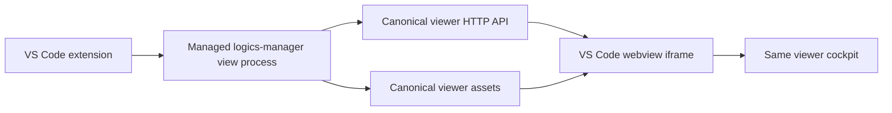

## adr_026_embed_the_canonical_local_viewer_in_the_vs_code_panel - Embed the canonical local viewer in the VS Code panel
> Date: 2026-07-05
> Status: Settled
> Drivers: viewer parity, lowest duplication, VS Code maintenance cost, local security boundaries
> Related request: `req_287_make_the_vs_code_extension_host_the_same_logics_viewer_ui`
> Related backlog: `item_526_define_the_vs_code_embedded_viewer_host_contract`, `item_527_add_a_vs_code_managed_local_viewer_server_lifecycle`, `item_528_render_the_canonical_viewer_inside_the_vs_code_logics_panel`, `item_529_bring_viewer_write_actions_and_focus_workflows_to_parity_in_vs_code`, `item_530_retire_the_historical_vs_code_cockpit_and_command_surface`
> Related task: `task_284_orchestrate_vs_code_embedded_viewer_parity`
> Reminder: Update status, linked refs, decision rationale, consequences, migration plan, and follow-up work when you edit this doc.

# Overview
The VS Code Logics panel should host the same local viewer that `logics-manager view` serves, instead of rebuilding viewer screens inside the extension.

# Context
- The local browser viewer is now the fastest-moving product surface.
- The historical VS Code webview still has its own HTML, TypeScript indexing, and message handlers.
- Keeping both as normal product surfaces duplicates UI behavior and leaves VS Code behind.
- The viewer already owns route-level security, mutating-route checks, LAN behavior, diagnostics, CDX, workspace preview, and terminal/workshop APIs.

# Decision
- The VS Code extension will manage a local `logics-manager view --host 127.0.0.1 --port 0 --no-open` process for the active workspace root.
- The Logics webview will embed that local viewer URL in an iframe and allow only that loopback origin through its CSP.
- Normal viewer data and actions must continue to route through the Python viewer HTTP API.
- TypeScript may manage only VS Code concerns: workspace-root selection, child-process lifecycle, command palette shortcuts, focus URL construction, panel loading/error states, and cleanup.
- Do not implement a general TypeScript mirror of `/api/*`. Add a VS Code-specific bridge only for a route that cannot be supported by the canonical viewer process, and document the exception in the parity matrix.

# First milestone
Supported in the first milestone:
- viewer shell, board/details, document preview, status cockpit, recent activity, Git/CI/release panels, CDX status/reports/missions, workspace preview, and diagnostics;
- mutating actions that work unchanged through the loopback viewer process;
- VS Code command shortcuts for opening the embedded viewer, restarting it, focusing a Logics ref, and opening the same URL externally.

Explicitly deferred:
- remote VS Code/Codespaces/SSH behavior;
- replacing the viewer terminal transport;
- LAN exposure from inside VS Code beyond launching the existing external viewer mode;
- any action that requires a verified VS Code-only bridge.

# Alternatives considered
- Rebuild the viewer inside the VS Code webview using shared assets plus `postMessage` handlers.
Rejected because it preserves the second cockpit and reimplements the Python API contract in TypeScript.
- Open only an external browser.
Rejected because the requested product outcome is the same viewer inside the VS Code panel.
- Use a full HTTP proxy in the extension.
Rejected for the first milestone because the loopback viewer already owns routing and security; a proxy adds code without changing the user outcome.

# Consequences
- VS Code parity depends on the viewer server starting reliably.
- CSP and iframe behavior become the main technical risk.
- The extension gets smaller after the historical cockpit is retired.
- Browser viewer behavior remains unchanged because the iframe loads the same server surface.

# Migration and rollout
1. Add a small viewer-process manager with tests.
2. Replace the Logics panel with an embedded-viewer loading/error shell.
3. Add command palette shortcuts for focus, restart, external open, and optional LAN launch.
4. Audit route/action parity and document any disabled route.
5. Remove the historical VS Code cockpit after parity proof.

# Follow-up work
- If iframe embedding is blocked by VS Code in a supported environment, switch only the shell to same-webview asset loading with a configurable API base URL; keep the Python `/api/*` backend as source of truth.
- Add remote workspace support as a separate request if operators need it.

# References
- `logics_manager/viewer.py`
- `clients/viewer/browser-host.js`
- `clients/vscode/src/logicsWebviewHtml.ts`
- `clients/vscode/src/logicsViewProvider.ts`
- `logics/architecture/adr_012_keep_the_vs_code_plugin_as_a_thin_client_over_shared_hybrid_runtime_commands.md`
- `logics/architecture/adr_025_bound_viewer_cdx_modularization_around_payload_state_and_asset_sync.md`
