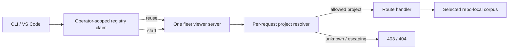

## adr_028_scope_the_fleet_viewer_registry_to_the_operator_profile_and_resolve_project_context_per_request - Scope the fleet viewer registry to the operator profile and resolve project context per request
> Date: 2026-08-12
> Status: Proposed
> Drivers: One fleet server per operator, tab isolation, LAN security preservation, CLI and VS Code compatibility
> Related request: `req_342_launch_a_standalone_logics_fleet_viewer_through_one_shared_local_server`
> Related backlog: `item_705_define_standalone_fleet_launch_and_bounded_operator_fleet_roots`, `item_706_make_project_context_request_scoped_before_sharing_the_viewer_server`, `item_708_replace_per_repository_viewer_reuse_with_a_safe_fleet_singleton`
> Related task: `task_339_deliver_the_standalone_fleet_viewer_and_singleton_server`
> Reminder: Update status, linked refs, decision rationale, consequences, migration plan, and follow-up work when you edit this doc.

# Overview
Replace the per-repository viewer registry key and the mutable shared `repo_root` server field with two complementary changes: one operator-scoped fleet claim in the registry, and an explicit validated project identifier carried with every viewer route.

# Context
- `claim_or_reuse` in `logics_manager/viewer_registry.py` keys each registry slot by `str(Path(repo_root).resolve())`. Opening three projects spawns three independent servers even though they all serve identical viewer assets.
- `LogicsViewerServer` in `logics_manager/viewer.py` holds a mutable `self.repo_root`. The switch-project endpoint overwrites this field for every connected client — tolerable for a single active viewer but unsafe as the routing model for a shared server where one browser tab can silently redirect another tab's data and action target.
- The viewer already has operator-scoped preferences in `logics_manager/viewer_preferences.py` stored under the operator's config home. Fleet roots and operator identity naturally belong alongside that preference store.
- The current `fleet` CLI (`logics_manager/fleet.py`) has no registry and no persistent state. Its discovery rule (immediate children containing `logics/`) is the right bounded model to reuse for the standalone fleet home.
- `logics/request/req_231_add_multi_project_navigation_to_the_logics_viewer.md` delivered safe multi-project switching within a launched-project context. `logics/request/req_322_one_viewer_per_repo_and_a_resolved_port_story_across_the_viewer_and_mcp.md` delivered the atomic per-repo registry. This decision evolves those foundations rather than replacing their safety properties.

# Decision
**Registry key**: Replace the per-repo key with a fixed `"fleet"` sentinel for the viewer fleet claim. The key is the same regardless of which project was the launch origin, so every viewer launch claims or reuses the one live fleet server. MCP registry keys are unaffected.

**Project context**: Remove `self.repo_root` as mutable shared server state. Every viewer route that operates on a project receives an explicit `project_id` parameter (query string or JSON body, consistent with existing viewer route conventions). A canonical resolver maps `project_id` to a validated resolved directory drawn from the server's allowed project set; it rejects unknown, missing, or path-escaping identifiers with a 403 before any filesystem operation.

**Allowed project set**: The server builds its allowed set at startup from the fleet-roots preference and at runtime when an operator adds a root or opens a project through the folder picker. An explicitly opened one-off project is added to the session allowed set without persisting it as a fleet root. No browser-provided absolute path bypasses this set.

**Standalone launch**: `--fleet` bypasses `find_repo_root` and the bootstrap prompt. The server starts from any working directory. When `--repo-root` is supplied with or without `--fleet`, the named project is added to the allowed set and the focus URL targets it directly — preserving CLI and VS Code embedding compatibility.

# Alternatives considered
- **Keep per-repo registries and add a fleet coordinator process**: A separate coordinator would proxy between callers and each per-repo server. Rejected because it adds a second long-lived process, complicates shutdown, and duplicates asset serving without reducing total server count.
- **Use HTTP session cookies for project context**: Sessions would preserve project state across requests without changing route signatures. Rejected because URL-based project focus (needed for VS Code panel focus and `--focus REF` links) cannot be expressed through a session, and cookie handling adds test complexity.
- **Validate project context only at write routes**: Leaving reads unrestricted would be simpler but creates an inconsistency where two tabs show different projects' data through different URL parameters and a read on the wrong project leaks information across operator sessions.
- **Allow arbitrary paths from the browser**: The existing folder picker uses a native OS dialog (`open-folder` route); no browser-provided path bypasses containment checks. This invariant is preserved unchanged.

# Consequences
- One viewer process is live per operator. All CLI invocations and VS Code windows that target the same operator share the same port and assets; first caller starts, rest reuse.
- Every viewer route must pass and validate a `project_id`. Routes that previously used `self.repo_root` implicitly now require an explicit parameter; this is a broad internal change but has no visible surface change for callers who already set project context through the UI.
- The VS Code extension's `--repo-root` focus path continues to work. The extension supplies the project root as the explicit project target; the server adds it to the allowed set and routes to it.
- Stale-server replacement and liveness checks from `req_322` are retained unchanged; only the registry key changes.
- Tests for two independently selected projects and a tab-isolation regression are required before this is settled.

# Migration and rollout
1. Extend `claim_or_reuse` to accept an optional key override; use `"fleet"` for viewer, keep repo-root key for all other callers.
2. Introduce the project-context resolver with path-containment and allowlist checks.
3. Thread `project_id` through all viewer routes currently reading `self.repo_root`; remove the `switch_project` mutation path once all callers use the per-request resolver.
4. Add `--fleet` CLI mode and fleet-root preference storage.
5. Update VS Code launcher to pass the workspace root as the explicit project target.
6. Run the full viewer smoke test and the cross-tab isolation regression before closing.

# Follow-up work
- If VS Code remote or Codespaces scenarios require a different transport, the explicit project-context model is compatible with a thin proxy layer because `project_id` is already in the request.
- LAN pairing across a fleet home (multiple operator machines sharing one server) is explicitly out of scope for this request; the security model should be revisited before enabling it.

# References
- `logics_manager/viewer_registry.py`
- `logics_manager/viewer.py`
- `logics_manager/viewer_preferences.py`
- `logics_manager/fleet.py`
- `logics/architecture/adr_024_lan_viewer_auth_model_read_only_contract_and_qr_library_choice.md`
- `logics/architecture/adr_026_embed_the_canonical_local_viewer_in_the_vs_code_panel.md`
- `logics/request/req_342_launch_a_standalone_logics_fleet_viewer_through_one_shared_local_server.md`
