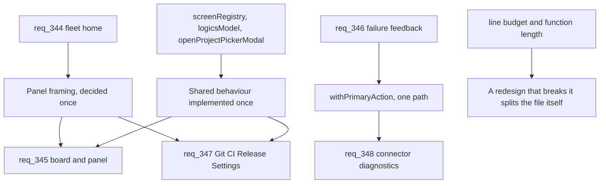

## adr_029_land_the_viewer_redesigns_on_the_shared_declaration_points - Land the viewer redesigns on the shared declaration points
> Date: 2026-08-13
> Status: Settled
> Related request: `req_345_make_the_project_view_lead_with_the_work_that_is_live`
> Related backlog: (none yet)
> Related task: (none yet)
> Drivers: five viewer requests opened in one day, each touching the same host source; the operator's question of whether this is the occasion for a viewer refactor
> Reminder: Update status, linked refs, decision rationale, consequences, and follow-up work when you edit this doc.
> Indicators reviewed: 2026-08-13 16:06:53

# Overview
- Five requests now change the viewer at once. Rather than open a sixth to restructure it, each of them lands on the declaration point that already exists for what it changes, and the existing line budget stays the gate. No speculative refactor is scheduled.

# Context
- Five requests were opened on 2026-08-13 against the viewer: `req_344` (fleet home), `req_345` (board, details panel, activity), `req_346` (fleet root, failure feedback, fleet flag), `req_347` (Git, CI, Release, Settings), `req_348` (connector diagnostics, update cache). The operator asked, reasonably, whether returning to this code so often is the occasion for a refactor.
- **The measurement does not support a refactor request on size grounds.** `scripts/check-source-line-budget.mjs` passes today. The largest files are `clients/viewer/viewer.css` at 5 321 lines, `clients/viewer/src/browser-host/index.js` at 4 447, `logics_manager/viewer.py` at 3 620 and `clients/viewer/src/browser-host/cdx.js` at 3 057. The repository has a budget for exactly this and has already judged these sizes acceptable. Opening a request to split them would be inventing work the project's own gate does not ask for.
- **The structural levers these five requests need already exist, and were built deliberately.** `screenRegistry` in the browser host declares every screen once, with how it refreshes -- added by `req_313` precisely so that adding a screen stops meaning edits in three places. `logicsModel.js` already distinguishes `isPrimaryFlowStage` from `isCompanionStage`, which is the split `req_345` needs for the board. `withPrimaryAction` is already the single path every primary action's failure takes. `openProjectPickerModal` is already the recovery the fleet root picker fails to reach. In each case the abstraction is present and the defect is that one call site does not use it.
- **The real risk is not size but divergence.** Four of the five requests independently propose the same corrections: a screen framed as a dismissable panel over a board, a verdict stated before its facts, status carried by colour rather than a repeated string, green collapsing while red expands. Delivered screen by screen, those become four similar implementations that drift. That is the cost worth spending an architecture decision on, not the line count.

# Decision
- No viewer-refactor request is opened. The five in flight are the work.
- The panel framing is decided once, in `req_344`, and inherited by every other screen. `req_347` states this explicitly and must not re-decide it.
- Where a redesign needs a behaviour that more than one screen shares -- the framing, the verdict header, the status encoding, the collapse-when-green rule, the failure-feedback path -- it is implemented once at the existing declaration point and reused, not copied per screen. A second implementation of any of these is a review finding, not a variation.
- `scripts/check-source-line-budget.mjs` and `scripts/check_function_length.py` remain the gate. A redesign that pushes a file past its budget splits that file as part of its own delivery, rather than deferring it to a refactor that has not been scheduled.
- The shared behaviours are proven where they are shared: the viewer UI campaign covers them across screens, so a screen that diverges fails a run rather than being caught by review.

## Added 2026-08-13, after auditing the nine chains for technical gaps

- **The campaign harness is itself a shared declaration point.** Eight backlog items across the chains each say "extend the campaign to my screens, take a baseline, do it before the redraws", none of them references another, and four independently describe the same wait-for-the-screen-and-prove-which-one behaviour. That is one piece of work split eight ways. The first of those items to be delivered builds the harness -- reaching a screen, waiting for it, proving which one was captured, applying the layout checks -- and the other seven consume it and add only their own screen list. A second harness is a review finding.
- **New interface state lives in the existing preference store.** Several redesigns introduce state that an operator will expect to survive a reload: which filter the board opens on, whether Done is folded per column, card or list mode, the library fold, the reader's position. `logics_manager/viewer_preferences.py` already holds ten such keys, and `req_315` already ruled on what is scoped to the user and what to the repository. New state goes there under that ruling; no redesign invents its own persistence, and none silently forgets state the operator set.
- **The line budget binds without being repeated.** No acceptance criterion in any chain mentions `scripts/check-source-line-budget.mjs`, and none needs to. The gate applies to every delivery whether or not a request restates it, and a redesign that crosses it splits the file inside its own delivery. This is recorded here so that its absence from the requests is a deliberate choice rather than an oversight.
- **Legibility without colour, and reach without a pointer, are conditions on all of them.** `req_352` owns those conditions and no screens; the chains that own screens inherit them. Its campaign checks are what make the inheritance real.

# Consequences
- Delivery order acquires a dependency it did not have: `req_344`'s framing decision gates part of `req_345` and `req_347`. This is already reflected in both requests and in their orchestration tasks.
- Some of these requests will do slightly more than their own screen needs, because they are the first to reach a shared behaviour. That cost is accepted here rather than argued per request.
- If a file does cross its budget during delivery, the split lands inside the request that caused it. This may make one backlog item larger than its siblings; that is preferred to a refactor request nobody has scoped.
- The campaign harness becomes a delivery dependency the chains do not name individually: whichever campaign item lands first is larger than its siblings, and the seven that follow are smaller. That imbalance is deliberate and should not be re-split.
- Revisit if a sixth viewer request opens without an obvious home: that would be evidence the declaration points are missing one, and at that point a restructuring request would have something concrete to restructure.

# References
- Related request: `req_345_make_the_project_view_lead_with_the_work_that_is_live`
- Related backlog: (none yet)
- Related task: (none yet)
- Also constrains: `logics/request/req_344_make_the_fleet_home_read_as_the_product_s_first_screen.md`, `logics/request/req_346_close_the_gaps_behind_a_fleet_root_click_that_does_nothing.md`, `logics/request/req_347_make_the_git_ci_release_and_settings_screens_answer_their_own_question.md`, `logics/request/req_348_stop_the_viewer_from_swallowing_a_diagnostic_and_from_repeating_a_stale_update.md`, `logics/request/req_349_make_the_corpus_health_and_onboarding_screens_earn_the_numbers_they_print.md`, `logics/request/req_350_theme_the_viewer_s_native_controls_and_finish_the_workshop_and_cdx_screens.md`, `logics/request/req_351_make_the_reader_readable_and_the_filter_panel_say_something.md`, `logics/request/req_352_keep_the_viewer_redesigns_legible_without_colour_and_reachable_without_a_mouse.md`
