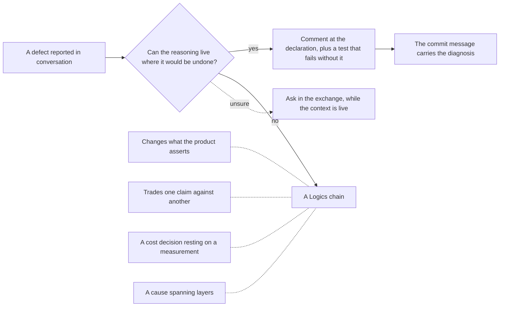

## adr_030_decide_when_a_fix_needs_a_logics_chain_and_when_a_comment_is_the_record - Decide when a fix needs a Logics chain and when a comment is the record
> Date: 2026-08-15
> Status: Settled
> Related request: (none yet)
> Related backlog: (none yet)
> Related task: (none yet)
> Drivers: Twelve operator-reported fixes shipped in one day with no Logics document behind them; the corpus assumes work arrives as a request and some of it does not.
> Reminder: Update status, linked refs, decision rationale, consequences, and follow-up work when you edit this doc.
> Indicators reviewed: 2026-08-15 16:38:02

# AI Context
- Summary: A fix needs a Logics chain when its reasoning cannot live at the point where it would be undone; otherwise the comment and its test are the record.
- Keywords: governance, when to scaffold, operator-reported fixes, comment as record, ADR 009 sibling
- Use when: Deciding whether a defect reported in conversation gets a chain or a commit.
- Skip when: Work that arrived as a request already -- it has its chain.

# Overview
- Work reported in conversation and fixed on the spot is real work, and most of it does not belong in the corpus. This states which part does, by asking where the reasoning can live rather than how large the change is.

# Context
- On 2026-08-15, 104 commits landed and 12 carried no Logics reference. All twelve were defects the operator reported in conversation: the Done fold overflowing its column, the list-row accent, a collapse that moved a chevron without folding, a runbook reported as orphaned, the reference index losing its scroll, editing a document after switching project, a slow screen rendering over the one just opened, Getting Started's ordering, the audit at 47s, the Settings identity grid, the reader's contents nav, and the runbook listing's cost.
- Nothing was neglected: each was diagnosed, measured or captured on a running viewer, fixed, tested and committed with its reasoning. What none of them had was a document.
- This is the same shape as req_372's finding about GitHub issues, on a different channel. There, the bridge assumes an issue is triaged before the work starts, so ten issues went around it. Here, the corpus assumes a need arrives as a request, so twelve fixes went around it. A path that is actually walked has no door.
- Size does not separate the twelve. Seven are localised traps -- a shorthand overriding a longhand, `display: grid` beating the UA stylesheet's `[hidden]`, a width that ignored its own margins -- and every one of them already carries a comment at the exact declaration that would be redone, plus a test that fails if it is. Five are not: the orphaned signal decides which document kinds carry a warning, the project-context defect had a cause spanning two layers, one arbitrates between two screens, and two are cost decisions with measurements. Those are the ones a future reader can reverse in good faith.
- The repository already relies on this distinction elsewhere without having stated it. `allow_reuse_address` carried its Windows finding and the price it traded, at the declaration; `_duplicate_proof_issues` carries why it looks at open documents only. Both are decisions recorded where they would be undone, and both held.
- The throughput matters too. The twelve happened during a fast report-and-fix exchange. A rule requiring a request per CSS trap would have stopped that exchange without protecting anything, since the knowledge was already being written where it counts.

# Decision
- A fix needs a Logics chain when **its reasoning cannot live at the point where it would be undone**. Otherwise the code comment and the test that fails without it are the record, and the commit message carries the diagnosis.
- Reasoning that cannot live at one point, and therefore needs a chain: a change to **what the product asserts** to an operator; a **trade** between two things that both have a claim; a **cost decision resting on a measurement**; a cause that **spans layers**, where no single site explains it.
- Reasoning that can: a defect **confined to one declaration or one function**, whose comment names the trap and whose test fails if it returns.
- When in doubt, the fix ships with a comment and the question is asked out loud, in the exchange, while the context is live. The operator decides. Deciding afterwards is archaeology, which is how this ADR came to be written.
- Whoever fixes says which side it falls on **at the moment of fixing**, in one sentence, rather than relying on remembering later.

# Consequences
- Some work will keep landing without a document, deliberately. The corpus stops pretending to be a complete record of every change and becomes a record of every decision, which is what it can actually be kept as.
- Comments and tests carry more weight, so a mechanical fix without a comment naming its trap is now incomplete rather than merely terse.
- Misfiled work is recoverable in one direction only: a fix that turns out to have decided something can be given a chain afterwards, whereas a chain scaffolded for a one-line CSS trap is dead weight nobody deletes. When genuinely unsure, prefer the comment and revisit.
- The twelve are not backfilled. They are history, nothing waits on them, and their commit messages carry the diagnosis -- the same call req_372 makes about the ten issues that closed without a link.
- This sits beside ADR 009 rather than replacing it: ADR 009 governs updating affected docs **during** a wave of work that has a chain; this governs whether the work gets a chain at all.

# References
- Related request: (none yet)
- Related backlog: (none yet)
- Related task: (none yet)
- Sibling finding on another channel: `logics/request/req_372_put_the_github_issue_bridge_on_the_path_the_work_actually_takes.md`
- Decisions already recorded where they would be undone: `logics_manager/viewer.py`, `logics_manager/audit.py`
