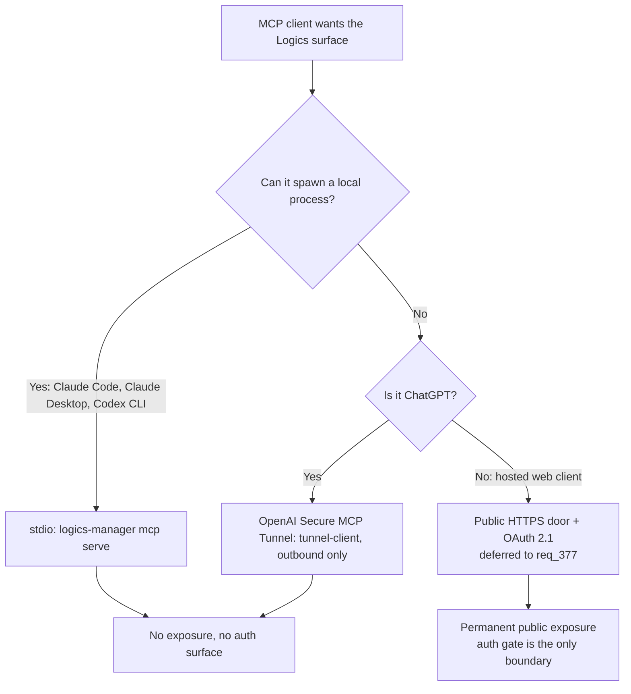

## adr_031_one_mcp_transport_per_client_class - One MCP transport per client class
> Date: 2026-08-15
> Status: Settled
> Related request: `req_376_make_the_chatgpt_mcp_connector_plug_and_play`
> Related backlog: (none yet)
> Related task: `task_387_deliver_a_durable_chatgpt_native_reactive_mcp_connector`
> Drivers: Reachability of the MCP surface per client; exposure of the operator's machine; how much authentication work each option actually requires.
> Reminder: Update status, linked refs, decision rationale, consequences, and follow-up work when you edit this doc.

# Overview
- Which transport carries the Logics MCP surface is decided by whether the client can spawn a local process, not by which vendor the client belongs to.

# Context
- Three ways to reach this repository's MCP surface were on the table at once, and the corpus had started designing the most expensive one first.
- Local clients (Claude Code, Claude Desktop, Codex CLI) launch the server themselves. `logics-manager mcp serve` already exists and already works: nothing is listening, nothing is exposed, there is no token to manage.
- ChatGPT cannot spawn a local process, but OpenAI shipped Secure MCP Tunnel (May 2026): `tunnel-client` opens an outbound HTTPS connection, pulls MCP work, and forwards it to a server that stays on localhost. The stable identity is a `tunnel_id`, and it can drive a stdio server directly. No inbound port, no public URL, no OAuth.
- A hosted web client that is neither of those (a claude.ai web connector or equivalent) would need a genuinely public HTTPS entry point with OAuth 2.1 discovery -- RFC 9728 protected resource metadata, RFC 8414, RFC 7591 or client-id metadata documents, RFC 8707 audience binding -- plus a tunnel provider whose URL is stable. That is the most expensive option by a wide margin, and as of 2026-08-15 no such client is actually asked for.
- Before this decision, `req_376_make_the_chatgpt_mcp_connector_plug_and_play` was scoped around a public localtunnel URL plus a hand-built OAuth front door, to serve a client that never needed either.

# Decision
- Route each client to the cheapest transport that reaches it: stdio when the client can spawn a process, OpenAI's Secure MCP Tunnel for ChatGPT, and a public HTTPS door only for hosted web clients that neither covers.
- Build only the transports a real client needs today. The public door is captured in `req_377_expose_the_mcp_surface_to_hosted_web_clients_through_a_public_https_door` in Draft, with its research intact, and stays unbuilt until a hosted client actually asks.
- The viewer's connector screen is the place this decision surfaces to the operator: it names the transport for the client at hand and gives the setup that client needs, rather than presenting one universal URL-and-token.
- The existing static bearer token on the HTTP surface stays as it is. It is defence in depth for local and tunnelled use, not the thing that makes a public door safe.

# Consequences
- The public URL disappears from the ChatGPT path entirely, and with it the whole class of problems the corpus was about to solve: unstable localtunnel subdomains, the loca.lt interstitial, TLS terminated by a third party, and durable OAuth token storage.
- `item_847_make_the_tunnel_url_and_bearer_token_durable_across_restarts` and `item_848_give_the_connector_a_chatgpt_native_oauth_front_door` are Obsolete, superseded by `req_377_...`. The High-complexity OAuth slice leaves the active corpus.
- ChatGPT now depends on an OpenAI Platform organization feature: a `tunnel_id` and an API key carrying the Tunnels scopes, with the Platform org linked to the ChatGPT workspace. That is a new external dependency, and an operator without it has no ChatGPT path.
- Connector credentials are machine-level, not per-repository (`~/.config/logics-manager/tunnel.env`, owner-only, env vars taking precedence). The connector is one per machine even while the MCP surface it serves is still one repository, so putting its `tunnel_id` and API key in a project's `.env` would be the wrong unit from the start.
- Open question, deliberately unanswered here: the connector is scoped to one repository, because the MCP surface binds a single `repo_root` at startup (logics_manager/mcp.py's `_repo_root`) and every tool resolves paths under it. A connector covering the whole fleet would need a project selector on every tool, and cannot cross machines anyway -- an MCP process only reads the disk it runs on, so the widest honest unit is one connector per machine, with that machine's project registry behind it, and one ChatGPT connector per machine. Worth doing when a second project's connector actually becomes annoying to run; not before.
- The day a hosted web client does arrive, the exposure question is a deliberate decision with the research already done, not an accident of how the connector happened to be built.
- Tailscale Funnel, not localtunnel, is the recorded starting point if a public door is ever built: TLS terminates on the operator's own machine and the name is stable. Its trade-off is a guessable name published in Certificate Transparency logs, which is why the auth gate carries the whole burden there.

# References
- Related request: `req_376_make_the_chatgpt_mcp_connector_plug_and_play`, `req_377_expose_the_mcp_surface_to_hosted_web_clients_through_a_public_https_door`
- Related backlog: `item_849_fix_the_settings_connector_toggle_and_make_the_connector_screen_reactive`
- Related task: `task_387_deliver_a_durable_chatgpt_native_reactive_mcp_connector`
- OpenAI Secure MCP Tunnel: https://developers.openai.com/api/docs/guides/secure-mcp-tunnels
- MCP authorization spec: https://modelcontextprotocol.io/specification/draft/basic/authorization
- logics_manager/mcp.py
- clients/viewer/src/browser-host/index.js
