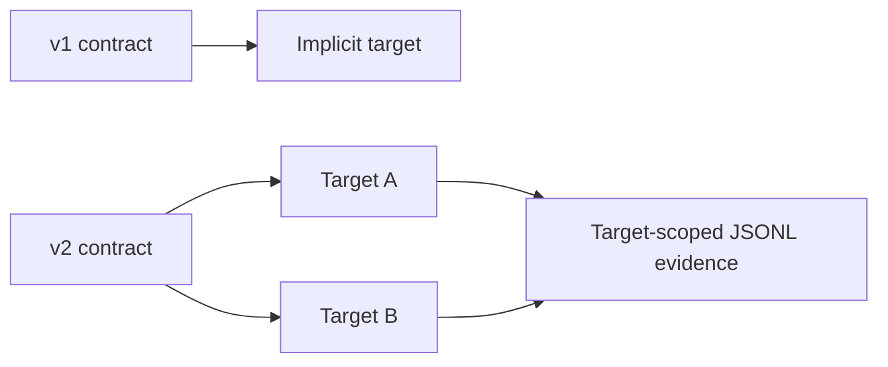

## adr_032_release_target_contract_v2_boundaries - Release target contract v2 boundaries
> Date: 2026-08-22
> Status: Proposed
> Related request: `req_379_make_release_and_closeout_workflow_contracts_convergent_across_targets`
> Related backlog: `item_855_add_target_scoped_release_contracts_and_evidence`
> Related task: `task_389_deliver_convergent_closeout_repair_and_multi_target_release_contracts`
> Drivers: independent artefact readiness, evidence isolation, v1 compatibility, and unambiguous command selection
> Reminder: Update status, linked refs, decision rationale, consequences, and follow-up work when you edit this doc.
> Indicators reviewed: 2026-08-22 13:06:50

# Overview
- Release contract v2 represents each independently releasable artefact as an explicit target while preserving the single-target v1 contract unchanged.

# Context
- The current contract evaluates one version source set, tag pattern, gate set, and evidence state for a repository. A project with a dashboard and worker can therefore satisfy the dashboard release gates while the worker is unmodelled.
- A target must own the release-specific policy: version identity, tags, gates, validation, publication, and evidence. A generic inheritance layer would make the first migration ambiguous and is not required for two real targets.
- The JSONL evidence ledger is already append-safe. Splitting it into files would add migration and discovery complexity without improving isolation; a target field and filtered evaluation are sufficient.

# Decision
- Keep v1 contracts and commands valid by normalizing them internally to one implicit target. Legacy evidence without `target_id` belongs to that implicit target only.
- Add v2 contracts with a non-empty list of unique target IDs. A target is self-contained; every excluded gate records a reason. A target that has no file version declares an explicit release-identity policy rather than receiving an invented version file.
- Keep one evidence JSONL store. New v2 entries carry `target_id`; target-scoped reset rewrites the ledger atomically and preserves all non-selected and malformed lines.
- Treat target IDs as stable opaque identifiers: renaming a target creates a new target rather than silently re-attributing historical evidence.
- `status` without a target is an all-target overview. `plan`, `validate`, `evidence add`, and `reset` require `--target` for a multi-target contract and reject unknown identifiers. Single-target v1 callers need no new argument.
- Context packs, MCP, and viewer status/reset APIs expose the same overview and target-detail contract as the CLI.

# Consequences
- The release evaluator needs a normalized target model and tests for v1, two targets, legacy evidence, invalid target IDs, cross-target evidence, reset preservation, and each status consumer.
- No configuration inheritance is introduced. Repeated target configuration is accepted until a measured need for shared defaults appears.
- A project must choose its release identity for artefacts without a version file, such as a tag-derived or explicitly supplied identifier.
- Changing a v2 target ID intentionally leaves its historical evidence with the old ID; a future migration command would need an explicit audited design.

# References
- Related request: `req_379_make_release_and_closeout_workflow_contracts_convergent_across_targets`
- Related backlog: `item_855_add_target_scoped_release_contracts_and_evidence`
- Related task: `task_389_deliver_convergent_closeout_repair_and_multi_target_release_contracts`
