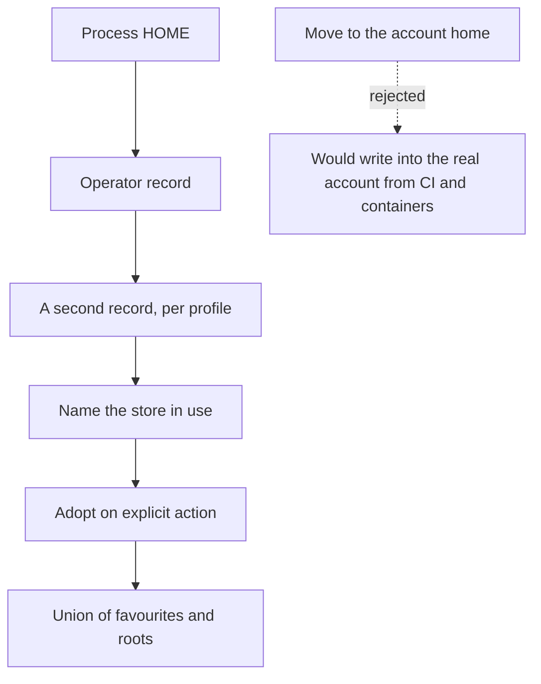

## adr_033_the_operator_preference_record_stays_keyed_to_home_and_a_forked_one_is_adopted_explicitly - The operator preference record stays keyed to HOME, and a forked one is adopted explicitly
> Date: 2026-09-09
> Status: Settled
> Related request: `req_388_say_which_operator_preference_store_the_viewer_is_using_and_stop_it_forking_silently`
> Related backlog: `item_886_decide_where_the_operator_record_belongs_and_adopt_an_existing_one_deliberately`
> Related task: `task_400_make_the_operator_preference_store_visible_then_decide_where_it_belongs`
> Drivers: Operator-visible data loss reported as F5 in req_387; four diverged stores measured on one machine.
> Reminder: Update status, linked refs, decision rationale, consequences, and follow-up work when you edit this doc.

# Overview
- The operator record keeps following the process HOME, because sandboxes depend on that; the fork it can produce is made visible and reachable instead of being engineered away.

# Context
- The operator record - favourites, last-used projects, Fleet discovery roots, refresh interval - resolves to LOGICS_VIEWER_PREFERENCES_HOME, or else to the HOME-relative .config/logics-manager directory.
- A viewer launched under a different HOME therefore opens a different file. Agent tool profiles run that way, so this is not hypothetical.
- Measured on the delivery machine: four records exist for one person, holding 9, 8, 7 and 2 favourites. Three name the same Fleet discovery root and one names none. They are diverged working sets, not copies, so no reading of them is authoritative.
- The operator reads this as data loss, and re-choosing the discovery root appears to repair it: the root is written into whichever record is now open. That is exactly the F5 report in req_387, which item_881 could not fully explain.
- The same keying decides the viewer's other per-machine state and scopes the single-instance viewer claim, so two HOMEs also mean two viewers that cannot see each other.
- item_885 already reports the record in use and warns when a second exists, in the launch banner, the viewer info payload, the Settings screen and doctor.

# Decision
- Keep the record keyed to HOME. A process that sets HOME is asking to be isolated, and every sandbox, container and CI runner relies on that; a record anchored to the account would have those runs writing into the operator's real file.
- Do not move, merge or copy any record automatically. With four diverged sets and no authoritative one, any automatic rule would silently pick a loser.
- Make the other record reachable instead: adoption is an explicit operator action that names the source file first, and merges rather than replaces - favourites and Fleet roots as a union, scalar preferences left alone.
- LOGICS_VIEWER_PREFERENCES_HOME stays the absolute override. It is how an operator deliberately points two launches at one record, and how every test isolates itself.

# Consequences
- A normal single-HOME install is unchanged: same path, same file, no warning, no new action.
- An operator whose record forked sees which file is open, sees that another exists, and can pull its favourites and Fleet roots into the active one from the viewer, without editing JSON.
- The records stay separate afterwards. Adoption copies forward once; it does not link the two, and a later change in one does not reach the other.
- Adoption is additive by construction, so it can be repeated safely, and it cannot remove a favourite. Un-starring after an adoption stays a separate, explicit act.
- Anyone wanting one record across profiles points LOGICS_VIEWER_PREFERENCES_HOME at it. That remains the supported answer, now a documented one.
- If tool profiles later stop rewriting HOME, this decision should be revisited: the fork would disappear at its source and adoption would become dead weight.

# References
- Related request: `req_388_say_which_operator_preference_store_the_viewer_is_using_and_stop_it_forking_silently`
- Related backlog: `item_886_decide_where_the_operator_record_belongs_and_adopt_an_existing_one_deliberately`
- Related task: `task_400_make_the_operator_preference_store_visible_then_decide_where_it_belongs`
