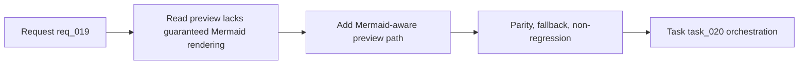

## item_019_render_mermaid_diagrams_in_read_markdown_view - Render Mermaid diagrams in Read markdown view
> From version: 1.7.0
> Status: Done
> Understanding: 100%
> Confidence: 98%
> Progress: 100%
> Complexity: Medium
> Theme: Markdown preview and Mermaid rendering
> Reminder: Update status/understanding/confidence/progress and linked task references when you edit this doc.

# Problem
The extension already exposes a `Read` action, but the rendered preview does not yet guarantee visual Mermaid rendering for Logics documents. Since Flow Manager templates now include Mermaid blocks by default, the current experience is incomplete: users can read the markdown, but they do not necessarily see the graph that carries the workflow meaning.

# Scope
- In:
  - Render valid fenced `mermaid` blocks in the `Read` flow for Logics documents.
  - Cover both VS Code runtime preview and browser-harness preview behavior.
  - Preserve normal markdown rendering for headings, lists, links, and regular code fences.
  - Add graceful fallback when Mermaid syntax is invalid or rendering is unavailable.
- Out:
  - Editing Mermaid diagrams from the preview surface.
  - Supporting non-Mermaid diagram syntaxes.
  - Broad redesign of the details panel or editor experience.

# Acceptance criteria
- AC1: `Read` renders valid Mermaid diagrams visually for representative request/backlog/task documents.
- AC2: Standard markdown rendering remains intact and non-Mermaid code fences are unaffected.
- AC3: Invalid Mermaid blocks fail gracefully without blanking the rest of the preview.
- AC4: Harness-mode preview behavior is aligned with VS Code preview behavior or explicitly documented if full parity is not feasible.
- AC5: Validation covers both generated Flow Manager docs and at least one manual smoke path.

# AC Traceability
- AC1 -> [src/extension.ts](/Users/alexandreagostini/Documents/cdx-logics-vscode/src/extension.ts) and [src/workflowSupport.ts](/Users/alexandreagostini/Documents/cdx-logics-vscode/src/workflowSupport.ts). Proof: dedicated read preview panel + Mermaid-aware markdown renderer.
- AC2 -> [src/workflowSupport.ts](/Users/alexandreagostini/Documents/cdx-logics-vscode/src/workflowSupport.ts) and [tests/workflowSupport.test.ts](/Users/alexandreagostini/Documents/cdx-logics-vscode/tests/workflowSupport.test.ts). Proof: markdown headings/lists/code fences kept under renderer tests.
- AC3 -> [src/extension.ts](/Users/alexandreagostini/Documents/cdx-logics-vscode/src/extension.ts) and [media/main.js](/Users/alexandreagostini/Documents/cdx-logics-vscode/media/main.js). Proof: Mermaid fallback banners preserved when rendering fails.
- AC4 -> [media/main.js](/Users/alexandreagostini/Documents/cdx-logics-vscode/media/main.js) and [debug/webview/README.md](/Users/alexandreagostini/Documents/cdx-logics-vscode/debug/webview/README.md). Proof: harness read preview now renders Mermaid and docs explain parity/limits.
- AC5 -> [task_020_orchestration_delivery_for_req_019_req_020_and_req_021.md](/Users/alexandreagostini/Documents/cdx-logics-vscode/logics/tasks/task_020_orchestration_delivery_for_req_019_req_020_and_req_021.md). Proof: compile/lint/test/logics-lint validations and manual read checks captured there.
- AC6 -> [media/main.js](/Users/alexandreagostini/Documents/cdx-logics-vscode/media/main.js), [debug/webview/README.md](/Users/alexandreagostini/Documents/cdx-logics-vscode/debug/webview/README.md), and [README.md](/Users/alexandreagostini/Documents/cdx-logics-vscode/README.md). Proof: harness preview parity and documented limits are explicit for browser mode.

# Links
- Request: `logics/request/req_019_render_mermaid_diagrams_in_read_markdown_view.md`
- Primary task(s): `logics/tasks/task_020_orchestration_delivery_for_req_019_req_020_and_req_021.md`

# Priority
- Impact:
  - High: Mermaid is now part of the canonical Logics docs, so missing rendering weakens the main reading experience.
- Urgency:
  - High: this should land before Mermaid-heavy flows become normal in day-to-day usage.

# Notes
- Derived from `logics/request/req_019_render_mermaid_diagrams_in_read_markdown_view.md`.
- Implemented in [src/extension.ts](/Users/alexandreagostini/Documents/cdx-logics-vscode/src/extension.ts), [src/workflowSupport.ts](/Users/alexandreagostini/Documents/cdx-logics-vscode/src/workflowSupport.ts), and [media/main.js](/Users/alexandreagostini/Documents/cdx-logics-vscode/media/main.js).

# Tasks
- `logics/tasks/task_020_orchestration_delivery_for_req_019_req_020_and_req_021.md`
