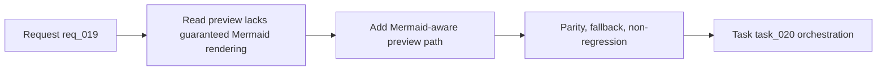

## item_019_render_mermaid_diagrams_in_read_markdown_view - Render Mermaid diagrams in Read markdown view
> From version: 1.7.0
> Status: Ready
> Understanding: 96%
> Confidence: 93%
> Progress: 0%
> Complexity: Medium
> Theme: Markdown preview and Mermaid rendering
> Reminder: Update status/understanding/confidence/progress and linked task references when you edit this doc.

# Problem
The extension already exposes a `Read` action, but the rendered preview does not yet guarantee visual Mermaid rendering for Logics documents. Since Flow Manager templates now include Mermaid blocks by default, the current experience is incomplete: users can read the markdown, but they do not necessarily see the graph that carries the workflow meaning.

# Scope
- In:
  - Render valid fenced `mermaid` blocks in the `Read` flow for Logics documents.
  - Cover both VS Code runtime preview and browser-harness preview behavior.
  - Preserve normal markdown rendering for headings, lists, links, and regular code fences.
  - Add graceful fallback when Mermaid syntax is invalid or rendering is unavailable.
- Out:
  - Editing Mermaid diagrams from the preview surface.
  - Supporting non-Mermaid diagram syntaxes.
  - Broad redesign of the details panel or editor experience.

# Acceptance criteria
- AC1: `Read` renders valid Mermaid diagrams visually for representative request/backlog/task documents.
- AC2: Standard markdown rendering remains intact and non-Mermaid code fences are unaffected.
- AC3: Invalid Mermaid blocks fail gracefully without blanking the rest of the preview.
- AC4: Harness-mode preview behavior is aligned with VS Code preview behavior or explicitly documented if full parity is not feasible.
- AC5: Validation covers both generated Flow Manager docs and at least one manual smoke path.

# AC Traceability
- AC1 -> Read preview implementation and smoke fixture docs. Proof: TODO.
- AC2 -> Regression checks on existing markdown rendering path. Proof: TODO.
- AC3 -> Error/fallback handling in preview path. Proof: TODO.
- AC4 -> Harness/runtime validation notes and docs. Proof: TODO.
- AC5 -> Task validation commands and manual checks. Proof: TODO.

# Links
- Request: `logics/request/req_019_render_mermaid_diagrams_in_read_markdown_view.md`
- Primary task(s): `logics/tasks/task_020_orchestration_delivery_for_req_019_req_020_and_req_021.md`

# Priority
- Impact:
  - High: Mermaid is now part of the canonical Logics docs, so missing rendering weakens the main reading experience.
- Urgency:
  - High: this should land before Mermaid-heavy flows become normal in day-to-day usage.

# Notes
- Derived from `logics/request/req_019_render_mermaid_diagrams_in_read_markdown_view.md`.

# Tasks
- `logics/tasks/task_020_orchestration_delivery_for_req_019_req_020_and_req_021.md`
