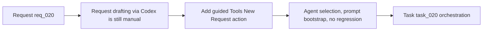

## item_020_add_tools_new_request_action_for_codex_prompt_bootstrap - Add Tools New Request action for Codex prompt bootstrap
> From version: 1.7.0
> Status: Ready
> Understanding: 96%
> Confidence: 94%
> Progress: 0%
> Complexity: Medium
> Theme: Agent orchestration and request drafting
> Reminder: Update status/understanding/confidence/progress and linked task references when you edit this doc.

# Problem
The extension supports agent selection and Codex prompt bootstrapping, but starting a new request-drafting conversation still requires several manual steps. Users who want help formulating a new Logics request must select the right agent themselves, open Codex, and reconstruct a suitable prompt before they can even describe the need.

# Scope
- In:
  - Add a `New Request` entry under `Tools`, near `Select Agent`.
  - Default or activate the request-authoring agent for this flow.
  - Open Codex with a request-drafting scaffold that preserves agent context.
  - Keep existing direct request-file creation flows unchanged.
- Out:
  - Auto-generating the final markdown request file in the same interaction.
  - Reworking all create-item actions in the UI.
  - General redesign of the Tools menu beyond this guided entrypoint.

# Acceptance criteria
- AC1: The `Tools` menu exposes `New Request` under `Select Agent`.
- AC2: Triggering this action activates the expected request-authoring agent and bootstraps Codex with a drafting prompt.
- AC3: The prompt is not auto-sent and leaves a clear place for the user to describe the need.
- AC4: Existing direct create flows (`Logics: New Request`, column create menu) remain unchanged.
- AC5: The UX wording is explicit enough to distinguish guided drafting from immediate file creation.
- AC6: Fallback behavior is clear when Codex prompt injection is unavailable.

# AC Traceability
- AC1 -> Tools menu markup and action wiring. Proof: TODO.
- AC2 -> Agent activation + Codex bootstrap logic. Proof: TODO.
- AC3 -> Prompt template and no-auto-send flow. Proof: TODO.
- AC4 -> Regression checks on existing creation paths. Proof: TODO.
- AC5 -> UI copy and README/help text updates. Proof: TODO.
- AC6 -> Clipboard or fallback messaging. Proof: TODO.

# Links
- Request: `logics/request/req_020_add_tools_new_request_action_for_codex_prompt_bootstrap.md`
- Primary task(s): `logics/tasks/task_020_orchestration_delivery_for_req_019_req_020_and_req_021.md`

# Priority
- Impact:
  - Medium-High: removes friction from one of the most common AI-assisted flows in the extension.
- Urgency:
  - Medium-High: worthwhile now that agent selection and prompt injection are already in place.

# Notes
- Derived from `logics/request/req_020_add_tools_new_request_action_for_codex_prompt_bootstrap.md`.

# Tasks
- `logics/tasks/task_020_orchestration_delivery_for_req_019_req_020_and_req_021.md`
