## item_021_propose_commit_after_bootstrap_with_generated_message - Propose commit after bootstrap with generated message
> From version: 1.7.0
> Status: Done
> Understanding: 100%
> Confidence: 98%
> Progress: 100% complete
> Complexity: Medium
> Theme: Bootstrap workflow and git ergonomics
> Reminder: Update status/understanding/confidence/progress and linked task references when you edit this doc.

# Problem
Bootstrap currently gets the repository into a usable Logics state, but it stops before offering a clean git checkpoint. Users are left with a standard set of setup changes to review and commit manually, which adds friction and increases the chance that bootstrap work remains uncommitted or is committed later with an unhelpful message.

# Scope
- In:
  - Propose a commit after successful bootstrap completion.
  - Generate a useful bootstrap-oriented commit message automatically.
  - Handle accept/skip and nothing-to-commit outcomes safely.
  - Respect repositories that may already contain unrelated dirty changes.
- Out:
  - Auto-pushing after commit.
  - A generic commit assistant for all project workflows.
  - Long-form AI-generated release notes or changelog content.

```mermaid
%% logics-kind: backlog
%% logics-signature: backlog|propose-commit-after-bootstrap-with-gene|req-021-propose-commit-after-bootstrap-w|bootstrap-currently-gets-the-repository-|ac1-a-commit-proposal-is-shown
flowchart LR
    Request[req_021_propose_commit_after_bootstrap_wit] --> Problem[Bootstrap currently gets the repository in]
    Problem --> Scope[Propose commit after bootstrap with genera]
    Scope --> Acceptance[AC1: A commit proposal is shown]
    Acceptance --> Tasks[task_020_orchestration_delivery_for_req_01]
```

# Acceptance criteria
- AC1: A commit proposal is shown only after bootstrap succeeds.
- AC2: The proposal contains a generated commit message suitable for bootstrap/setup changes.
- AC3: The user can accept or skip the commit explicitly.
- AC4: The flow handles nothing-to-commit and unrelated-dirty-state cases safely.
- AC5: User-facing messaging makes it clear that the proposal concerns bootstrap changes, not arbitrary project work.

# AC Traceability
- AC1 -> [src/extension.ts](/Users/alexandreagostini/Documents/cdx-logics-vscode/src/extension.ts). Proof: post-bootstrap prompt is called only after successful bootstrap completion.
- AC2 -> [src/workflowSupport.ts](/Users/alexandreagostini/Documents/cdx-logics-vscode/src/workflowSupport.ts). Proof: generated bootstrap commit message derives from bootstrap-scoped changed paths.
- AC3 -> [src/extension.ts](/Users/alexandreagostini/Documents/cdx-logics-vscode/src/extension.ts). Proof: explicit `Commit Bootstrap Changes` / `Not now` flow is non-blocking.
- AC4 -> [src/workflowSupport.ts](/Users/alexandreagostini/Documents/cdx-logics-vscode/src/workflowSupport.ts) and [src/extension.ts](/Users/alexandreagostini/Documents/cdx-logics-vscode/src/extension.ts). Proof: pre/post bootstrap git-status parsing skips commit proposal on dirty repos and handles nothing-to-commit.
- AC5 -> [README.md](/Users/alexandreagostini/Documents/cdx-logics-vscode/README.md). Proof: Tools menu docs now mention the bootstrap commit proposal and generated message behavior.
- AC6 -> [src/workflowSupport.ts](/Users/alexandreagostini/Documents/cdx-logics-vscode/src/workflowSupport.ts) and [src/extension.ts](/Users/alexandreagostini/Documents/cdx-logics-vscode/src/extension.ts). Proof: bootstrap commit proposal compares pre-bootstrap dirtiness and only stages bootstrap-scoped paths.
- AC7 -> [src/extension.ts](/Users/alexandreagostini/Documents/cdx-logics-vscode/src/extension.ts) and [README.md](/Users/alexandreagostini/Documents/cdx-logics-vscode/README.md). Proof: user-facing dialog text frames the commit as bootstrap/setup work, not arbitrary project changes.

# Links
- Request: `logics/request/req_021_propose_commit_after_bootstrap_with_generated_message.md`
- Primary task(s): `logics/tasks/task_020_orchestration_delivery_for_req_019_req_020_and_req_021.md`

# Priority
- Impact:
  - Medium: improves bootstrap completion quality and git hygiene with a small but high-leverage workflow step.
- Urgency:
  - Medium: valuable once bootstrap is already part of the day-to-day setup story.

# Notes
- Derived from `logics/request/req_021_propose_commit_after_bootstrap_with_generated_message.md`.
- Implemented in [src/extension.ts](/Users/alexandreagostini/Documents/cdx-logics-vscode/src/extension.ts) and [src/workflowSupport.ts](/Users/alexandreagostini/Documents/cdx-logics-vscode/src/workflowSupport.ts).

# Tasks
- `logics/tasks/task_020_orchestration_delivery_for_req_019_req_020_and_req_021.md`
