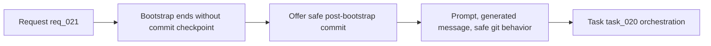

## item_021_propose_commit_after_bootstrap_with_generated_message - Propose commit after bootstrap with generated message
> From version: 1.7.0
> Status: Ready
> Understanding: 96%
> Confidence: 94%
> Progress: 0%
> Complexity: Medium
> Theme: Bootstrap workflow and git ergonomics
> Reminder: Update status/understanding/confidence/progress and linked task references when you edit this doc.

# Problem
Bootstrap currently gets the repository into a usable Logics state, but it stops before offering a clean git checkpoint. Users are left with a standard set of setup changes to review and commit manually, which adds friction and increases the chance that bootstrap work remains uncommitted or is committed later with an unhelpful message.

# Scope
- In:
  - Propose a commit after successful bootstrap completion.
  - Generate a useful bootstrap-oriented commit message automatically.
  - Handle accept/skip and nothing-to-commit outcomes safely.
  - Respect repositories that may already contain unrelated dirty changes.
- Out:
  - Auto-pushing after commit.
  - A generic commit assistant for all project workflows.
  - Long-form AI-generated release notes or changelog content.

# Acceptance criteria
- AC1: A commit proposal is shown only after bootstrap succeeds.
- AC2: The proposal contains a generated commit message suitable for bootstrap/setup changes.
- AC3: The user can accept or skip the commit explicitly.
- AC4: The flow handles nothing-to-commit and unrelated-dirty-state cases safely.
- AC5: User-facing messaging makes it clear that the proposal concerns bootstrap changes, not arbitrary project work.

# AC Traceability
- AC1 -> Post-bootstrap completion hook and success-only prompt. Proof: TODO.
- AC2 -> Commit-message generation logic. Proof: TODO.
- AC3 -> Accept/skip UX path and non-blocking behavior. Proof: TODO.
- AC4 -> Git-status inspection and safe staging/commit path. Proof: TODO.
- AC5 -> Prompt copy and docs/README updates. Proof: TODO.

# Links
- Request: `logics/request/req_021_propose_commit_after_bootstrap_with_generated_message.md`
- Primary task(s): `logics/tasks/task_020_orchestration_delivery_for_req_019_req_020_and_req_021.md`

# Priority
- Impact:
  - Medium: improves bootstrap completion quality and git hygiene with a small but high-leverage workflow step.
- Urgency:
  - Medium: valuable once bootstrap is already part of the day-to-day setup story.

# Notes
- Derived from `logics/request/req_021_propose_commit_after_bootstrap_with_generated_message.md`.

# Tasks
- `logics/tasks/task_020_orchestration_delivery_for_req_019_req_020_and_req_021.md`
