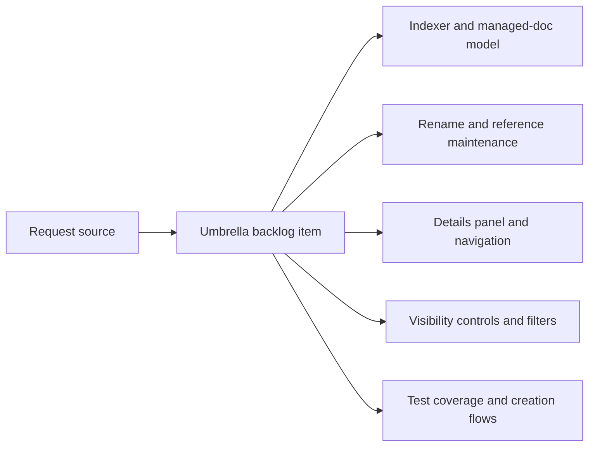

## item_022_align_vs_code_plugin_with_companion_docs_workflow - Align VS Code plugin with companion docs workflow
> From version: X.X.X
> Status: Ready
> Understanding: ??%
> Confidence: ??%
> Progress: 0%
> Complexity: Medium
> Theme: General
> Reminder: Update status/understanding/confidence/progress and linked task references when you edit this doc.

# Problem
The request is too broad to execute safely as a single backlog item.
It spans plugin data-model alignment, reference maintenance, UI/navigation work, visibility controls, and creation/test flows.
Without an explicit split, execution risks become high:
- scope is too large for a single task chain;
- acceptance criteria become hard to trace;
- product and architecture framing can be lost between unrelated implementation concerns.

# Scope
- In:
- Split the request into focused backlog items that can be implemented and tested independently.
- Keep a single umbrella item to preserve coordination and traceability back to the request.
- Make the child items explicit enough to support later product brief / architecture decision linkage if needed.
- Out:
- Implementing the feature work directly inside this umbrella item.

# Acceptance criteria
- AC1: The request is split into focused backlog items that cover the main delivery areas:
  - plugin indexer and managed-doc model;
  - rename/reference maintenance;
  - details-panel companion-doc navigation;
  - supporting-doc visibility controls;
  - creation flows and regression coverage.
- AC2: Each child backlog item links back to the request and is scoped tightly enough to support later task creation.

# AC Traceability
- AC1 -> Child items `item_023` to `item_027` created. Proof: linked below.
- AC2 -> Each child item references `req_022_align_vs_code_plugin_with_companion_docs_workflow`. Proof: linked below.

# Decision framing
- Product framing: Required
- Product signals: pricing and packaging, navigation and discoverability
- Architecture framing: Required
- Architecture signals: data model and persistence, contracts and integration

# Links
- Product brief(s): `logics/product/prod_000_companion_docs_ux_for_the_vs_code_plugin.md`
- Architecture decision(s): `logics/architecture/adr_000_represent_companion_docs_in_the_vs_code_plugin_workflow_model.md`
- Request: `req_022_align_vs_code_plugin_with_companion_docs_workflow`
- Primary task(s): `task_021_align_vs_code_plugin_with_companion_docs_workflow`

# Priority
- Impact:
- Urgency:

# Notes
- Derived from request `req_022_align_vs_code_plugin_with_companion_docs_workflow`.
- Source file: `logics/request/req_022_align_vs_code_plugin_with_companion_docs_workflow.md`.
- Split into:
  - `item_023_align_plugin_indexer_and_managed_doc_model_for_companion_docs`
  - `item_024_extend_plugin_rename_and_reference_maintenance_to_companion_docs`
  - `item_025_add_companion_docs_section_and_navigation_in_plugin_details_panel`
  - `item_026_add_supporting_doc_visibility_controls_to_plugin_board_and_list_views`
  - `item_027_add_companion_doc_creation_flows_and_regression_coverage_in_plugin`
