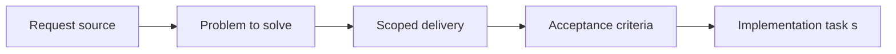

## item_023_align_plugin_indexer_and_managed_doc_model_for_companion_docs - Align plugin indexer and managed doc model for companion docs
> From version: X.X.X
> Status: Ready
> Understanding: ??%
> Confidence: ??%
> Progress: 0%
> Complexity: Medium
> Theme: General
> Reminder: Update status/understanding/confidence/progress and linked task references when you edit this doc.

# Problem
Describe the problem and user impact

# Scope
- In:
- Out:

# Acceptance criteria
- AC1: The plugin indexer and shared managed-doc model recognize `product` and `architecture` docs as first-class managed artifacts.
- AC2: Stage/type assumptions are centralized enough that future doc-family additions do not require scattered hardcoded changes.

# AC Traceability
- AC1 -> Indexer/model changes implemented with proof in tests and code references.
- AC2 -> Shared stage/type registry or equivalent centralization introduced with proof in code references.

# Decision framing
- Product framing: Not needed
- Product signals: (none detected)
- Architecture framing: Required
- Architecture signals: data model and persistence, contracts and integration

# Links
- Product brief(s): (none yet)
- Architecture decision(s): `logics/architecture/adr_000_represent_companion_docs_in_the_vs_code_plugin_workflow_model.md`
- Request: `req_022_align_vs_code_plugin_with_companion_docs_workflow`
- Primary task(s): (none yet)

# Priority
- Impact:
- Urgency:

# Notes
- Derived from umbrella item `item_022_align_vs_code_plugin_with_companion_docs_workflow`.
- Derived from request `req_022_align_vs_code_plugin_with_companion_docs_workflow`.
