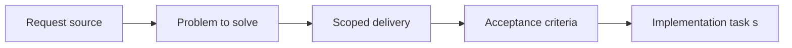

## item_023_align_plugin_indexer_and_managed_doc_model_for_companion_docs - Align plugin indexer and managed doc model for companion docs
> From version: 1.9.0
> Status: Done
> Understanding: 99%
> Confidence: 98%
> Progress: 100%
> Complexity: Medium
> Theme: Plugin managed-doc model and indexing
> Reminder: Update status/understanding/confidence/progress and linked task references when you edit this doc.

# Problem
The plugin originally treated only `request`, `backlog`, `task`, and `spec` as managed Logics docs.
That made `product` and `architecture` companion docs invisible or weakly typed in the main workflow cockpit.
Without a shared managed-doc model, later UI and maintenance work would have been forced into duplicated hardcoded exceptions.

# Scope
- In:
- Extend the plugin stage model to include `product` and `architecture`.
- Centralize managed-doc families, ordering, and directory coverage.
- Ensure indexer inference and usage extraction work for companion-doc paths and ids.
- Out:
- UI affordances beyond what is needed to validate the shared model.

# Acceptance criteria
- AC1: The plugin indexer and shared managed-doc model recognize `product` and `architecture` docs as first-class managed artifacts.
- AC2: Stage/type assumptions are centralized enough that future doc-family additions do not require scattered hardcoded changes.

# AC Traceability
- AC1 -> Implemented in `src/logicsIndexer.ts` with coverage in `tests/logicsIndexer.test.ts`.
- AC2 -> Managed-doc families, ordering, and directory helpers centralized in `src/logicsIndexer.ts` and reused by `src/extension.ts`.

# Decision framing
- Product framing: Not needed
- Product signals: (none detected)
- Architecture framing: Required
- Architecture signals: data model and persistence, contracts and integration

# Links
- Product brief(s): (none yet)
- Architecture decision(s): `logics/architecture/adr_000_represent_companion_docs_in_the_vs_code_plugin_workflow_model.md`
- Request: `req_022_align_vs_code_plugin_with_companion_docs_workflow`
- Primary task(s): `task_021_align_vs_code_plugin_with_companion_docs_workflow`

# Priority
- Impact: High. This item provides the shared model required by the rest of the plugin work.
- Urgency: High. UI and maintenance work would be brittle without it.

# Notes
- Derived from umbrella item `item_022_align_vs_code_plugin_with_companion_docs_workflow`.
- Derived from request `req_022_align_vs_code_plugin_with_companion_docs_workflow`.
- Delivered:
  - `LogicsStage` extended to `product` and `architecture`;
  - managed-doc family registry introduced;
  - stage ordering and directory helpers centralized;
  - targeted regression coverage added.
