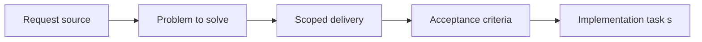

## item_024_extend_plugin_rename_and_reference_maintenance_to_companion_docs - Extend plugin rename and reference maintenance to companion docs
> From version: 1.9.0
> Status: Done
> Understanding: 99%
> Confidence: 97%
> Progress: 100%
> Complexity: Medium
> Theme: Plugin maintenance and reference coherence
> Reminder: Update status/understanding/confidence/progress and linked task references when you edit this doc.

# Problem
Once companion docs became visible to the plugin, rename and reference-maintenance flows also needed to treat them as first-class managed docs.
Without that, a user could rename a request/backlog/task/product/architecture doc and silently leave broken references behind.

# Scope
- In:
- Extend rename eligibility to `prod_...` and `adr_...`.
- Rewrite managed references across all supported Logics doc families.
- Make maintenance helpers testable independently from the full extension host.
- Out:
- Unrelated workflow actions such as promotion or lifecycle state changes.

# Acceptance criteria
- AC1: Rename/reference maintenance flows cover `request`, `backlog`, `task`, `spec`, `product`, and `architecture` managed docs.
- AC2: Companion-doc references stay coherent when managed docs are renamed or rewritten.

# AC Traceability
- AC1 -> Implemented in `src/extension.ts` and `src/logicsDocMaintenance.ts` with regression coverage in `tests/logicsDocMaintenance.test.ts`.
- AC2 -> Reference-token rewriting and rename-suffix handling covered in `tests/logicsDocMaintenance.test.ts`.

# Decision framing
- Product framing: Not needed
- Product signals: (none detected)
- Architecture framing: Required
- Architecture signals: contracts and integration

# Links
- Product brief(s): (none yet)
- Architecture decision(s): `logics/architecture/adr_000_represent_companion_docs_in_the_vs_code_plugin_workflow_model.md`
- Request: `req_022_align_vs_code_plugin_with_companion_docs_workflow`
- Primary task(s): `task_021_align_vs_code_plugin_with_companion_docs_workflow`

# Priority
- Impact: High. Broken links would make companion-doc support unreliable.
- Urgency: High. This had to land before broader UI exposure.

# Notes
- Derived from umbrella item `item_022_align_vs_code_plugin_with_companion_docs_workflow`.
- Derived from request `req_022_align_vs_code_plugin_with_companion_docs_workflow`.
- Delivered:
  - maintenance helpers extracted into `src/logicsDocMaintenance.ts`;
  - companion-doc rename coverage enabled;
  - managed-reference rewriting aligned with the expanded doc model.

# Tasks
- `logics/tasks/task_046_extend_plugin_rename_and_reference_maintenance_to_companion_docs.md`
