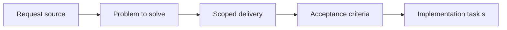

## item_024_extend_plugin_rename_and_reference_maintenance_to_companion_docs - Extend plugin rename and reference maintenance to companion docs
> From version: X.X.X
> Status: Ready
> Understanding: ??%
> Confidence: ??%
> Progress: 0%
> Complexity: Medium
> Theme: General
> Reminder: Update status/understanding/confidence/progress and linked task references when you edit this doc.

# Problem
Describe the problem and user impact

# Scope
- In:
- Out:

# Acceptance criteria
- AC1: Rename/reference maintenance flows cover `request`, `backlog`, `task`, `spec`, `product`, and `architecture` managed docs.
- AC2: Companion-doc references stay coherent when managed docs are renamed or rewritten.

# AC Traceability
- AC1 -> Maintenance coverage extended with proof in code and tests.
- AC2 -> Rename/reference regression coverage added with proof in tests.

# Decision framing
- Product framing: Not needed
- Product signals: (none detected)
- Architecture framing: Required
- Architecture signals: contracts and integration

# Links
- Product brief(s): (none yet)
- Architecture decision(s): `logics/architecture/adr_000_represent_companion_docs_in_the_vs_code_plugin_workflow_model.md`
- Request: `req_022_align_vs_code_plugin_with_companion_docs_workflow`
- Primary task(s): (none yet)

# Priority
- Impact:
- Urgency:

# Notes
- Derived from umbrella item `item_022_align_vs_code_plugin_with_companion_docs_workflow`.
- Derived from request `req_022_align_vs_code_plugin_with_companion_docs_workflow`.
