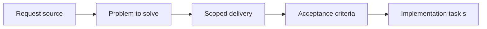

## item_025_add_companion_docs_section_and_navigation_in_plugin_details_panel - Add companion docs section and navigation in plugin details panel
> From version: 1.9.0
> Status: Done
> Understanding: 99%
> Confidence: 97%
> Progress: 100%
> Complexity: Medium
> Theme: Plugin details-panel UX and navigation
> Reminder: Update status/understanding/confidence/progress and linked task references when you edit this doc.

# Problem
Even after indexing companion docs, users still needed a clear place in the plugin to discover and navigate them from primary workflow items.
Without an explicit details-panel affordance, companion docs would remain technically present but operationally hard to use.

# Scope
- In:
- Add a dedicated `Companion docs` section in the details panel.
- Support direct `Open` and `Read` navigation for managed linked docs.
- Surface `Primary flow` links for supporting docs and expose linked specs contextually.
- Out:
- Full redesign of the board itself.

# Acceptance criteria
- AC1: The details panel exposes a dedicated companion-doc section or equivalent explicit affordance for linked product and architecture docs.
- AC2: Users can navigate to existing companion docs from primary workflow items without relying on raw file hunting.

# AC Traceability
- AC1 -> Implemented in `media/main.js` with coverage in `tests/webview.harness-a11y.test.ts`.
- AC2 -> Managed `Open`/`Read` actions and supporting-doc backlink sections covered in `tests/webview.harness-a11y.test.ts`.

# Decision framing
- Product framing: Required
- Product signals: navigation and discoverability
- Architecture framing: Not needed
- Architecture signals: (none detected)

# Links
- Product brief(s): `logics/product/prod_000_companion_docs_ux_for_the_vs_code_plugin.md`
- Architecture decision(s): `logics/architecture/adr_000_represent_companion_docs_in_the_vs_code_plugin_workflow_model.md`
- Request: `req_022_align_vs_code_plugin_with_companion_docs_workflow`
- Primary task(s): `task_021_align_vs_code_plugin_with_companion_docs_workflow`

# Priority
- Impact: High. This is the main contextual UX for companion/supporting docs.
- Urgency: High. It realizes the product and architecture direction without overloading the board by default.

# Notes
- Derived from umbrella item `item_022_align_vs_code_plugin_with_companion_docs_workflow`.
- Derived from request `req_022_align_vs_code_plugin_with_companion_docs_workflow`.
- Delivered:
  - `Companion docs` section for primary flow items;
  - `Primary flow` section for supporting docs;
  - contextual `Specs` section for primary items;
  - direct `Open` and `Read` actions for managed links.

# Tasks
- `logics/tasks/task_047_add_companion_docs_section_and_navigation_in_plugin_details_panel.md`
