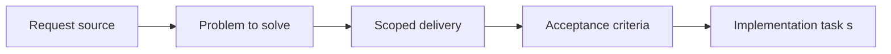

## item_026_add_supporting_doc_visibility_controls_to_plugin_board_and_list_views - Add supporting doc visibility controls to plugin board and list views
> From version: 1.9.0
> Status: Done
> Understanding: 98%
> Confidence: 96%
> Progress: 100%
> Complexity: Medium
> Theme: Board/list visibility control model
> Reminder: Update status/understanding/confidence/progress and linked task references when you edit this doc.

# Problem
Supporting docs needed to be discoverable globally without taking over the board by default.
If exposed naively as permanent first-class columns, they would reduce scanability of the delivery workflow.

# Scope
- In:
- Add an explicit secondary visibility toggle for companion docs.
- Preserve hidden-by-default behavior for supporting docs unless explicitly requested.
- Keep supporting-doc columns navigable while restricting primary creation controls to delivery stages.
- Improve stage labels/order when supporting docs are shown.
- Out:
- A full alternate board product just for documentation governance.

# Acceptance criteria
- AC1: Supporting-doc visibility is controllable through deliberate board/list filters or secondary visibility controls.
- AC2: Default delivery-board readability is preserved while companion/supporting docs remain discoverable when explicitly enabled.

# AC Traceability
- AC1 -> Implemented in `media/main.js` with regression coverage in `tests/webview.harness-a11y.test.ts`.
- AC2 -> Toggle defaults, visible-stage ordering, and board-column behavior covered in `tests/webview.harness-a11y.test.ts`.

# Decision framing
- Product framing: Not needed
- Product signals: (none detected)
- Architecture framing: Not needed
- Architecture signals: (none detected)

# Links
- Product brief(s): `logics/product/prod_000_companion_docs_ux_for_the_vs_code_plugin.md`
- Architecture decision(s): (none yet)
- Request: `req_022_align_vs_code_plugin_with_companion_docs_workflow`
- Primary task(s): `task_021_align_vs_code_plugin_with_companion_docs_workflow`

# Priority
- Impact: High. This controls whether the plugin remains delivery-first while still surfacing supporting docs.
- Urgency: Medium-High. It had to land once companion docs became visible in the UI.

# Notes
- Derived from umbrella item `item_022_align_vs_code_plugin_with_companion_docs_workflow`.
- Derived from request `req_022_align_vs_code_plugin_with_companion_docs_workflow`.
- Delivered:
  - `Show companion docs` toggle with default hidden state;
  - supporting-doc stage labels refined;
  - supporting-doc columns kept non-authoring;
  - cards show contextual badges and primary-flow linkage when relevant.
