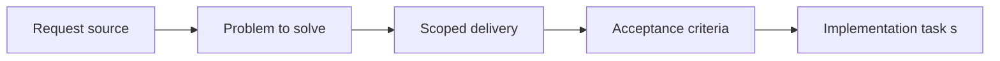

## item_026_add_supporting_doc_visibility_controls_to_plugin_board_and_list_views - Add supporting doc visibility controls to plugin board and list views
> From version: X.X.X
> Status: Ready
> Understanding: ??%
> Confidence: ??%
> Progress: 0%
> Complexity: Medium
> Theme: General
> Reminder: Update status/understanding/confidence/progress and linked task references when you edit this doc.

# Problem
Describe the problem and user impact

# Scope
- In:
- Out:

# Acceptance criteria
- AC1: Supporting-doc visibility is controllable through deliberate board/list filters or secondary visibility controls.
- AC2: Default delivery-board readability is preserved while companion/supporting docs remain discoverable when explicitly enabled.

# AC Traceability
- AC1 -> Visibility/filter control model implemented with proof in webview tests and code references.
- AC2 -> Default-state and toggle behavior covered with proof in tests.

# Decision framing
- Product framing: Not needed
- Product signals: (none detected)
- Architecture framing: Not needed
- Architecture signals: (none detected)

# Links
- Product brief(s): `logics/product/prod_000_companion_docs_ux_for_the_vs_code_plugin.md`
- Architecture decision(s): (none yet)
- Request: `req_022_align_vs_code_plugin_with_companion_docs_workflow`
- Primary task(s): (none yet)

# Priority
- Impact:
- Urgency:

# Notes
- Derived from umbrella item `item_022_align_vs_code_plugin_with_companion_docs_workflow`.
- Derived from request `req_022_align_vs_code_plugin_with_companion_docs_workflow`.
