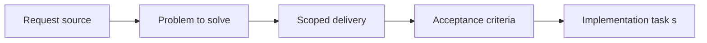

## item_027_add_companion_doc_creation_flows_and_regression_coverage_in_plugin - Add companion doc creation flows and regression coverage in plugin
> From version: X.X.X
> Status: Ready
> Understanding: ??%
> Confidence: ??%
> Progress: 0%
> Complexity: Medium
> Theme: General
> Reminder: Update status/understanding/confidence/progress and linked task references when you edit this doc.

# Problem
Describe the problem and user impact

# Scope
- In:
- Out:

# Acceptance criteria
- AC1: The plugin exposes an intentional companion-doc creation flow, preferably via a generic `Create companion doc` action.
- AC2: Regression coverage exists for companion-doc creation, opening, and supporting workflow integration.

# AC Traceability
- AC1 -> Companion-doc creation flow implemented with proof in code references and interaction tests.
- AC2 -> Regression coverage added with proof in tests.

# Decision framing
- Product framing: Not needed
- Product signals: (none detected)
- Architecture framing: Not needed
- Architecture signals: (none detected)

# Links
- Product brief(s): (none yet)
- Architecture decision(s): (none yet)
- Request: `req_022_align_vs_code_plugin_with_companion_docs_workflow`
- Primary task(s): (none yet)

# Priority
- Impact:
- Urgency:

# Notes
- Derived from umbrella item `item_022_align_vs_code_plugin_with_companion_docs_workflow`.
- Derived from request `req_022_align_vs_code_plugin_with_companion_docs_workflow`.
